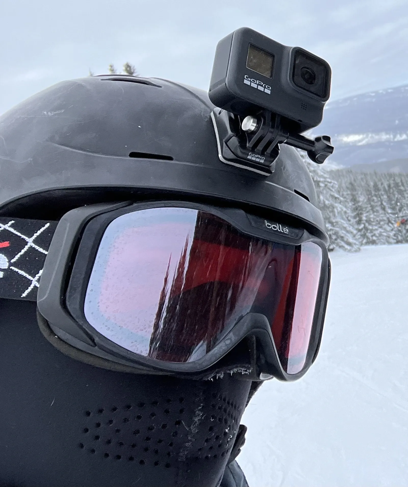

+++
title = 'About Me'
date = 2023-11-05T17:38:57-05:00
draft = false
showthedate = true
+++

<aside class="invisAside">
	<figure>
		
		<figcaption>Me</figcaption>
	</figure>
</aside>

I'm Nathan, I'm a computer nerd who loves to travel, and do many other things. Including, geocaching, flying, blogging, exploring transit systems, and a whole lot more. I am the guy who will want to walk the whole airport. Maybe more than once.

If for some terrifying reason you like this crap, you can subscribe via [RSS](/posts/feed.xml). If you would like to only subscribe to a certain type of post, each post tag has it's own RSS feed. You can find a list of those [here](/tags).

Any opinions expressed here are entirely my own, not of my employer(s) or third party.