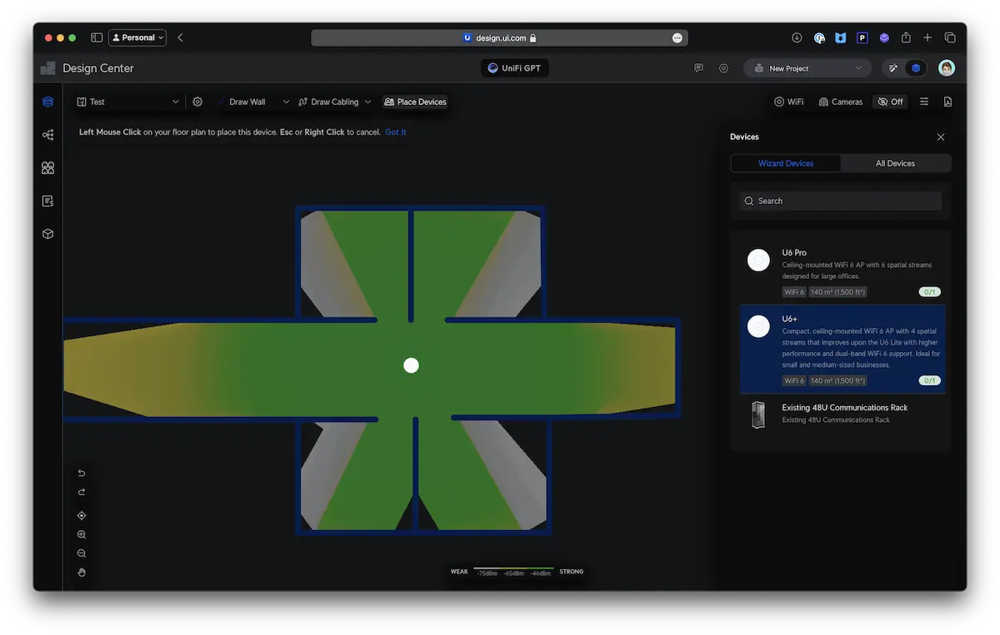
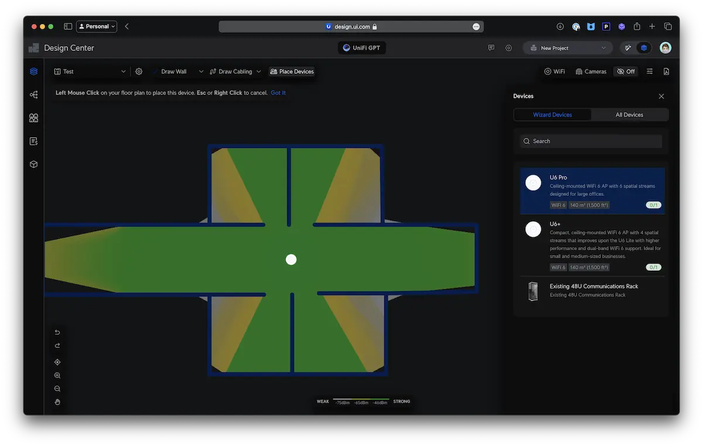
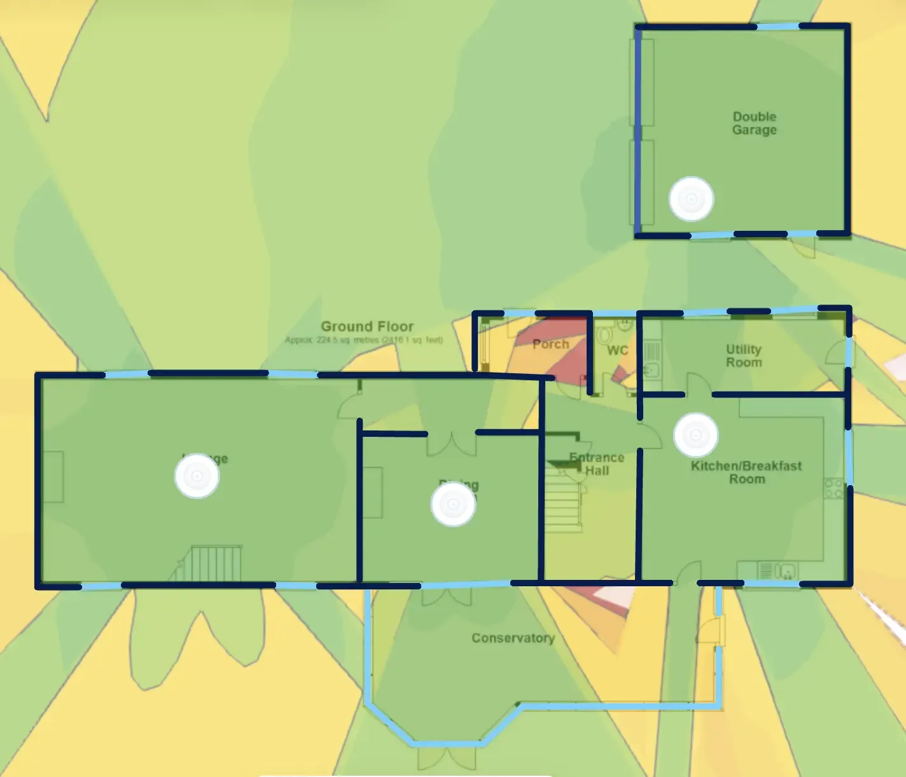
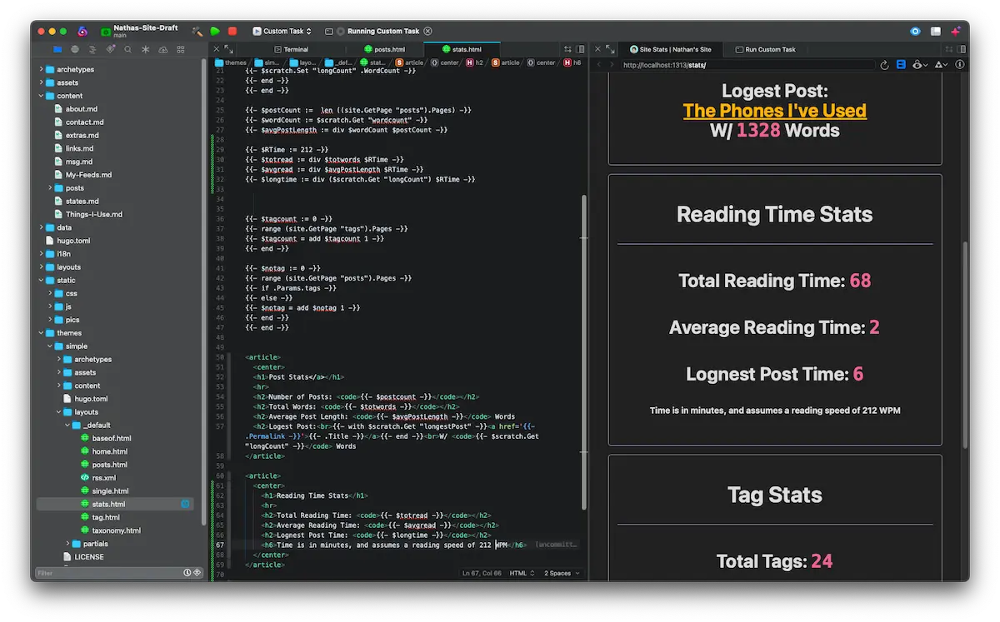

+++
title = 'Penpals With Kev'
date = 2023-03-28T16:18:33-04:00
draft = false
+++

Here's the email conversation I had with [Kev](https://kevquirk.com), as part of his [penpal project](https://kevquirk.com/seeking-pen-pals).

<article>
From: <code>Nathan</code> 
To: Kev 
Date: Apr 1, 2024

Hey Kev,

This penpal thing is going to be interesting, but, as we’ve only exchanged  few messages on Mastodon, a little about myself. I work in both physical and cybersecurity, the first one being in retail loss prevention, and the latter being in cybersecurity education. Some of my main hobbies included computer networking, geocaching (my favorite one I’ve got was in a store drain (yes, I did climb in to get it)), commercial drone flight (FAA licensed), and too many more.

That is a big back yard you got there. If you wait any longer on that grass, you might need something like a bushhog to get through it. I’ve always wondered about mowers using belts to drive the blades. You’d think a chain drive would be far better, but chains do cost more.

Hopefully those fancy UNiFi APs work out. That’s pretty close to the same setup I use, though one of the APs is built in to my UNiFi console (Dream Router). The UNiFi network dashboard is just a dream (no put intended) to use. Just a couple clicks, and you have one SSID over multiple APs. Their camera interface is also really good. Kinda wish work would copy a few features for our in house system.

- Nathan
</article>

<article>
From: <code>Kev</code> 
To: Nathan 
Date: Apr 5, 2024

Hey Nathan,

Thanks for taking part in this little experiment of mine. Tell me more about the Cyber education you do…is that a specific course that you teach, or something else entirely?

Yup, it is a big back yard, and it’s one that’s simultaneously a blessing and a curse. On the one hand, it’s great to have so much space and to be out there, enjoying it. But on the other hand, it’s a bitch to maintain haha. I’m actually in the process of buying a towable flail mower which should cut down on the issues I’ve been having with the current mower and its shitty belts, but we shall see.

I’m hoping the unify network does the job. It’s not gonna be cheap, so it better work! I think it will; I’ve done the calculations and it’s looking like there will be plenty of coverage, even with the occasional thick wall to traverse. You might be able to help me, actually. I’m currently in a bit of a quandary as to which AP’s to get. I’m torn between the U6 Plus and the U6 Pro.

The Plus seems like it will do the job just fine, and it’s around half the price of the Pro. But while I’m shelling out all this money, I’m debating whether to just throw caution to the wind and get the best I can. You got any advice for a Unifi novice?

Look forward to talking more soon.

Kev
</article>

<article>
From: <code>Nathan</code> 
To: Kev 
Date: Apr 7, 2024

Hey Kev,

The cybersecurity course I TA (teaching assistant) is a six month crash course with the University of Minnesota that goes over a lot of things. We start of with a quick intro of Linux (ls cd, the basics), then jump off the diving board from there. By week 10 we’re cracking password, week 11 we’re spraying an AD network, and by week 16 we’re breaking into VMs on a network in a big CTF. At the end (week 24), the students have to do a research project of their choice, I always tell them to watch some DEFCON talks, but only a few do. When I took the course, my project was on cracking Wi-Fi a 1/4mi away from the AP, with stuff I found in my trash can. 

You have an odd house. I couldn’t really replicate your thick walls in the UNiFi design center. But they did have an option for concrete walls (12/20db), so I drew up a quick hallway, with two and four rooms. The U6pro definitely does a better job punching through the walls than the plus. But you really want them in a hallway if you can. I’ve attached a zip with the design center results.

<figure>
	
</figure>

<figure>
	
</figure>

- Nathan
</article>

<article>
From: <code>Kev</code> 
To: Nathan 
Date: Apr 10, 2024

Hey Nathan,

That’s an interesting course. I’ve done a few certifications over the years, and it seems a lot of what is covered in more generic InfoSec course seems to be on your crash course.

Good job building a YAGI out of rubbish - I like the thinking haha.

Yeah my house is kinda weird, but that’s because it’s not actually a house. It was built to be a barn, then converted around 100 years ago. It makes for a very interesting layout though. I actually didn’t know about the design tool on the UI site. I went ahead and uploaded a to-scale layout of our house and played around with the different kinds of AP’s and their positions. I think I’ve settled on the layout (see attached).

<figure>
	

I’m gonna do this install this coming Friday, so I’ll be sure to write about it over on the blog. :)

Thanks,

Kev

</article>

<article>
From: <code>Nathan</code> 
To: Kev 
Date: Apr 14, 2024

Hey Kev,

Yeah it’s a pretty fun course to worth with. Just wish I didn’t to file as much plagiarism reports with the university as I end up doing. Just part of grading I guess.

It’s only weird because t was converted from a barn. Its layout look very similar to a lot of the older houses (1800’s and older) here in the eastern US. 

That AP layout should work pretty well, good coverage in all the rooms and the halls. You even made sure to get some free in the most important art of the restroom.

In regards to your last blog post (and that Mastodon post). I had had a coworker like that at the university. Going off on me because I use macOS instead of Linux. “I have nothing wrong with Linux, I use it all the time. I just enjoy actually getting my work done.” He didn’t have a response to that. 

- Nathan
</article>

<article>
From: <code>Kev</code> 
To: Nathan 
Date: Apr 15, 2024

Hey Nathan,

I suppose plagiarism is the AI world we live in these days. I assume you have tools that you run the submitted work through that look for this kind of thing?

My house was built in the 1800s, so it makes sense that it is similar to the houses you see in the US. Interesting how that kind of architecture traverses entire oceans. Mind you, a couple hundred years ago, the US and UK were much closer in terms of their lineage than they are now, so I suppose that makes sense.

Luckily I’ve only had a couple of the trolls reach out to me following that post. I was expecting it to be worse.

The AP’s have gone in now and they’re working perfectly. I’m gonna write something about it over the coming days, but long story short, I pretty much full speed across the entire house, which is pretty cool. Overall it was a worthy investment, I think.

Kev
</article>

<article>
From: <code>Nathan</code> 
To: Kev 
Date: Apr 18, 2024

Hey Kev,

Yeah, a few students each class try to just use LLMs for their homework. We have a few tools to try and detect it, but it really comes down to knowing the student, and how they write. All that builds to the point I can interrogate them about it. Having my main job being loss prevention helps a lot there. As we do some interrogation when we apprehend a “customer”.

That does explain a fair bit about the layout. The US and UK were a lot “closer” back then. Grant it, we were at war with each other, but that’s besides the point.

Glad to hear the new AP's are working out! Installing a UNiFi system was one of the best things I’ve done. I used to have to disconnect and reconnect from our old system to get data to flow.  Now I don’t think about my WiFi, I just use it. Looking forward to reading that blog post about it.

- Nathan
</article>

<article>
From: <code>Kev</code> 
To: Nathan 
Date: Apr 18, 2024

Hey pal,

Yeah, I can see how that would be the best way. If you have a student that’s barely literate, then they submit a Shakespearian epic, that would be a tell, I think. :)

Hey, you guys started that war. That’s on you lot. :)

The new APs continue to work perfectly. Very happy with them and money well invested.

I was reading about how you simplified the way you host your site. Woah, 3 repos…that’s brave! I struggle to keep one repo for my site in check. Can I ask, why don't you use branches on a single repo instead of separate repos?

Kev
</article>

<article>
From: <code>Nathan</code> 
To: Kev 
Date: Apr 21, 2024

Hey man,

It’s real easy when the question is “what is the purpose of the files in the assets folder” and they answer “the assets folder likely contains…”. Dead giveaway. 

Look, what can I say, it’s what we do. :)

Yeah, three was a lot. I don’t really remember why I originally went with three. But I’m glad to switched to my current workflow. The reason I’m using two repos, is because I want my site’s workings public. My drafts on the other hand, no. So I have two repos. The one for my drafts (named dev) has a full copy of my site (minus non draft posts). That way I can view how the post will look, as I write it. Posting is way easier that I make it sound, I just drag the post’s folder to my main repo, hit the build button in my editor, then push to GitHub.

It’s kinda like the workflow with blot, just with one extra button.

<figure>
	
	<figcaption>Building my stats page in Nova</figcaption>
</figure>

As to why not branches, besides the issue of not really being able to have a private branch that I can easily sync across more than one device in a public repo. I like having that hard separation between where I can experiment in peace, and the live “production” repo.

I take your oldest was playing in that soccer game? We just had our main football (🏈) season end a couple months back, so things are pretty boring right now in the US. Though UFL started just, so that’s something. 

- Nathan 
</article>

<article>
From: <code>Kev</code> 
To: Nathan 
Date: Apr 25, 2024

Hey pal,

That does make sense actually. When I was using Jekyll, I actually considered doing something similar so I could have the source public, but my content private. So I get it.

The logic behind branches makes sense to me, but in practice, using them is a PAIN! So I don’t use them, either. Instead, I have Laravel Herd running on my laptop, so I’m always running a local PHP server. Any dev work to the site, I just do it locally on main. When I’m happy, I push the changes.

Nova looks really good to be fair - I’ve never used it before, so I might check it out. I used to use Atom, but when Github killed that, I switched to VSCodium and I’ve been on that ever since. I’ve also heard good things about Sublime Text, but never used that either.

What’s this “soccer” thing you speak of? MY oldest was most definitely playing football. I assume you’re referring to American Football when you’re referring to the season ending? :-D

There’s only a few days of the month left, so I assume this is likely to be our last exchange. So I just want to say thanks for being part of this little experiment on mine - I’ve really enjoyed chatting with you this month, Nathan!

Kev
</article>

<article>
From: <code>Nathan</code> 
To: Kev 
Date: Apr 29, 2024

Hey man,

Ah sorry, I guess football is gaining popularity over there. What’s he play? Quarterback? Line men? Tackler? :P

It was pretty great talking with you as well, Kev. Glad I could take part in this project of yours.

- Nathan
</article>