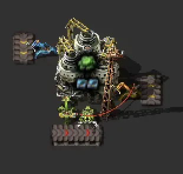
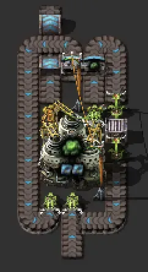
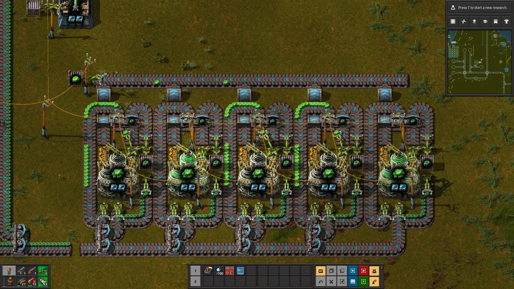
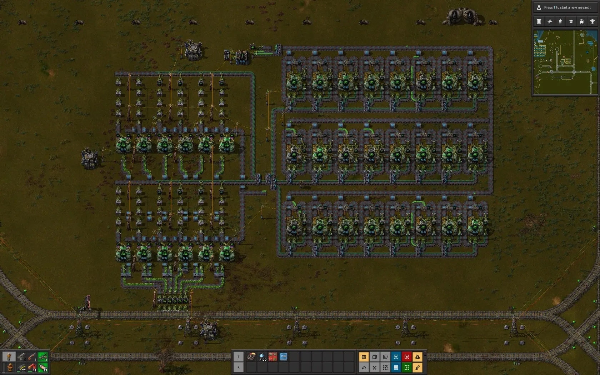
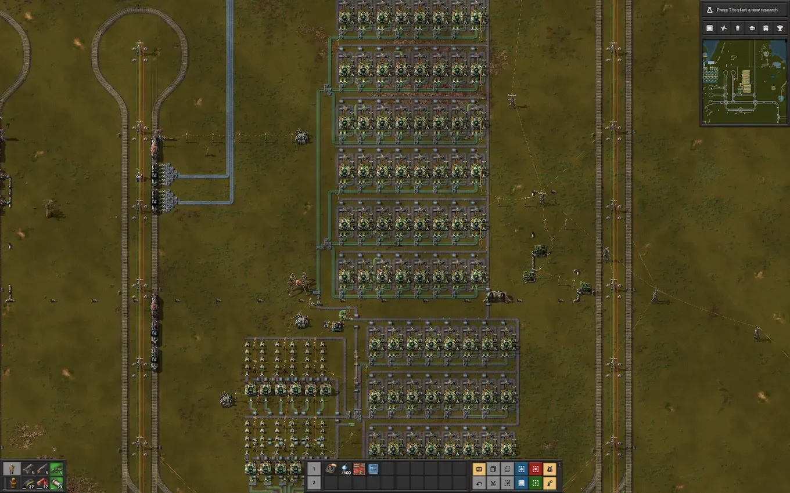

+++
title = 'Kovarex'
date = 2024-03-20T13:21:17-04:00
draft = false
subtitle = "Green rocks"
+++

I've had Kovarex researched for a bit. But now it was time to actually get it up and running.

Kovarex is a pain. it takes three of your junk U-238s, and outputs one useful U-235. The painful part, is that you can't just give it three U-238s. That would be too easy. No, you need to give it five U-238s, and 40 U-235s. Yes, 40. and with that, you get, one, new U-235.

The puzzle I had to figure out was, how do I extract that one U-235, and send the 40 others back to the centrifuge. So I hit the internet, and found this design.

<figure>
	
</figure>

This thing uses a wire, and state monitoring to have an inserter, only grab a U-235, when a different inserter is holding the U-238. This is just what I needed. I just hate the layout, so I redesigned it using the same concept.

<figure>
	
</figure>

That's better. This design can easily be be tiled on the left and right side. Now to start making U-235, so I can fuel up more of these.

<figure>
	
</figure>

More.

<figure>
	
</figure>

MORE!!

<figre>
	
</figre>

That'll do. Now I can arm the War Spider with 80 plus nuclear missiles, and take "care" of the environmentalists.