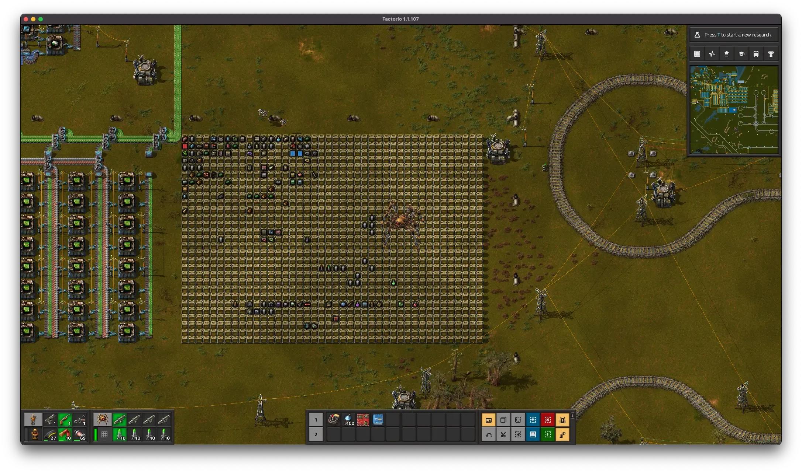

+++
title = 'More Storage'
date = 2024-05-22T19:12:38-04:00
draft = false
+++

It's been a bit, but I'm playing again.

<h2>I Need More!!!</h2>

My storage array was tiny. A small 5x10 ish block. And I was pretty much out of storage. I needed more, but how much more?

I could go pretty big, it would take a lot of resources and time to build. Or, I could go scaleable, build what I need, with room to add more.

I went with massive, setting part of the bot mall to make storage chests, and pasting down something stupid.

<figure>
	
	<figcaption>The new storage block</figcaption>
</figure>

My coworker says I have a problem. I don't, but if this thing gets full... I will. Until I build a bigger one.