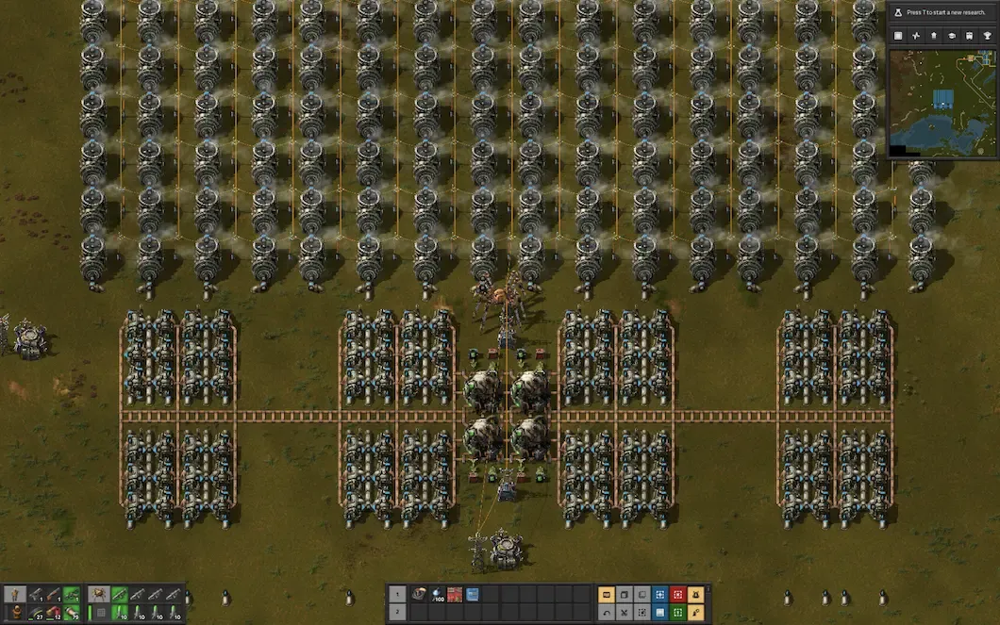

+++
title = 'Out of Power'
date = 2024-03-24T12:28:23-04:00
draft = false
subtitle = "HONK HONK, said the power alarm"
+++

I need to rethink somethings. I was adding a bigger buffer to my Kovarex plant, when an alarm went off. One I haven't heard in a long time. The power alarm. Right then and there, everything died on me... What the fuck just happened.

I got in the War Spider, and raced to the reactor. Turbines weren't spinning, she was dead. I quickly checked the reactor temps, 600C, and no fuel. I needed fuel, and fast, before these things cooled off too much. Racing up to my fuel plant, I found the problem, it ran out of iron plates. I'll fix that later, right now I just need to keep the reactors hot.

I grabbed some spare fuel, and raced back to the reactor. Once there, I isolated the plant from the rest of the factory, and loaded in the fuel. 515C, that’s what the reactors got down to. Now just to let them heat back up. 

So, why did I rush to get fuel? Simple, mass. My reactor is pretty big, and that gives it a lot of thermal mass. So, if it went completely cold, it would take quite awhile to heat back up.

<figure>
	
	<figcaption>Reactors and heat exchangers</figcaption>
</figure>

I had to wait a bit for it to heat up enough. While this reactor can in thory make 1.1Gw, my base only uses about 160ishMw. The issue is, I have a lot of robo-ports. And when they loose power, their batteries will loose a bit of charge, as the bot return to them[^1]. When the power came back on, my base, for about two seconds, drew close too 600Mw. Good thing my plant can handle that.

I'm currently rebuilding/moving my fuel production plant, to help prevent this from happening again.

[^1]: The bots will finish their task and return to a robo-port in the event of a power outage.