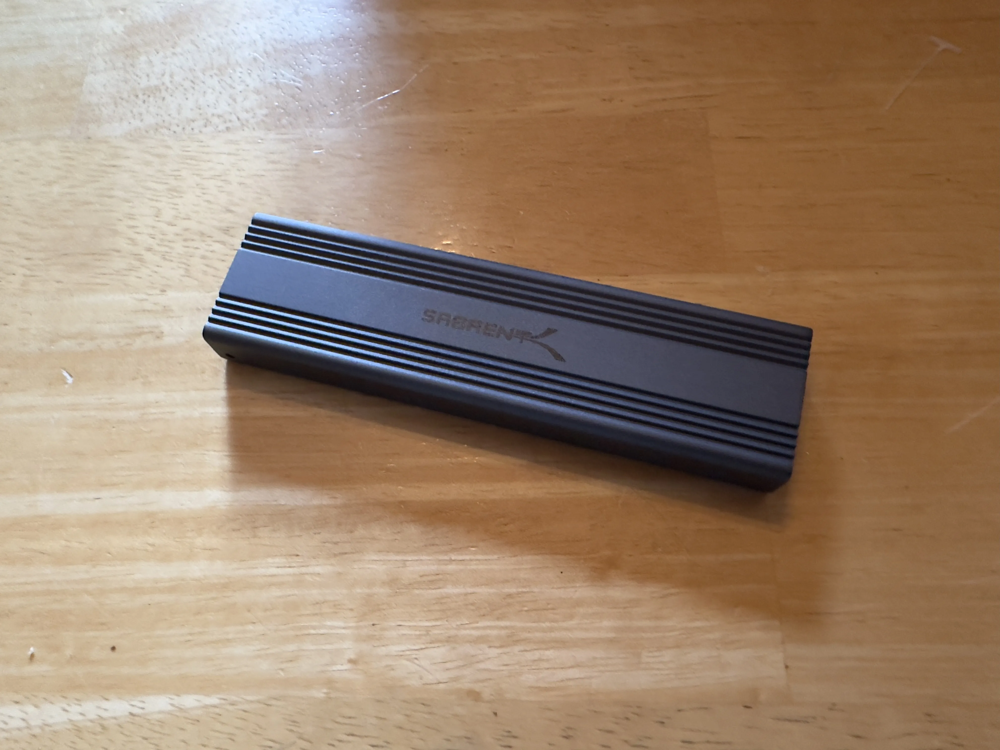
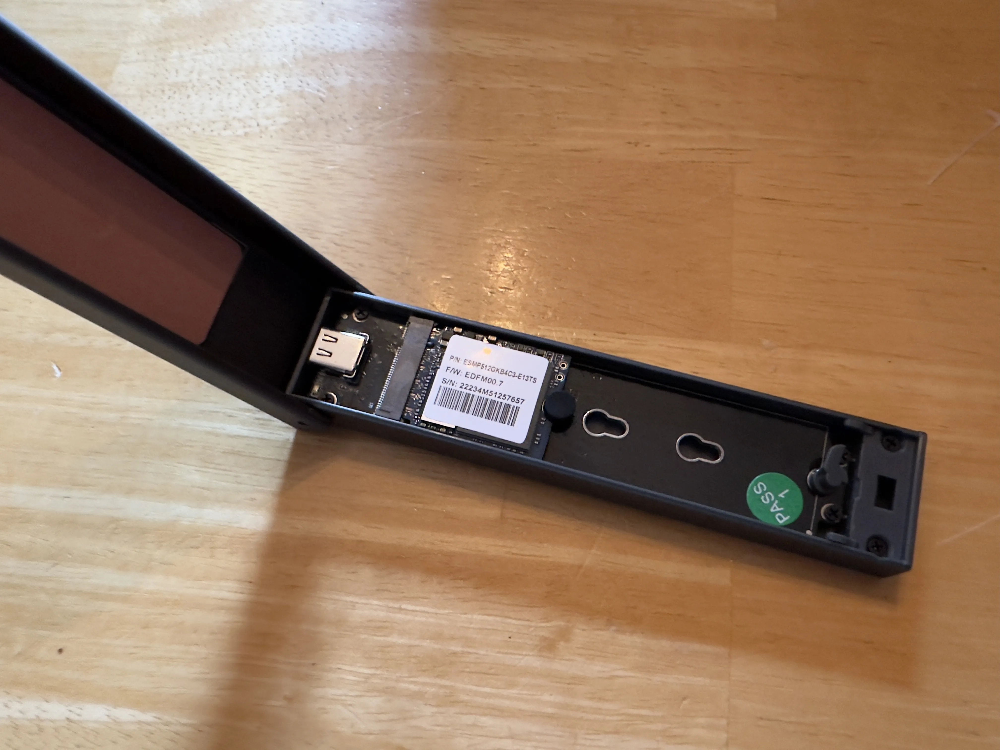

+++
title = 'Making a Fast As Hell Flash Drive'
date = 2023-10-27T10:26:18-05:00
draft = false
+++

A while back, I upgraded the storage in my Steam Deck. Going from 512GB, to 2TB. The upgrade was so worth it. But, as a result, I had a 512GB SSD just sitting around. 

After a while, I ended up ordering an NVME SSD enclosure. 

After chucking the SSD in there, and formatting it. I now have a little, fast as hell, USB drive. That I can also use if I need to image other NVME drives.

<a class="button" href="mailto:reply.65tu8@nthp.me?subject=RE%3A%20Making%20a%20Fast%20As%20Hell%20Flash%20Drive"> Reply to this post via email 📫</a>

For Webmail Users  
Address: <code>reply.65tu8@nthp.me</code> 
Subject: <code>RE: Making a Fast As Hell Flash Drive</code>

