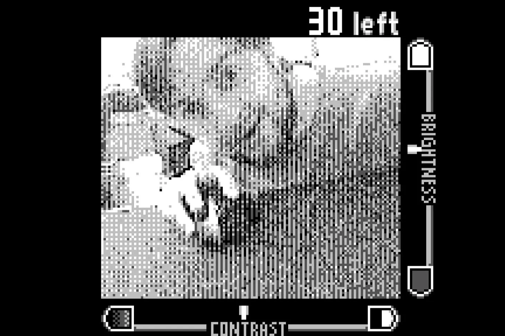

+++
title = 'My New Old Webcam'
date = 2023-11-13T17:17:57-05:00
draft = false
tags = ['Old Game Systems']
+++

I've had an Analogue Pocket for a while now. If you don't known what the Pocket is, it’s a handheld FPGA game system. Capable of replicating a ton of old game systems. You can learn more about it [here](https://www.analogue.co/pocket). One neat thing about the Pocket, it has a GB / GBA slot on it. I've been playing GBA games on it since I got it. But only recently, did I pick up its dock.

The dock, let's you plug it into a TV. That's it. Alright, it also has two USB ports on it, and let's you connect a bunch of different wireless controllers. After using the dock for a few days, I had an idea.

Quite a while back. People were sharing an article about how a dude used a GameBoy Camera for Zoom. There was nothing really special about it. He was using a Pocket, its dock, and a cheap capture card. So I bought a cheap capture card.

<aside>
	<figure>
	
	<figcaption>Taken using macOS Photo Booth</figcaption>
	</figure>
</aside>

I was a little concerned about the adapter. It was shocking light. To the point I didn't think It was going to work. But somewhat to my surprise, it did, and it looked pretty good. I work two jobs. One in loss prevention, and the other as a cybersecurity TA. The latter of the two is a remote job. And perfect for this type of thing. I'm defiantly looking forward to using it there, when I can.