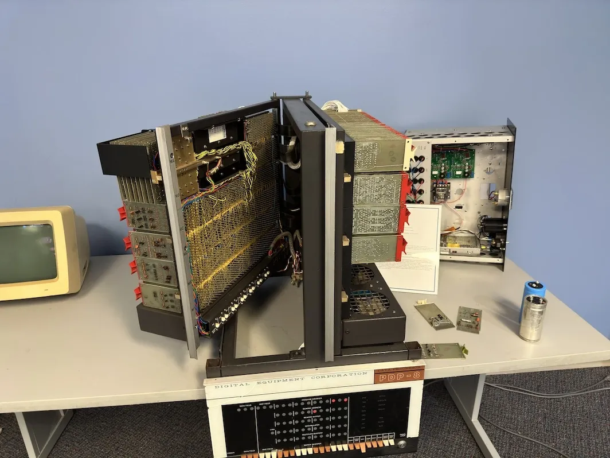
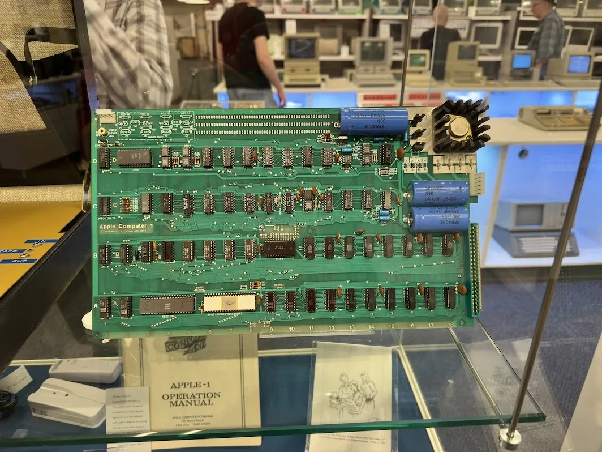

+++
title = 'System Source Museum'
date = 2023-10-25T10:18:56-05:00
draft = false
tags = ['Old Computers', 'Museums']
+++

Jump to: [The Trip](#trip) | [The Museum](#museum) | [G15](#g15) | [Thoughts](#thoughts)  
Quick Links: [Flickr Album](https://www.flickr.com/photos/197704187@N04/albums/72177720312149715/with/53281603158/) | [Museum Website](https://museum.syssrc.com)

A couple days ago, I went to a bucket list level computer museum here in Maryland. A few weeks ago, a Youtube channel that I watch [Usagi Electric](https://www.youtube.com/@UsagiElectric), has been working on an old 1950's computer (on loan for repair from the museum), and announced that he would be at the museum to swap out a part. He also said, that it would also be a meet and greet. 

## The Trip [🔗](#trip)

I had been planning on going to the museum for a bit. I was putting it off simply because it was a one hour drive (Yeah, I can be a little lazy). However, when Usagi released a video saying the Museum will be having an open house, and that he would be there swapping a part out on a Bendix G15... I had to go.

## The Museum [🔗](#museum)

After an hours drive, I pulled into the museum just outside Baltimore [^1]. The open house started with a tour. We first went to the Cray room. 

### Cray Room [🔗](#cray)

The Cray room had, well, Cray super computers in it. The main showpiece was a Cray 1. They also had a section of a Cray 2. The Cray 2 was submersion cooled. The coolant used for it ([Fluorinert](https://www.3m.com/3M/en_US/p/d/b40045180/)) costs around $1,000 per gallon. And they had a jar of the stuff. They were also crazy enough to let us hold it. The stuff is dense. A US gallon of water weighs about 8.33 LBs. A gallon of Fluorinert weighs about 14.66 LBs.

 
Photo

### DEC Room [🔗](#dec)

After the Cray room, we moved on to the DEC room. In the DEC room was one of the first computers available. The LINC. The crazy thing about the LINC, is that not only is the chick who wrote the operating system for it, a Marylander. She also helped the museum, get theirs up and running. They also had a (mostly) working PDP 8/1. As well as a "straight" 8. A PDP 8 that's built using diode cards, and thus, fits on a table.

 
Photos

### The rest of the museum [🔗](#restofit)

After the dec room, we were let into the main room of the museum. There was just too much to go over here. They had a real apple 1, a bunch of apple 2s, an apple 3, NEXT Cube, a BeBox, tons of IBMs, and way way more. And the best part, it was all hands on. We could actually use the computers on display! (not the Apple 1, the had a replica for people to play with).

 
Photos

## Usagi and the G15 [🔗](#g15)

The main even. David from [Usagi Electric](https://www.youtube.com/@UsagiElectric/videos), was there to swap out the drum memory in a Bendix G15. He's been restoring a G15 sent to him from the museum (yes, they have two). The drum memory in his unit was completely crashed. However, the drum in the G15 still at the museum, was fine. That's why he was up in Maryland swapping them out. Definitely watch his [playlist on working on the G15](https://www.youtube.com/playlist?list=PLnw98JPyObn3QSIwUz5Iv6NA1x-uGFqAa)

 
Video

Sorry about the sound, a lot of people were talking.  
https://www.youtube.com/watch?v=uOGCUNv8Yg8

 
Photos

  
A wild [Vintage Geek](https://www.youtube.com/@vintagegeek)  

## Thoughts [🔗](#thoughts)

Overall, the museum was fantastic. I am defiantly going back.

All of the photos I took are available on my [Flickr](https://www.flickr.com/photos/197704187@N04/albums/72177720312149715/with/53281603158/), in their full resolution (48Mpx). So definitely check that out.

[^1]: Bal'Mer
