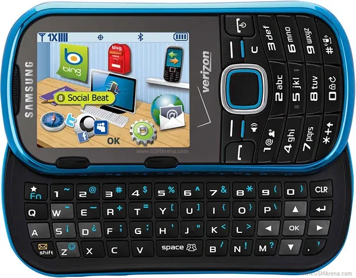
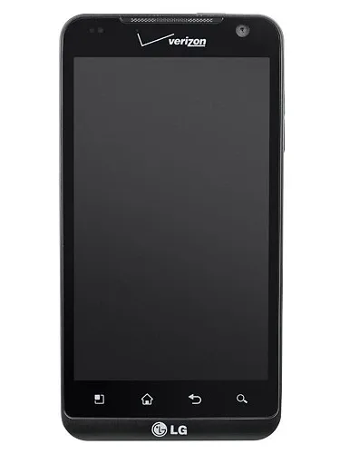
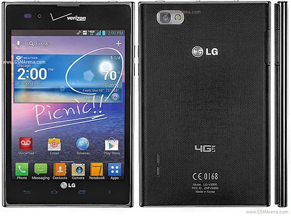
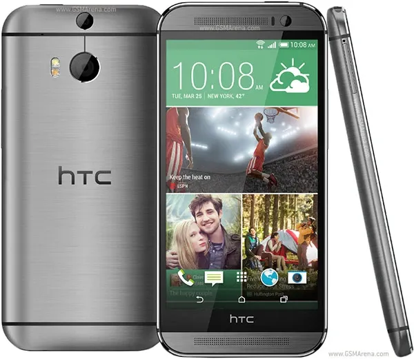
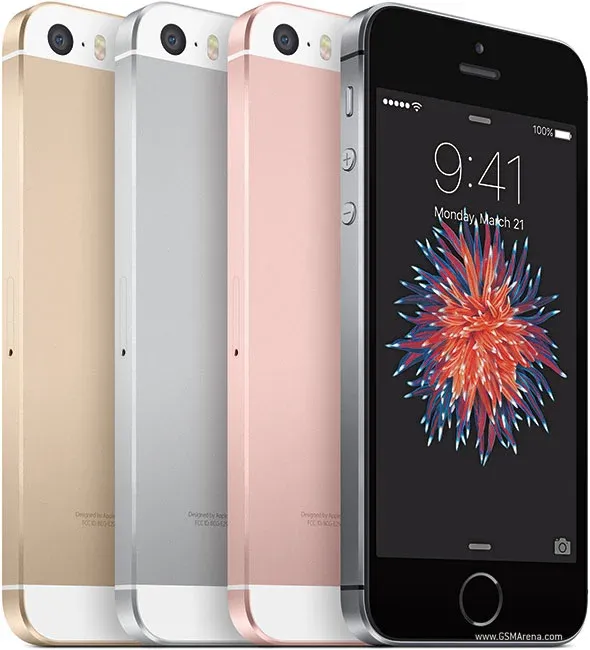
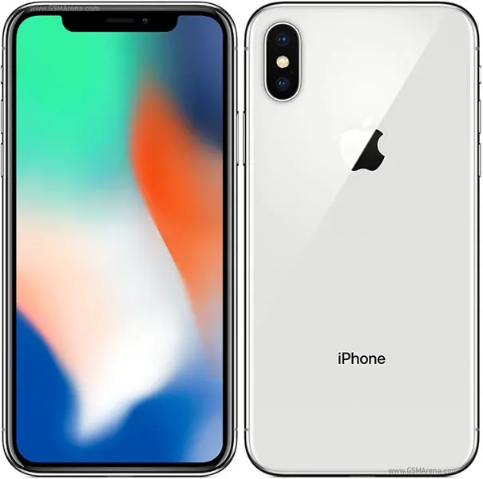
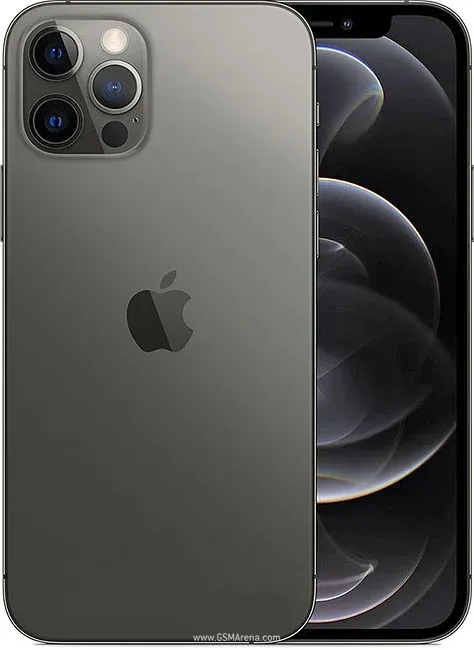
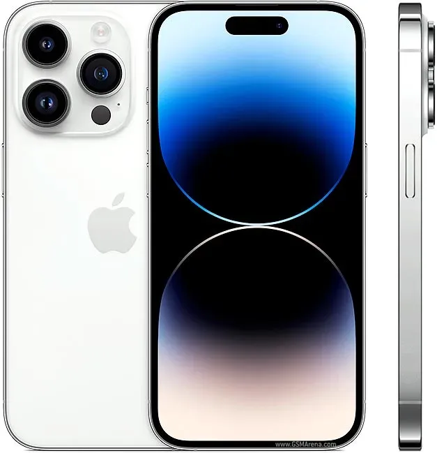

+++
title = "The Phones I've Used"
date = 2023-11-20T20:04:56-05:00
draft = false
+++

Over the years, I have a number of phones. Some good, some bad. Some not even smart. So I figured, let's go through them.

	
## Samsung Intensity II & iPod Touch 4th Gen [🔗](#intensity)

<aside>
	<figure>
	
	<figcaption>Credit <a href="https://www.gsmarena.com/samsung_u460_intensity_ii-pictures-3450.php">GSMArena</a> Mine was black with orange accents</figcaption>
	</figure>
</aside>

This was the first phone I had. A basic messaging phone, with a slid-out keyboard. Now, you might be asking, how did you do anything? Games? Calendar? IM??? Simple, you carry a different device. My generation, was the last to use a separate phone and PDA. The PDA of choice at the time, was a 4th Gen iPod Touch.

There's not much to say about this combo. It was simple, and worked. It was also to norm at the time to rock two devices. However, I would make the jump[^5] to a smartphone, with my next upgrade.

## LG Revolution [🔗](#revolution)

<aside>
	<figure>
	
	<figcaption>Credit <a href="https://www.gsmarena.com/lg_revolution-pictures-3732.php">GSMArena</a></figcaption>
	</figure>
</aside>

My first smartphone was an LG Revolution. The Revolution was one the worst phones I've used. With bad performance (though not the worst in this list), and one major safety issue. I defiantly did not have smooth entry to the smart phone world.

This phone was very laggy, apps struggled to run, and things like navigation were basically impossible. But that wasn't the worst part of it. Every now and then, the battery would get dangerously hot. To the point of getting close to burning my leg. I was actually worried that the battery might go into [thermal runaway](https://www.youtube.com/watch?v=3PHbIaT-TtM). After a lot of back and forth with Verizon, I got a different phone.

## LG Intuition [🔗](#intuition)

<aside>
	<figure>
	
	<figcaption>Credit <a href="https://www.gsmarena.com/lg_intuition_vs950-pictures-5005.php">GSMArena</a></figcaption>
	</figure>
</aside>

I was given this phone by Verizon to replace my dangerous LG Revolution. Even though the Intuition was a newer phone, it somehow had worse performance. The home screen redrew itself every time you hit the home button. Google maps couldn't keep up (when it didn't crash), causing it to give me wrong turns. Oh, I didn't have one of these. 

The unit I was given to replace my Revolution, was a "Verizon Certified Refurbished" unit, AKA, broken. It was only on my **fourth** Intuition, did I get a fully "working" one. Needless to say, I was eagerly awaiting my upgrade date.

Definitely check out this old [PocketNow video](https://www.youtube.com/watch?v=Jo3WYTUVNVA&t=347s), to see just how bad this thing is.

## HTC One M8 [🔗](#HTC-ONE)

<aside>
	<figure>
	
	<figcaption>Credit <a href="https://www.gsmarena.com/htc_one_(m8)-pictures-6074.php">GSMArena</a></figcaption>
	</figure>
</aside>

That fateful morning in 2014 came, and it felt like Christmas. I didn't know what phone I was going to get, but I knew what kind. A flagship. I wasn't going to take what Verizon wanted me to, I was getting something good. After looking over the show room floor for a bit, I went with the HTC ONE M8. A top of the line phone in 2014. 

I was very happy with it. It was was snappy, ran everything perfectly, had a really good screen, and fantastic speakers[^1]. I used the ONE happily for a couple years, but one thing kept bugging me.

Updates, or how slow I got them. On carrier locked phone here in the US, android update are slow as hell. First, Google releases an update to android, then the phone manufacturer has to make sure all their stuff works on the new OS. Okay, that makes sense. But Verizon had to shove their hand into it has well. After HTC finished making the update good to go. Verizon got a say in it, and that slowed things down a lot. This, and the fact that I had recently switched to Mac, made me start looking to the other side.

## iPhone SE [🔗](#se)

<aside>
	<figure>
	
	<figcaption>Credit <a href="https://www.gsmarena.com/apple_iphone_se-pictures-7969.php">GSMArena</a></figcaption>
	</figure>
</aside>

Wanting to update at the same time as everyone else, and wanting something that worked better with my then new Mac[^2]. I made the jump, to the iPhone. A platform jump is never a small one, and I knew that going in. I got my contacts moved over, installed all my main apps that had an iOS version, synced my music over. It took all day. 

My first impressions was how far iOS had come since I last used it (iOS 6 on an iPod Touch). iOS 9, while still somewhat simplistic, was very coherent. And I liked that. The small size (and small battery), did got annoying after awhile. But, I really liked the phone, and how well it worked with my mac. And needless to say, my friends were happy that I was now a blue bubble.

## iPhone X [🔗](#x)

<aside>
	<figure>
	
	<figcaption>Credit <a href="https://www.gsmarena.com/apple_iphone_x-pictures-8858.php">GSMArena</a></figcaption>
	</figure>
</aside>

After watching the launch of the iPhone X, I knew I wanted one. There was just one small problem. I was still on my two year contract with Verizon for my SE. So I went to the Verizon store to talk.

I had payed off enough of my SE that Verizon was happy to let me upgrade early. I just had to make a 20% down payment on the X. My plan was to buy the phone in full, but big red[^3] had other ideas. Turns out Verizon doesn't let you just buy outright. So I had to make the down payment, then pay it off on my first bill. Fine.

Right off the bat, I was loving the bigger screen. It was bright, vivid, and beautiful. The rounded edges that blended into the glass felt great. And FaceID was the cherry on top. I loved this phone. and to this date, it's the phone I've used the longest. 

## iPhone 12 Pro [🔗](#12pro)

<aside>
	<figure>
	
	<figcaption>Credit <a href="https://www.gsmarena.com/apple_iphone_12_pro-pictures-10508.php">GSMArena</a></figcaption>
	</figure>
</aside>

I started off not wanting to get the 12. My X is still fantastic, I just had a fresh battery put in it, I'll just skip the 12... and then came the Apple event. The "new" flat sides, bigger battery, and more capable cameras had me. To the point where not only did I buy one on pre order day, I was quick enough that it showed up on launch day. This was also my foray into buying unlocked. Something I put off for far too long.

The bigger battery helped a ton. I was able to comfortably make it through a work day. Vs just on the X (even after the battery change). The flat sides felt great, and the faster FaceID was very welcome. Overall, my favorite thing about this phone, is that I got it day one. The only issue I had, was that the screen wouldn't turn fully off when showing black.

## iPhone 14 Pro [🔗](#14pro)

<aside>
	<figure>
	
	<figcaption>Credit <a href="https://www.gsmarena.com/apple_iphone_14_pro-pictures-11860.php">GSMArena</a></figcaption>
	</figure>
</aside>

After Apple showing off the new 48Mpx camera, and the fancy dynamic island, I was intrigued. But waited a bit before upgrading. But once I did, I did not regret it.

I was in love with the new camera after the first photo I took. The photos I took were up there[^4] with my DJI Mavic air 2's camera. It was just more flexible than the Mavic, and you don't need a license to use it. Check out my [Flickr](https://www.flickr.com/photos/197704187@N04/albums) to see some photos from this phone.

The dynamic island was pretty useful out the gate for me (once the 3rd party API dropped). Having live NFL and NHL scores up there, was great. It became a truly fantastic feature on my next flight though. The ability to have gate assignment, and time till gate departure, on my screen at all times, was a killer for me. Overall, I am very happy with this phone.

## Ratings

That's a good amount of phones. So let's rate them on a scale of 1 - 10.

> Note: I'm only going to rate the smart phones

	<aside>
		Scale 
		1 --- 5 ---- 10 
		Shit  Neutral  Great
	</aside>

| Phone         | Rating |
|---------------|--------|
| LG Revolution | 🔥1🔥    |
| LG Intuition  | 0      |
| HTC One M8    | 7      |
| iPhone SE     | 7      |
| iPhone X      | 9      |
| iPhone 12 Pro | 8      |
| iPhone 14 Pro | 10     |

[^1]: BoomSound

[^2]: 2015 13" rMBP

[^3]: Not Target, don't bite me [Bullseye](https://en.wikipedia.org/wiki/Bullseye_(mascot)?wprov=sfti1#)

[^4]: Get it

[^5]: Making the jump to a smartphone was a big deal back in high school.