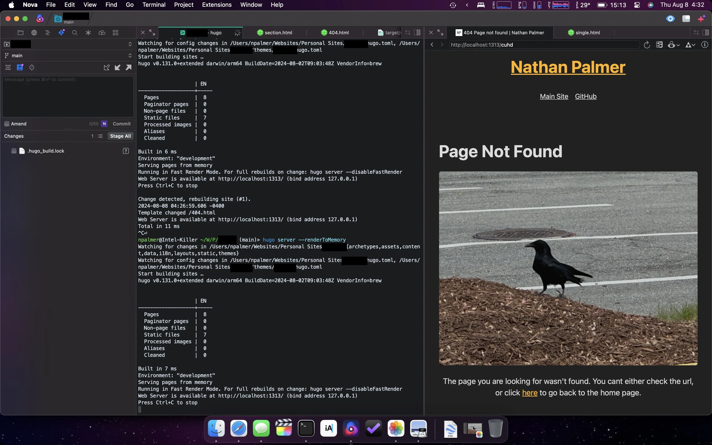

+++
title = '404 Pages'
date = 2024-08-08T14:03:00-04:00
draft = false
subtitle = "They best be odd"
tags = ['Web', 'Hugo']
+++

I wanted to flesh out one of my other sites. Add some more pages to add context to things on it. With the site being a hand written HTML file, adding more pages would be a slight pain. Nothing crazy, that's how I did [FartMail.me](https://github.com/nathnp/fartmail.github.io). But that's a joke site, this site needs future maintainability, and a hand written site would be a much bigger pain down the line. So I converted it to Hugo.

## 2AM Hugo

---

Firing up some eurobeat, I got to work. I thought this was going to be a real pain, while it was work, it wasn't that bad. I tend to think Hugo is a massive pain, probably because my main site has a number of “fancy” Hugo functions that I’ve written.

Working on the conversion made me realize how much I’ve slow burned learned Hugo from working on this site.

## 404 - Bird Not Found

---

While doing the site conversion, and adding more pages, I took the time to make a 404 pages.

I feel like a good 404 page needs an odd photo. [This site](/404) has one, same with [FartMail](https://fartmail.me/404), so I needed one for the site I was working on.

I ended up going with a picture of a crow that I took. Sure that site is meant to be more professional, but is it a 404 pages if it isn’t a little odd?

<figure>
	
</figure>