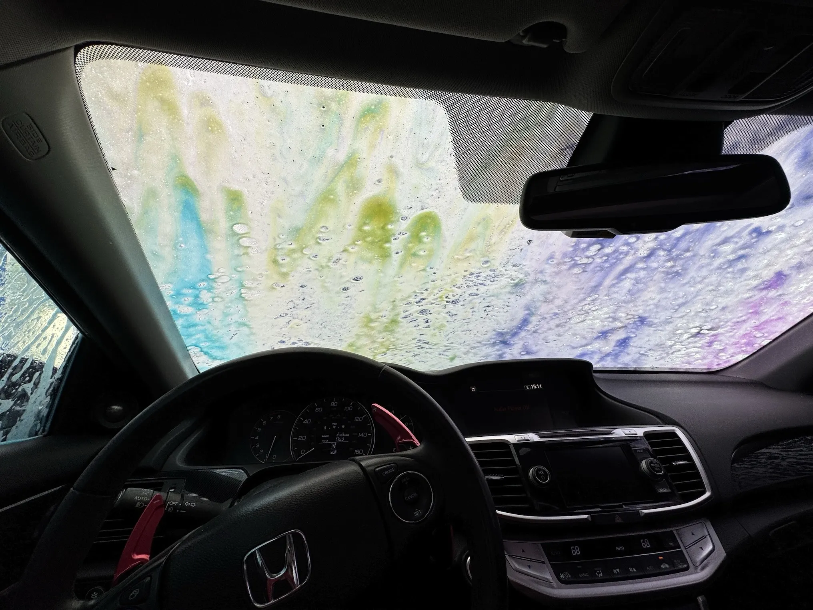
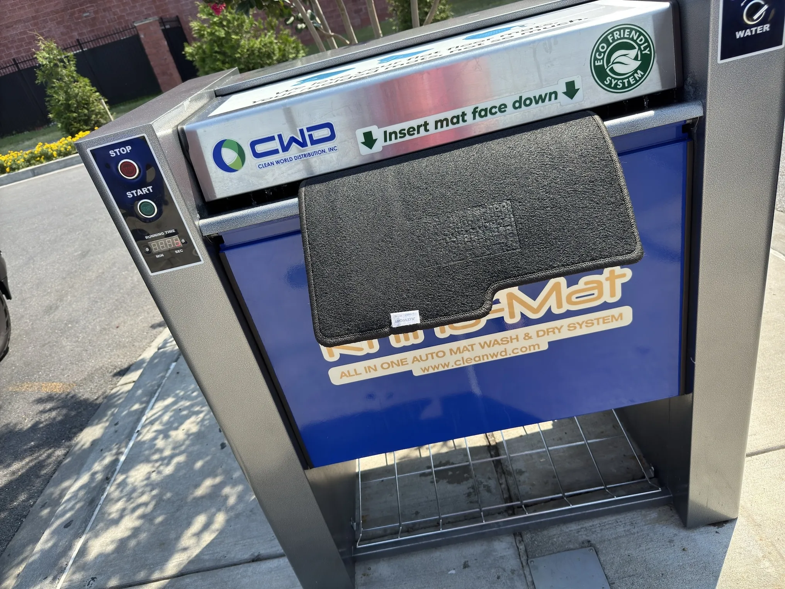
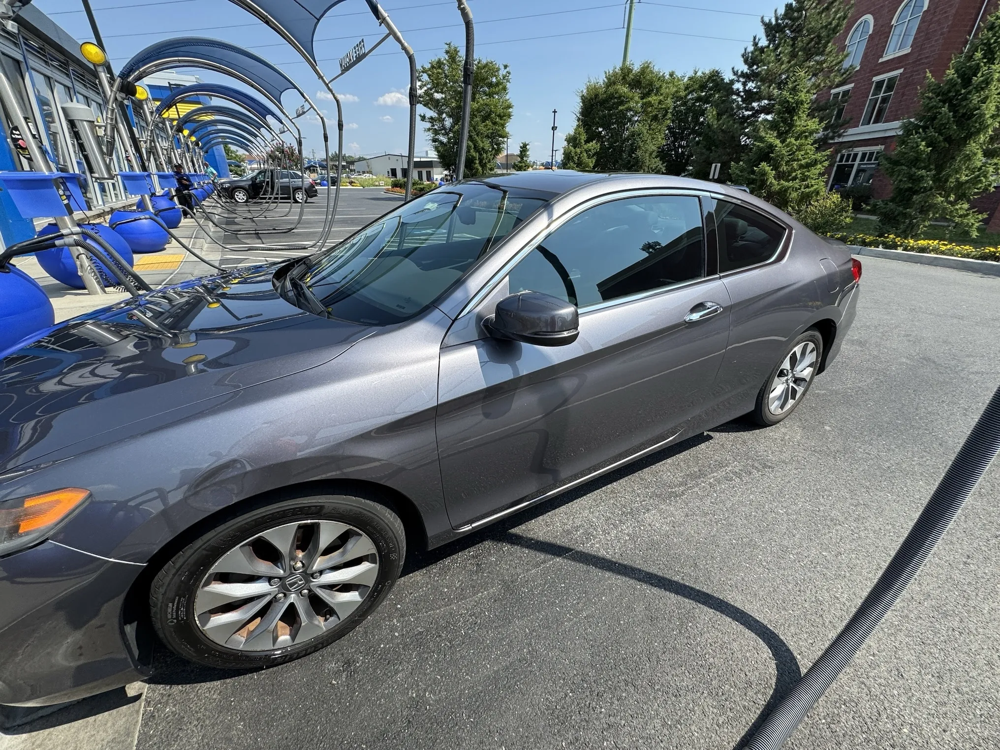

+++
title = 'A Clean Car'
date = 2024-08-05T16:31:00-04:00
draft = false
subtitle = "I like it shinny"
tags = ['My Car']
+++

It’s a bright, sunny, 92°F day outside. Might as well get the car nice and clean.

## Car Bath Time

---

After nice drive[^1] through the local national park, I pulled in to the Auto Spa. After tossing some money at them, and putting my car onto the moving belt. I was in.

<figure>
	
</figure>

After the main wash, I pulled around to hit the vacuums, and mat washer. I made the decision to keep the car (and A/C) running what I was doing all this, I’m glad I did[^2].

<figure>
	
</figure>

There’s nothing like a freshly cleaned car. And hearing an Auto Spa employee yell at someone because they didn’t put their car in neutral, and almost hit the car in front of them. Dude slammed that E-Stop button.

<figure>
	
</figure>

[^1]: Other than my car complaining about an overheating forward camera.
[^2]: Yes, I locked the doors when I walked away.