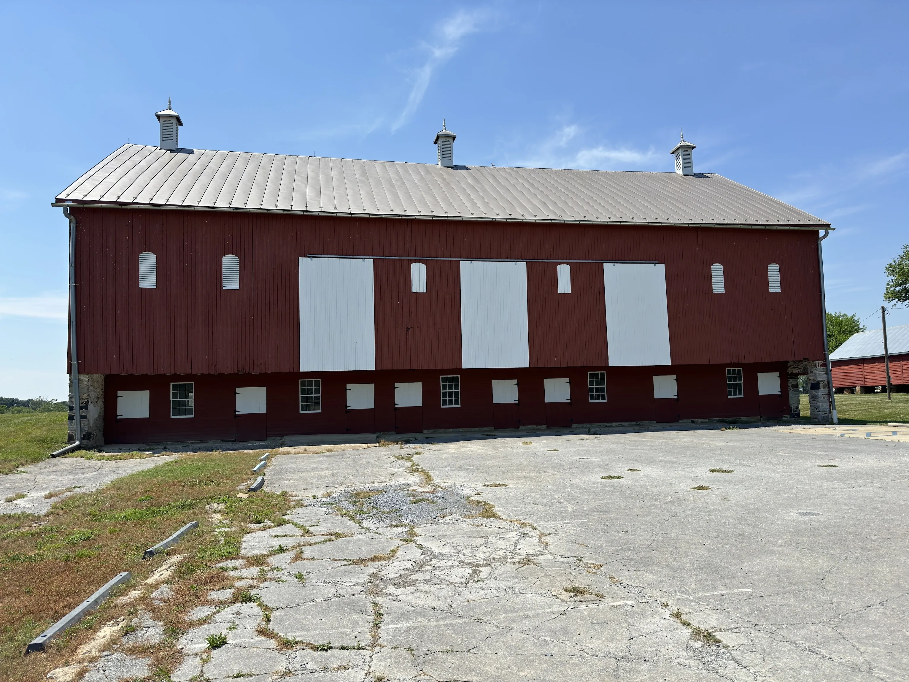
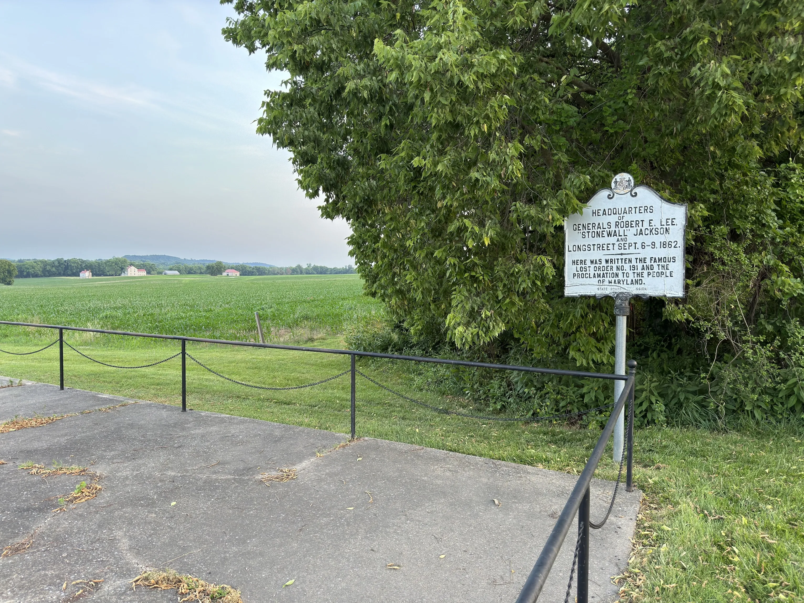
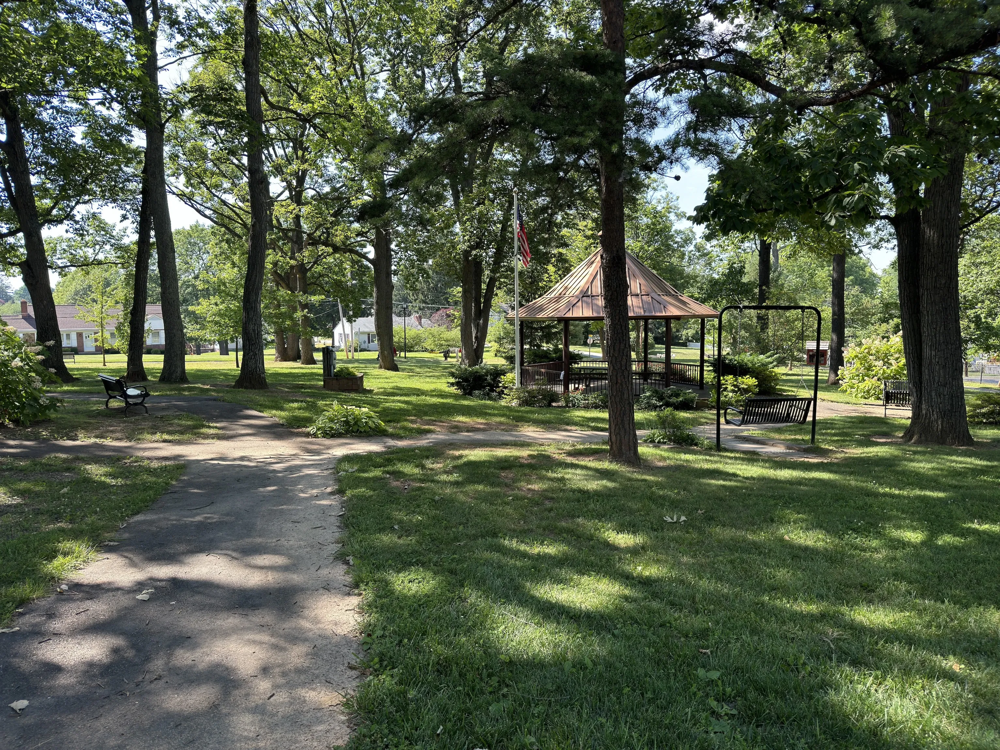

+++
title = 'A Few Days in the Sun'
date = 2024-06-23T10:26:00-04:00
draft = false
subtitle = "UV radiation be damned"
tags = ['Geocaching']
+++

With the angry sun in the sky, 90+ degrees, and high UV. Summer is starting early. So let's go outside.

<h2>Time to Find Some Logbooks</h2>

Looking at the map in iCaching, I picked out a few geocaches to hit. Some big, some [tiny](https://shop.geocaching.com/default/geocaching-supplies/cache-containers/bison-black-manga-nano-cache-container.html). With the coordinates in hand, I headed off.

<figure>
	
</figure>

My first cache brought me to this old barn in a National park. This started off stressful though, as a  [wasp](https://www.youtube.com/watch?v=EVCrmXW6-Pk) was trying to get into my car. After some quick thinking, I closed the window. The only question was, would it close in time.

As the window moved closer to the fully upright and locked position. The wasp moved closer, and closer. Right at the last possibly second, the window closed. Trapping the wasp between it, and the door frame.

I knew this one was going to nasty. As the last posted log stated the thing was covered in dead worms. That doesn't really bug me, but I packed gloved just in case. And I'm glad I did. As it was covered in bird poop... Great.

<figure>
	
	<figcaption>A sign about the "<a href="https://en.wikipedia.org/wiki/Special_Order_191">lost order 191</a>", which allowed the union army to intercept the confederates in Maryland.</figcaption>
</figure>

The next day, I made my way to a different part of the same National park. Here, a sign marks the spot where [order 191](https://en.wikipedia.org/wiki/Special_Order_191) was found.

I know it doesn't look like it, but the cache is visible in the photo. and no, I'm not going to tell you where it is.

<figure>
	
</figure>

The last cache I went after, was in this nice little park. Nothing fancy about the cache, though it was tucked away in an old Eagle Scout project. As a former Scout and Arrowmen myself, I really liked that.

The sun was pretty not fun with these. But that's what I get for going outside right now.