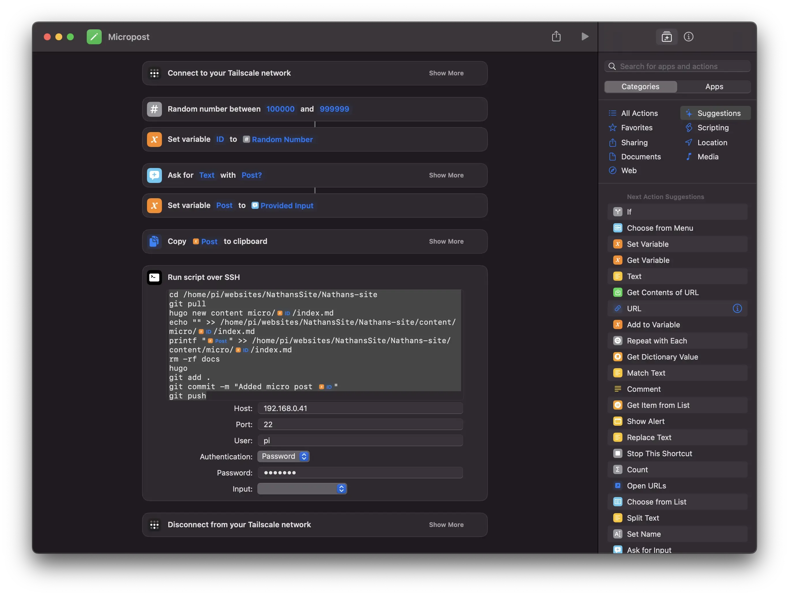

+++
title = 'Adding Micro Posts'
date = 2024-05-26T12:25:00-04:00
draft = false
subtitle = "So tiny"
tags = ['Web', 'Hugo']
+++

With me being on a social media break. I still wanted to have some kind of micro blog going. Mostly because it's pretty fun to look back on. I wanted it to be on here, but I needed an easy way to post from my phone.

<h2>Phone Posts</h2>
<hr>

Posting from my phone is kinda hard. Every post on this site starts out as a mark down file. The website you see here, gets generated on my mac, then set to my host. That's kinda hard to do on a phone.

So I don't. Yes The micro post gets written on my phone, but it's sent off to a server, that does the rest. That server, is a Raspberry Pi 5, on my home network.

So, how  do I tell the Pi what to do? Simple, a shortcut. 

<figure>
	
	<figcaption>The shortcut</figcaption>
</figure>

First thing it does, is VPN back to my home network, then it creates a random post id, asks for the post content, then passes that to a bash script that runs over ssh.

```BASH
#ID is a shorcuts var
#Post is also a shortcuts var

cd /home/pi/websites/NathansSite/Nathans-site
git pull
hugo new content micro/ID/index.md
echo "" >> /home/pi/websites/NathansSite/Nathans-site/content/micro/ID/index.md
printf "Post" >> /home/pi/websites/NathansSite/Nathans-site/content/micro/ID/index.md
rm -rf docs
hugo
git add .
git commit -m "Added micro post ID"
git push
```

This works pretty well. The only downside, is that I can't easily add a photo. I'm going with the mindset, that if it's worth a photo, it's worth a full post. If you want to check it out, its over at [/micro](/micro). It even has an RSS feed, and reply buttons.