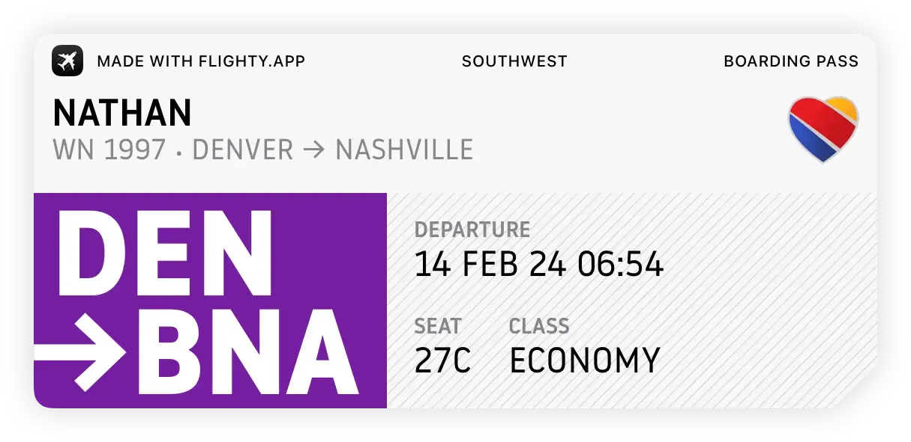
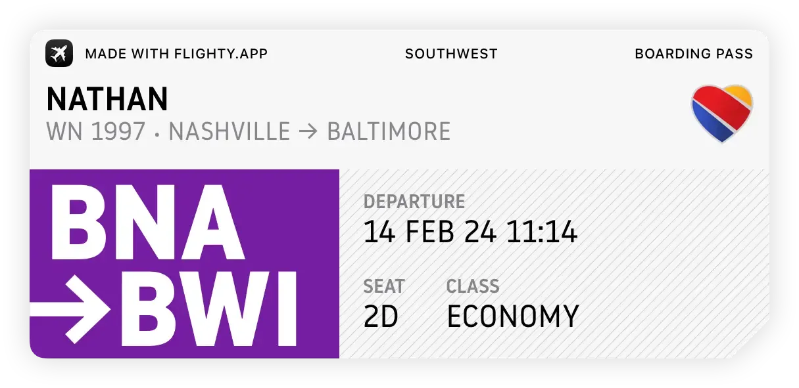

+++
title = 'Back to BWI'
date = 2024-02-14T14:42:18-05:00
draft = false
subtitle = 'Home is the crabland'
tags = ['Denver 2024', 'Vacations', 'Flying']
+++

It started with getting to the airport, and that meant getting up at 3AM

## DEN -> BNA

<figure>
	
	<figcaption>DEN -> BNA</figcaption>
</figure>

The airport was pretty quiet this morning. That made getting through TSA pretty quick. Though, at the entrance, the computer didn't like my mobile ID, and threw some alerts. The agent had me try my physical ID, and that was fine, so he let me go. Can't trust the MVA[^1] for anything.

### The Food Journey

This started when I got off the people-mover at C where my gate was. I got up to the main food court, and looked at my options[^2]. With nothing good in site, I checked a map. There was a Chick-Fil-A in B, sweet. I headed back downstairs to the people-mover, and headed off to B.

When I got to B, I headed up to the food court, excited for some good Chick-Fil-A breakfast... It was closed. Alright, most fast food places in airports open at 5AM, it was almost that time. So I whipped out my phone to double check and, it opens at 6AM... My flight boards at 6:20AM, that won't work.

I took the people-mover back to C and looked at my options. C had an Auntie Anne's, that'll work. After a long ass walk, I arrive at the pretzel place, and it was closed. This one opened at 10AM... What the hell is wrong with you DEN?

### The Flight

There's not many people on this flight, around 100/147. That means that I was able to get a whole row to myself, yay!

## BNA -> BWI

<figure>
	
	<figcaption>BNA -> BWI</figcaption>
</figure>

I do love a connection, airports are cool, and I love to explore them. However, this is the worst kind of connection[^3], the kind where I don't get off the plane. I'll take a direct flight over these. With those, I know I won't get to explore a new airport. With this connection type, I'm so close, but so far. I did however, get to move up to the very front of the plane, as you can see in the boarding pass pics.

### The Flight

This is a pretty short flight, about one hour in the air. To pass the time, I watched some plane crash documentaries, while working on this post.

[^1]: The Maryland equivalent to a DMV, they issue our physical and mobile IDs.

[^2]: Having a bite before flying is a requirement for me.

[^3]: For me, at least.