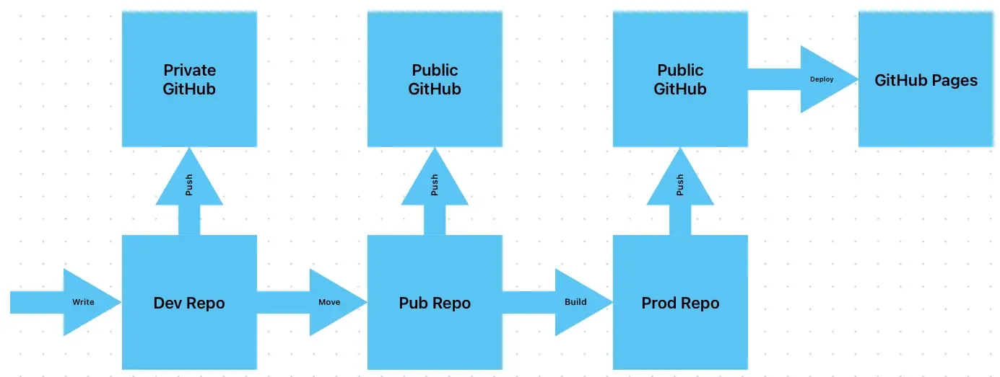

+++
title = 'Changing How I Host This Site'
date = 2024-04-18T14:27:53-04:00
draft = false
subtitle = "Reducing insanity"
tags = ['Web']
+++

I've been pretty happy with my website. The way I hosted it though, that's a different story. To be clear, I'm not changing web hosts, my frustration is all my doing. I'm just de-shitting how I use my web host.

I'm using GitHub to host my site. And the way I was hosting it was, ass. I was using three repos. A dev, pub, and prod repo. Dev is for post drafts, pub was a public repo of my Hugo[^1] project, and prod was where my built site was hosted from. This was just too much.

<figure>
	
	<figcaption>A flow chat of publishing a post</figcaption>
</figure>

So, I killed the prod repo. My site is now hosted from a folder in the pub repo. I did have to change where Hugo puts a build. This was just a simple line in my config `publishDir = 'docs'`. I just had to tell GitHub to host grab the files form the docs folder, and put my CNAME[^2] file in the static folder.

So instead of hitting build, moving the files, and pushing. I just have to build, and push. I should have done this sooner.

[^1]: What my site is made in.

[^2]: This is the URL config for GitHub Pages.