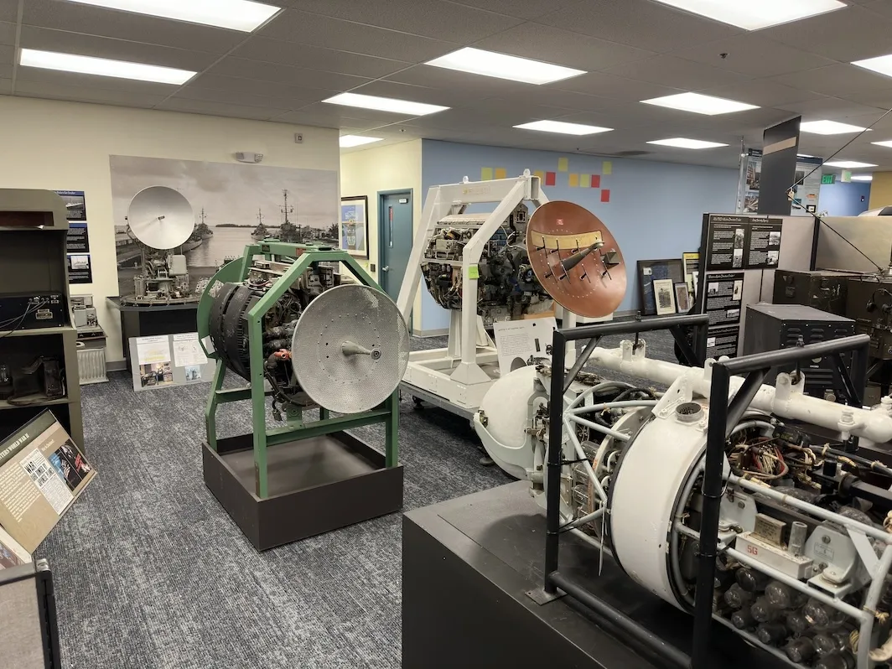
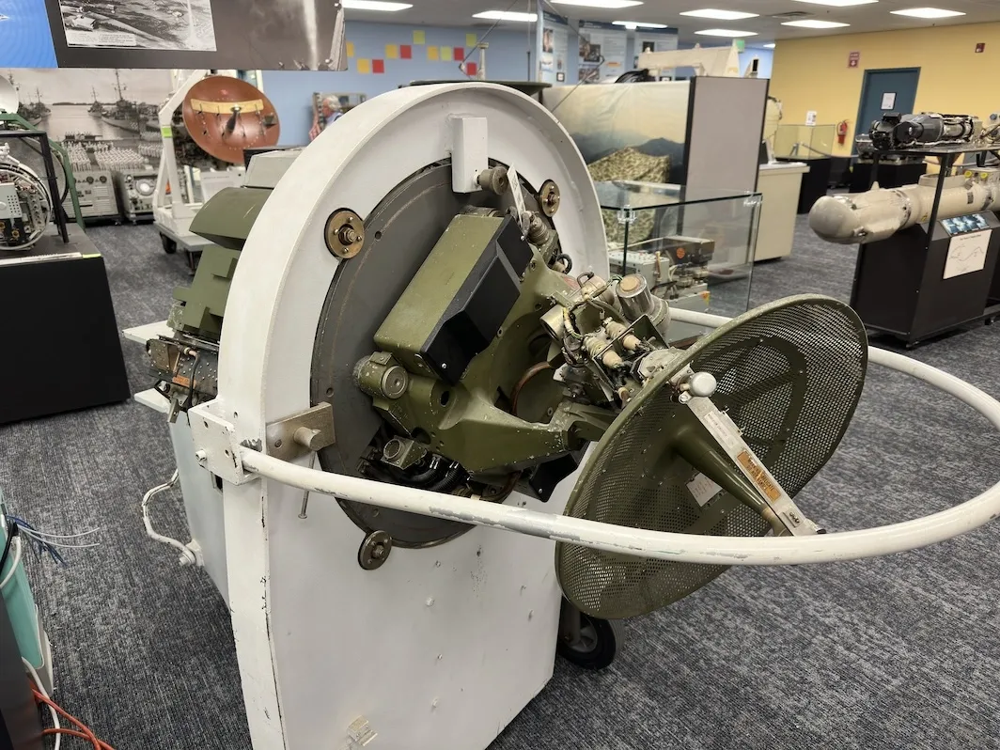
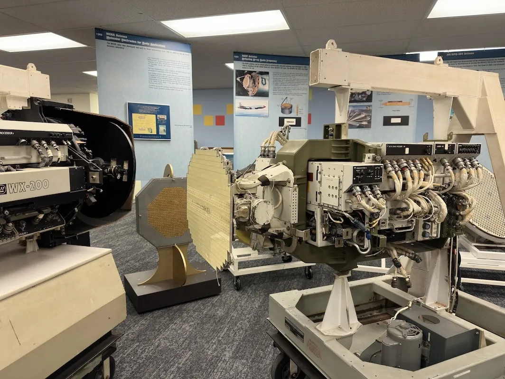

+++
title = 'Checking Out a New Museum'
date = 2024-05-18T00:12:30-04:00
draft = false
subtitle = "We're closed, please come in"
tags = ['Museums']
+++

Yesterday, I went back down to the System Source Museum in Baltimore Maryland[^1]. I already have a [post](/posts/2023/system-source-museum/) about that place. But, something new was opening up there.

<h2>National Electronics Museum</h2>

The National Electronics Museum was moving into some of the extra space at System Source. It wasn't open yet, but System Source was having an open house, so I got take a peek.

They mostly had old radio equipment, and a whole lot of radar systems. I known very little about radar. So, I'm going to have to drag my  radar nerd friend down from Colorado.

<figure>
	
</figure>

<figure>
	
</figure>

<figure>
	
</figure>

Full res images can be found on my [Flickr](https://link.nthp.me/flickr)

[^1]: Bal'mer Mer'lin