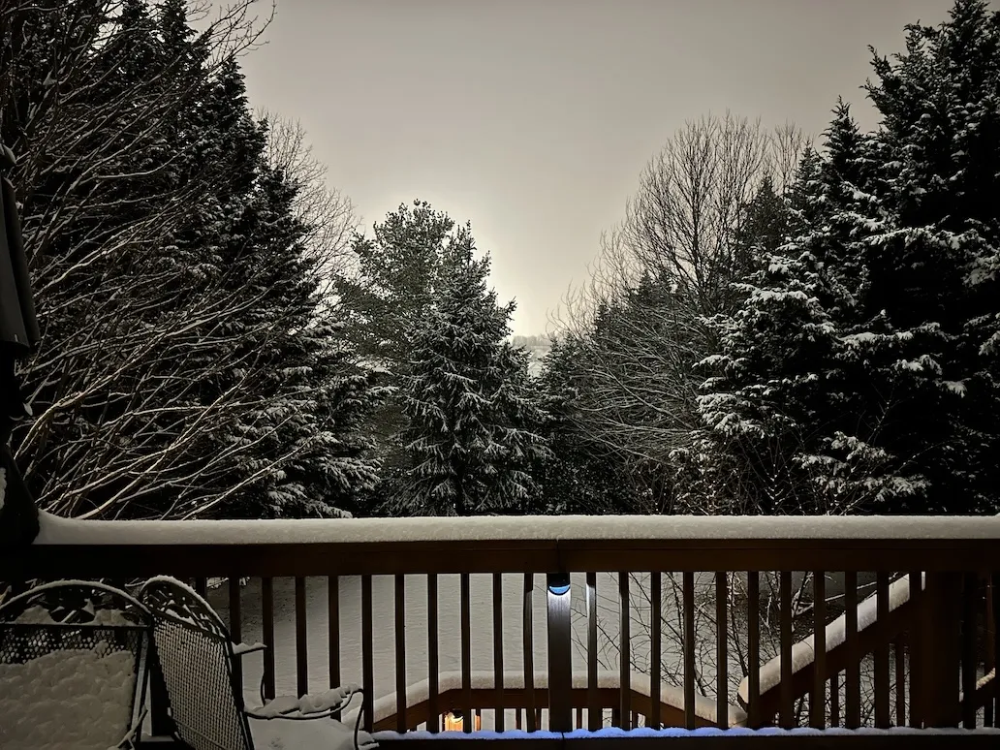

+++
title = 'Update: First Snow'
date = 2024-01-15T23:42:51-05:00
draft = false
subtitle = "There's mooooore!!!"
tags = ['Winter', 'Personal', 'Post Update']
+++

>This is an update to my last post, [First Snow](/posts/first-snow).

The snow is falling faster now.

<figure>
	
	<figcaption>More snow!!!</figcaption>
</figure>