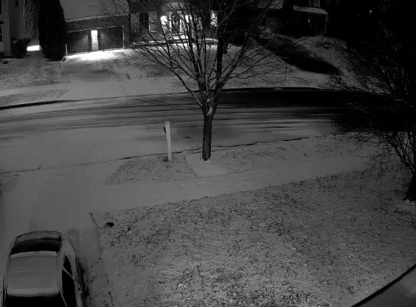

+++
title = 'First Snow'
date = 2024-01-15T19:39:58-05:00
draft = false
subtitle = 'All wheel drive into a ditch'
tags = ['Winter', 'Personal']
+++

It's that time of the year. Time to crash your car off the road!

Snow is falling in my neck of Maryland now. And while it looks nice, people don't know how to drive in it. Even though it snows every year here.

<figure>
	
	<figcaption>Snow!</figcaption>
</figure>

It also doesn't help that the county roads haven't been salted yet. The state highways are fine. Just not the neighborhood roads. Getting home from work was easy, till I got off the highway. 

Looking at the weather for the next week. The snow will probably hang around. Most here will hate that, but I love it. I've always loved the look of a snow filled sky, and covered ground. 

I also want it to stay, because I need to get skiing. My trip to Colorado is coming up soon, and I need to get in shape for those tall boi mountains. Subscribe to my [RSS](/posts/feed.xml) feed for that, as I'll be posting during the trip. You can also subscribe to just the [Denver 2024](/tags/denver-2024/) tag if you want.