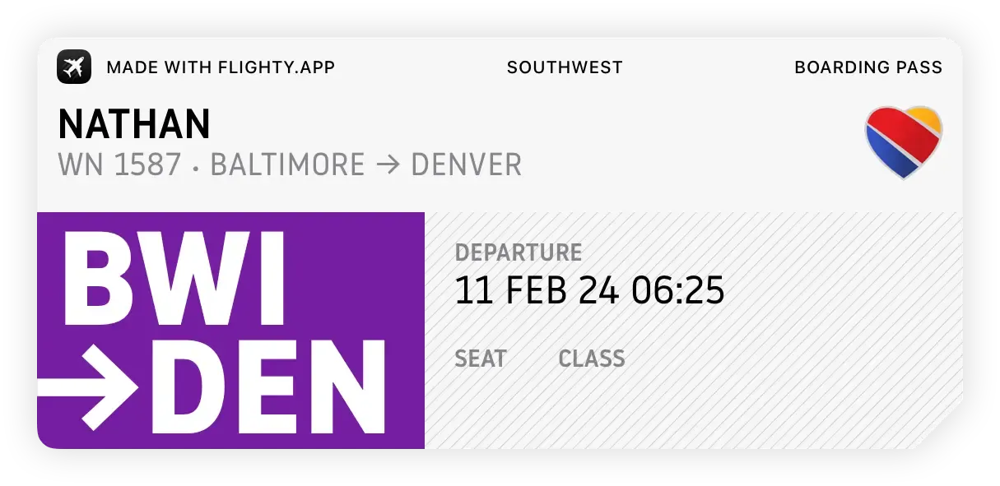

+++
title = 'Flying Back to Denver'
date = 2024-02-11T07:09:03-05:00
draft = false
subtitle = "Here we go again"
tags = ['Denver 2024', 'Vacations', 'Flying']
+++

The time has come, time go get up super early. My flight is scheduled to depart at 06:25, so that meant I had to be up at that time, yesterday. Why yesterday you might ask? Southwest is a first come, first serve seating airline. To control the chaos, they have three boarding groups. And depending on when you check in, determines you boarding group, and position. The sooner you check in, the better boarding spot you get.

<figure>
	
	<figcaption>BWI -> DEN</figcaption>
</figure>

Good ol' BWI charges to use bag carts. So I had to whole all my stuff myself. Carrying skis, polls, and boots all in one hand isn't fun. At least they were in bags. Checking them in was easy. Southwest counts a ski bag, and boot bag, as one bag. I just had to tell the kiosk what I had, and hand them off.

As of this paragraph, I'm waiting for my plane. Like the [last time](/posts/flight-update-3/) I flew to Denver. I loaded up a bunch of videos on my mac to watch. This time, I didn't just grab a ton of plane crash videos. I grabbed some other stuff.

<details><summary>Plane Crashes</summary>

```
BURSTING into flames seconds after takeoff - British Airways 268.mp4
Crashing SECONDS after Takeoff?! Singapore 006.mp4
Did Flight 1713 Pilots Miss a Crucial Step Before Takeoff?.mp4
HORRIFYING - all 4 engines FAILED! | British Airways flight 9.mp4
Two engines FALL OFF Boeing 747 moments after takeoff | El Al 1862.mp4
WHAT caused the WORST single air crash in history?? | Japan Air 123.mp4
What Netflix got WRONG - Malaysian Flight 370.mp4
What REALLY happened Korean Flight 007??.mp4
```

</details>
<details><summary>Technology Connections</summary>

```
1970's Camera Tech- How they showed you what settings to use.mp4
Flash photography used to be pretty wild.mp4
Movies made sound with a light bulb- Sound-on-film.mp4
Personal "air conditioners" aren't what they seem.mp4
Photoelectric light controls are weirder than they seem.mp4
The correcting feature of typewriters is not what I thought.mp4
This goofy fridge has a really clever design. It's also kinda terrible..mp4
```

</details>
<details><summary>Tech Tangents</summary>

```
1980 Terminal with Linux - TeleVideo 950.mp4
An Apple --- That "Just Works?".mp4
DECtalk DTC01 - 1984 Speech Synthesizer.mp4
Forgotten Before Zune - Microsoft Portable Media Center.mp4
Installing FreeDOS for 8086 on an IBM 5150.mp4
Origins of the 3.5in Floppy Disk.mp4
Printing From the Past - HP 2671G Thermal Printer.mp4
USB to ISA Card Surrounded by Issues But Still Works Well.mp4
```

</details>

## The Gate
<hr>

My Flight this time is a direct route. That's pretty boring. I love exploring airports, so having a connection is big value add for me. So not having one kinda sucks. I'm also stuck on a 737-700, one of the smaller more cramped 737s. It's almost 5AM, time to get some food.

Now that I've had some food, it's time to board. I got up at 6AM yesterday to check in on the app[^1]. I managed to score spot B2, about as good as you can get without paying. Second in line, in the second line.

## The Flight
<hr>

In the second spot, of the second line, at the second gate, in the second terminal.

Boarding and take off went smoothly, far better than my last flight to Denver. Glad I don't have to add the [air craziness](/tags/air-crazyness/) tag to this post. We'll see about my flight home. But before that, I need to ski.

[^1]: With Southwest, you have to check in to get your boarding pass. Check in starts 24h before gate departure. The sooner you check in, the better boarding position you get. Your boarding position is just you spot in line to get on the plane. Once you get on board the plane, you can take whatever seat you want.

