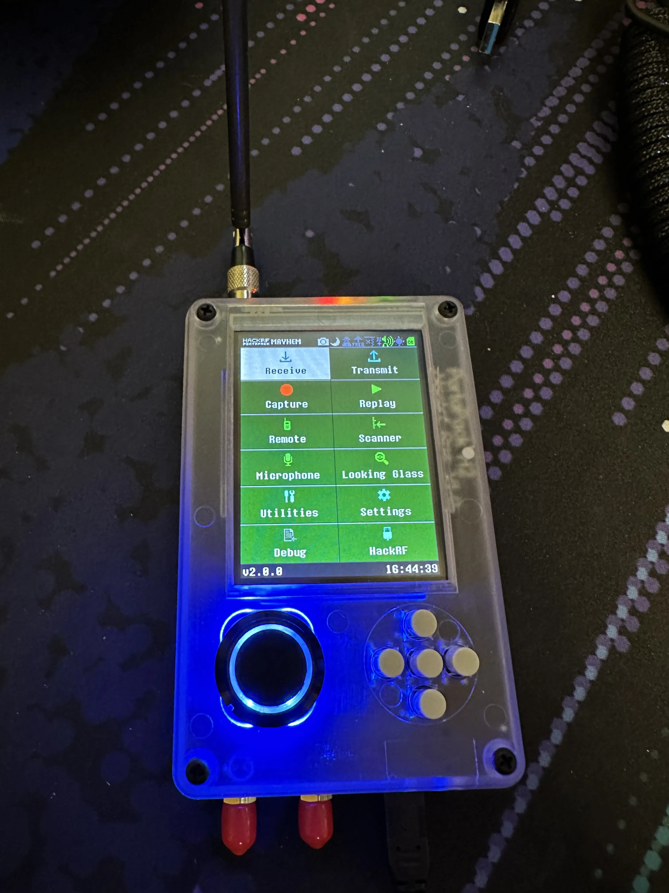

+++
title = 'Getting a Hackrf'
date = 2024-03-11T21:46:48-04:00
draft = false
subtitle = "A hacky little thing"
tags = ['hackrf']
+++

After over a week in shipping[^1]. I finally got my portapack h2 in for my hackrf one. 

<figure>
	
	<figcaption>The portapack h2 installed on a hackrf one</figcaption>
</figure>

I'm not done with this build yet. I have a battery in the mail so I don't have to be tethered to a power source. And I have an all black metal case coming in.

So far, the main things I've done with it are: receive ADS-B, and listen in on some NFM broadcasts (the little radios some businesses use). I am planing on doing more (and a longer blog post), just need that battery.

[^1]: From California to Maryland, wth USPS