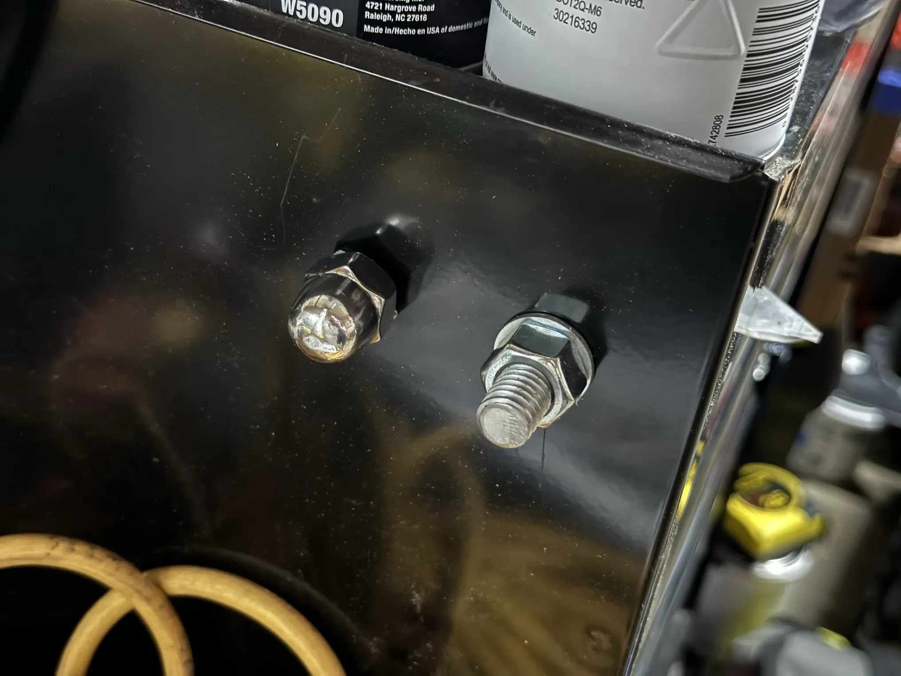
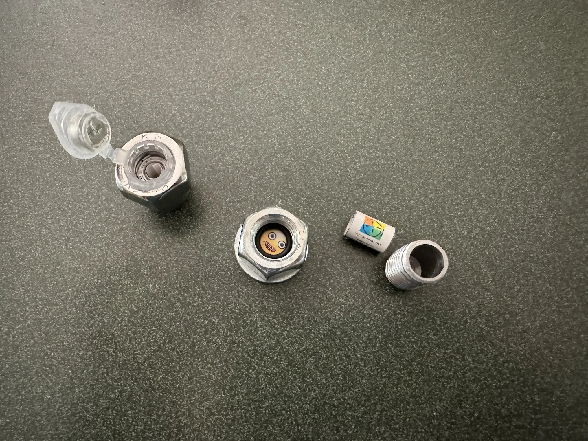

+++
title = 'Getting Evil'
date = 2024-06-24T18:35:00-04:00
draft = false
subtitle = "Nutty geocaches"
tags = ['Geocaching']
+++

<figure>
	
</figure>

I know what you're thinking. "Why are there bolts sticking out of that tool cart? And why are you posting about them?". But what if I told you, these aren't bolts. They're fake.

<h2>Blending In</h2>

These are a couple geocache containers that picked up. They're meant to blend in to their environment.

Most geocaches are going to be pretty hidden, and out of sight. Cachers expect that. These, hide in plain sight, something a lot of cachers don't expect.

<figure>
	
	<figcaption>The containers opened up</figcaption>
</figure>

These are going to be fun to hide. And I'm guessing, even more fun to read the logs on.