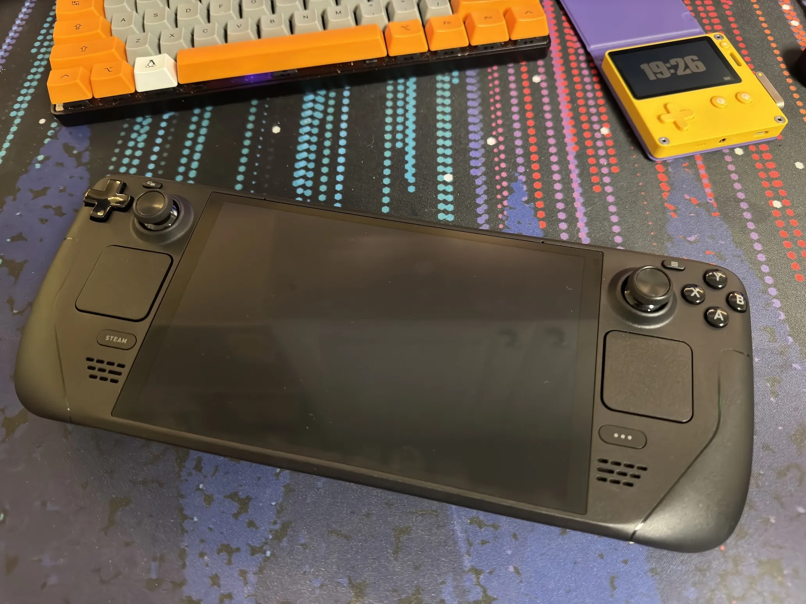

+++
title = 'Getting My Deck Back'
date = 2024-07-25T19:33:00-04:00
draft = false
subtitle = "This took a while"
tags = ['Steam Deck']
+++

After a long, painful wait, I have my Steam Deck back from Valve.

<figure>
	
	<figcaption>My Deck OLED</figcaption>
</figure>

## Is It Fixed

---

As a quick recap, I had to send in my Deck for a failing left trackpad. It would stop responding to touch a few minutes after boot up. Sometimes it would work if you applied a lot of pressure, but to get it to work normally, I'd need to reboot the Deck. It was also really loud compared to the right trackpad. After sending a message to Valve, they were pretty quick to send me a shipping label.

After a two week wait, I have my Deck back in my hands. The question is, is it fixed? Yes, yes it is. And it was a pretty painless process.

Now I can get back to driving fake trucks while on the couch.