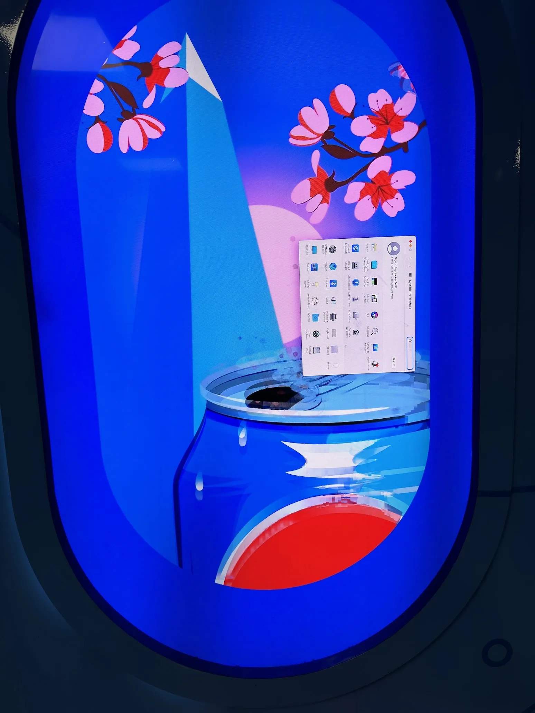

+++
title = 'Getting TSA PreCheck'
date = 2024-07-24T14:22:00-04:00
draft = false
subtitle = "Take my fingers, I don't want them any more"
tags =['Flying']
+++

A few weeks ago, I didcidid to sign up for TSA PreCheck. That way I can just slip through security at the airport. I already did the online bit, now I just had to do the airport part.

Normally with TSA PreCheck, you have to schedule an interview with a TSA agent at a major airport. This sounds like a massive pain. Luckily, I didn't have to do that part. As a CLEAR Plus member, I could do my application through CLEAR, and just show up whenever I want, no appointment. So that's what I did.

## The Airport Part

---

The lowest effort airport for me to get to was DCA. Mostly because it was a 25 minute dive to the Metro, and an almost straight shot train ride. So I headed off for DCA.

Hopping off the blue line and heading in, I got straight to work. After snapping a pic of a Pepsi sign being driven by a Mac[^1]. I first started by finishing my CLEAR enrollment. Getting my prints taken, a photo snapped, and my eyes scanned, as well as my ID. Then it was on to my PreCheck enrollment.

After looking up my application, I had my prints re-taken, this time to be sent off to TSA. Unlike with the CLEAR enrollment, they needed all of my fingers. Then they scanned my ID, and birth certificate, and took a picture of my face. I payed the fee, and now I get to wait.

It'll take 3-5 days for the background check to complete. I'm not worried about it, seeing how TSA signed off on my pilots license background check. After that, I'll just have to add my “Known Traveler Number” to my flight reservations, and it’ll be smooth flying.

---

P.S. If you’re visiting DC, take the yellow line to Virginia (or back to DC). It goes over the Potomac river, and looks fantastic.

[^1]:  I approve