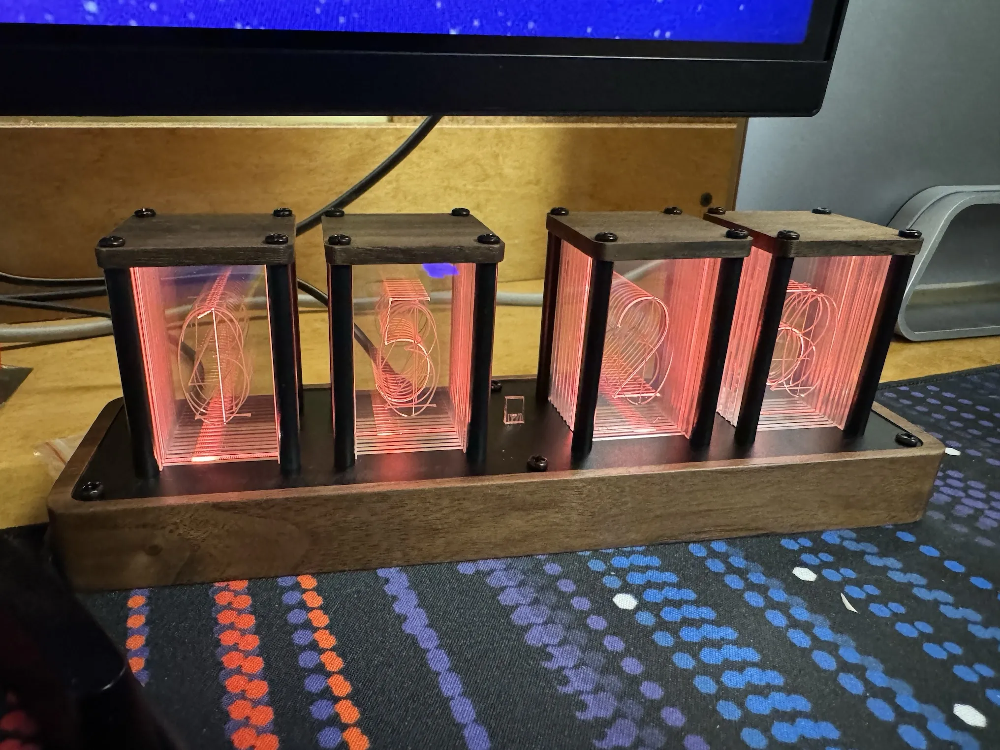

+++
title = 'Hacking My Clock'
date = 2024-07-23T17:03:00-04:00
draft = false
subtitle = "Do what I want"
tags = ['Clocks']
+++

On a whim, I picked a cool looking clock.

<figure>
	
	<figcaption>Trust me, it looks way better in person</figcaption>
</figure>

It uses layers of edge lit etched plastic to display the time. This looks really cool, and is why I picked it up. But it also lets you change the color with a web interface... a not good web interface.

## The Webpage Of A Clock

---

The clock's webpage lets you do a few things. Things like change the time zone, set lighting effects, and change the colors of the digits. The issue is, you have to use a color wheel to change the colors, no presets, no manual input. This makes it a pain to have all the number be the same. So I went digging.

After a bit of snooping in Safari, I found that the colors settings are sent as http get requests to the clock. Actually, all setting changes are set that way. If I wanted all the colors to be the same, all I have to do is bang out a few get requests.

## "Hacking" The Clock

---

After a few minutes of capturing what I needed, I through it all into a bash script.

```BASH
#!/bin/bash

curl 'http://192.168.0.237/mode?m=1&s=1'

curl 'http://192.168.0.237/tubecolor?t=1&h=9&s=100&v=100'

curl 'http://192.168.0.237/tubecolor?t=2&h=9&s=100&v=100'

curl 'http://192.168.0.237/tubecolor?t=3&h=9&s=100&v=100'

curl 'http://192.168.0.237/tubecolor?t=4&h=9&s=100&v=100'

curl 'http://192.168.0.237/tubecolor?t=5&h=9&s=100&v=100'
```

The first thing the script does, is set the clock to use a custom color, and turn off the fancy effects. Then it just goes through each LED (the t= number), and sets them to a nice shade of amber.

<figure>
	
	<figcaption>Using clock.sh to set the colors on the clock</figcaption>
</figure>

This opens the doors to doing more things with it. I could have the colors change with the weather, or really whatever I want. For now, I'm just going to leave it amber, as it looks nice.