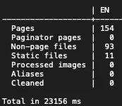
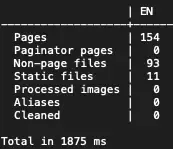
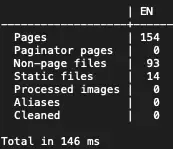

+++
title = 'Hugo on a Raspberry Pi 1'
date = 2024-04-22T20:36:42-04:00
draft = false
subtitle = "This does not taste good"
tags = ['Web', 'Hugo', 'Raspberry-Pi']
+++

I had an idea. Not too long ago, I picked up a Raspberry Pi 5. The things is pretty fast, but how does it compare to the Pi 1? How can I compare it to a Pi 1?

<h2>Hugo Time</h2>
<hr>

Why not build my site on the Pi 1, that's something I do pretty often. I just need to get Hugo on my it.

The first option you might think of, is just install it from apt. This won't work. The version in apt is 0.80.0, too old for my site. It also isn't the version installed on my Pi 5 (0.125.2), so it isn't a fair comparison.

Alright, download it from their GitHub. I tried that, it threw an `Illegal instruction` error, and died. So that wouldn't work.

Homebrew? Nope, brew on Linux doesn't support ARM.

<h2>Fine, I'll Do It Myself</h2>
<hr>

Hugo is written in Go, so I needed to install that. That wasn't that hard, just had to download Go for ARMv6 Linux, copy it to `/usr/local`, and add it to my path. Easy.

Building Hugo, was slow. Super slow. 2+ hours slow. But, it was pretty easy. I just had to run one command.
	
```BASH
CGO_ENABLED=1 go install -tags extended github.com/gohugoio/hugo@latest
```

Coming back later that day, it was done. Yay! I just had to find it. That took longer than I care to admit. In the end, it was in `~/go/bin`. Now to use it.

<h2>Building My Site</h2>
<hr>

After cloning down my site's [repo](https://github.com/nathnp/Nathans-site), I copied my new Hugo binary over, and ran it. Now, before I say how long it took, let's go over how long my other computers take.

My main computer (M1 MacBookPro), takes about 150ms. The Pi 5, takes about 1870ms. The Pi one on the other hand. 23156ms. That's over 23 seconds.

<details><summary>Results</summary>
<center>
<figure>
	
	<figcaption>Hugo output from the Pi 1</figcaption>
</figure>
<figure>
	
	<figcaption>Hugo output from the Pi 5</figcaption>
</figure>
<figure>
	
	<figcaption>Hugo output from my mac</figcaption>
</figure>
</center>
</details>

That was with the Pi 1 at the stock 700MHz clock speed. Overclocking it to 1GHz drops the build time to 13 seconds. Still pretty slow, but much faster.

Was this worth the time, hell no. Was it fun, yeah. And for some extra fun, this site build[^1] was built on the Pi 1.

[^1]: As of this post being posted.
