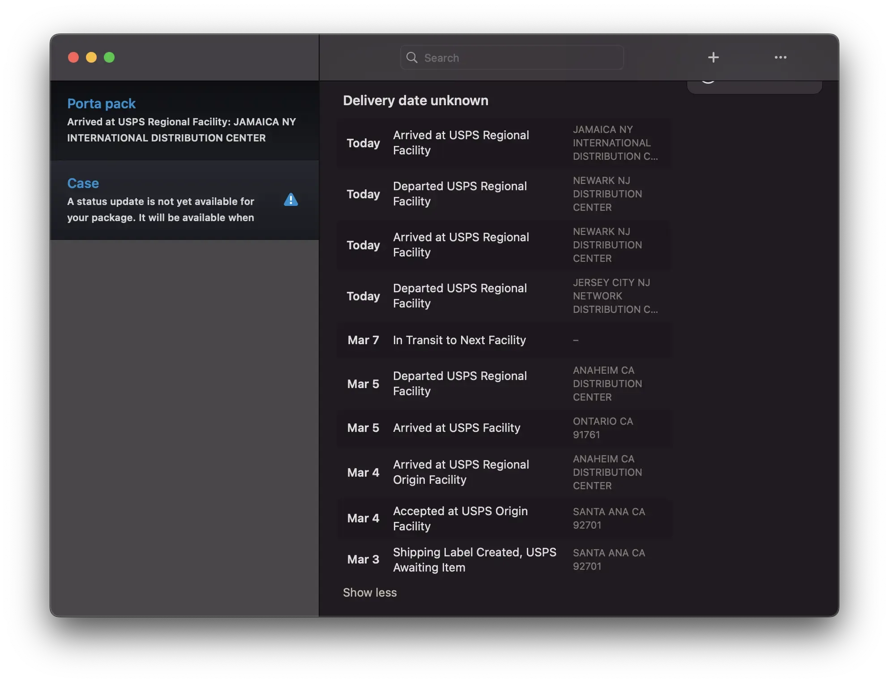

+++
title = 'Hurry Up USPS'
date = 2024-03-08T12:59:14-05:00
draft = false
subtitle = "Where's my stuff?"
tags = ['hackrf', 'Rant']
+++

A about a week ago, I picked up a Hackrf One. And this thing is cool. I won't go into what it can do here (hoping to do another post about it). At the same time, I also ordered a portapack h2. The portapack basically allows the hackrf to drive itself, without the need of a computer.

The issue is, I need it to show up.

<figure>
	
	<figcaption>Shipment history</figcaption>
</figure>

At least its getting closer. New York isn't too far from Maryland.