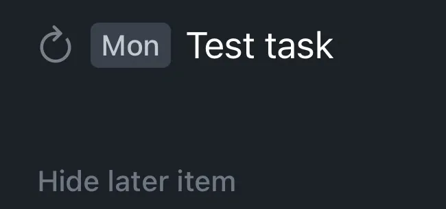

+++
title = 'I Need a Task Manager'
date = 2024-06-05T16:12:00-04:00
draft = false
subtitle = "It's over due"
tags = ['Thoughts', 'OmniFocus']
+++

I missed an important task. Like, an important one. One, I've never missed, and one I can't miss again. I need to fix that.

<h2>A Task Manager</h2>

I need a task manager. Something to help me keep track of what needs to get done, and what has been done. Looking around at the market, I really had four options.

- [Apple Reminders](https://support.apple.com/guide/reminders/welcome/mac)

- [Things 3](https://culturedcode.com/things/)

- [Todoist](https://todoist.com)

- [OmniFocus 4](https://www.omnigroup.com/omnifocus)

Looking at these four, they each had things I liked. Apple reminders is free. Things 3 has a great design, and the ability to sort tasks for due "today", and this evening. Todoist has natural language processing to make tasks. And OmniFocus is super configurable. But, each has their downsides.

Apple reminders is pretty limited with what you can do this it. As it's more of a reminder program, vs a task manager.

Things 3 had a hard deal breaker. If you set a task as repeating, you can't complete the task early. Seeing how I'm going to be tracking if I've made bill payments, that a hard no for me.

<figure>
	
	<figcaption>I have to wait till the 10th to mark this task off</figcaption>
</figure>

Todoist had a lot to like. It's workflow fits what I was looking for pretty well. With natural language processing, and location reminders. However, it's subscription only. $48/year isn't the worst, not by a long shot. But I really don't like renting software, unless I have to. I also wasn't the biggest on their [privacy policy](https://doist.com/privacy). Its not bad, but I would prefer more.

OmniFocus is powerful. And that's also its downside. It can take a while to learn how it works, and how to use it. And until you learn it, it can feel like your fighting with it. Unlike Todoist, there isn't any natural language processing, but all of your data is stored locally. With options with sync through Omni's service, or via your own server[^1]. There is a subscription option. Or, you can just buy a license for that major version.

<h2>The Choice</h2>

After playing around with the options. I ended up going with OmniFocus 4. Yeah it doesn't have the natural language processing, but it makes up for that. The E2EE, local database, the ability to not have a task show up until a specified date, far better location reminders[^2], and the fact that I had the option to not rent it.

Yeah it wasn't cheep, but I did find an old OmniFocus 3 pro for iPhone license I had, from a very long time ago. So I was able to get that sweet upgrade discount. Thankfully they moved to a new unified license system. So while that old one was only for the iPhone version, upgrading it got me the everything.

[^1]: You can even set your own end to end encryption key.

[^2]: In Todoist, location reminders are per task, so if you want five tasks to pop up with you get somewhere, you have to add that location to each task. In OmniFocus, it's per tag. So if I want five tasks to pop up when I get to IAD or BWI, I just have to make a tag with that location tied to it, that add the one tag to those tasks. Way better.