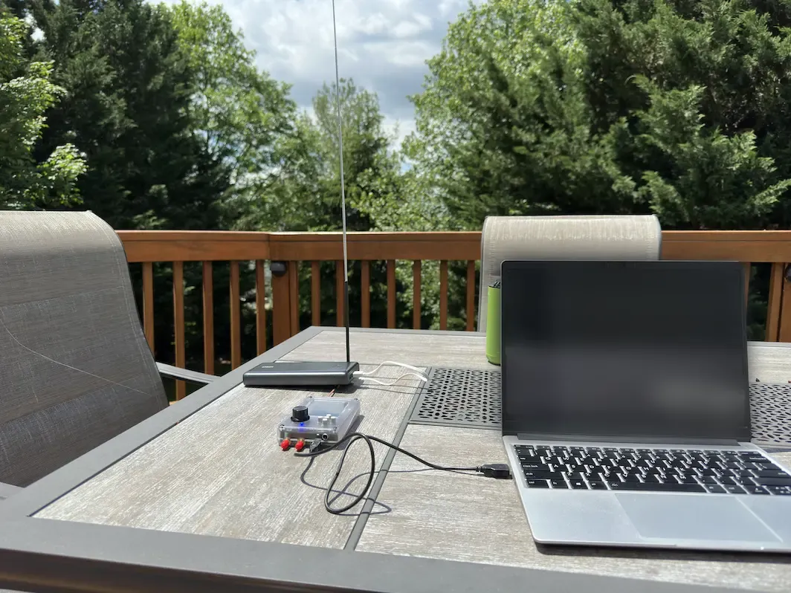
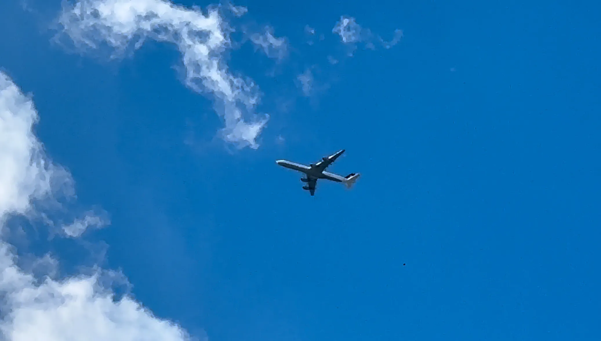

+++
title = 'I See You Mr Plane'
date = 2024-05-16T14:28:50-04:00
draft = false
subtitle = "And I can hear you screaming"
tags = ['Hackrf', 'Plane Spotting']
+++

It's a nice day out, let's go plane spotting.

<h2>I Can Hear You Scream</h2>

As a big fan of planes, I have a [Flightradar24](https://www.flightradar24.com) subscription. Flightradar lets you see aircraft stats and live locations on the web. They can do that because planes broadcast all this information. People capture it, and stream it to Flightradar. That's cool and all[^1], but I want to capture this data myself.

The set up I used for this, was my laptop doing the decoding, a Hackrf One as my software defined radio, and a 20db amp to make the signal more stronk.

<figure>
	
	<figcaption>Laptop running SDRangel with radio stuff hooked up</figcaption>
</figure>

This setup worked pretty well. I was picking up the aircraft long before I was able to see them. I need to do this again, just with less trees and houses to block the signal. And maybe a better camera.

<figure>
	
	<figcaption>A340 from Germany</figcaption>
</figure>

[^1]: It really is.