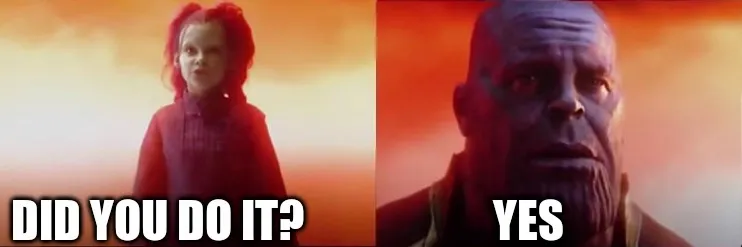

+++
title = 'It Is Done'
date = 2024-05-28T23:53:00-04:00
draft = false
subtitle = "Goodbye Mastodon"
tags = ['Mastodon']
+++

<figure>
	
</figure>

I did it. I nuked my Mastodon account. I'm not going to go over why, as I already kinda did in [another post](/posts/2024/the-network-that-isnt/). But now, it's done.

I might go back some day, but for now, I'm going to focus a lot on my blog. I have some big posts in the works, and not just the ones I talked about in my [upcoming flights](/posts/2024/upcoming-flights/) post. Yes one of them is about flying. Not about me flying, but about how flying isn't that hard, or stressful.

I'm looking forward to posting that, as I am for what this blog first mindset will bring. It will be a while before that post drops. I need to get some more airport photos. Good thing I have... seven, upcoming flights. Yay.