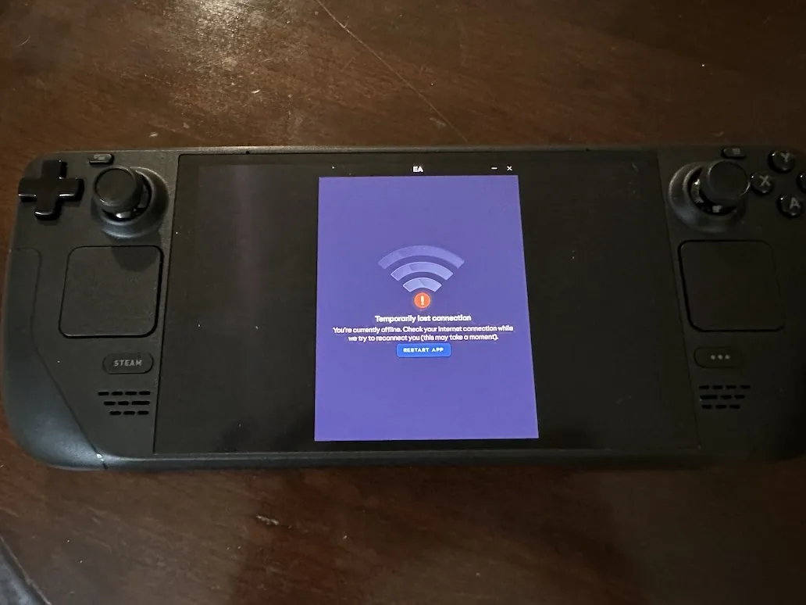
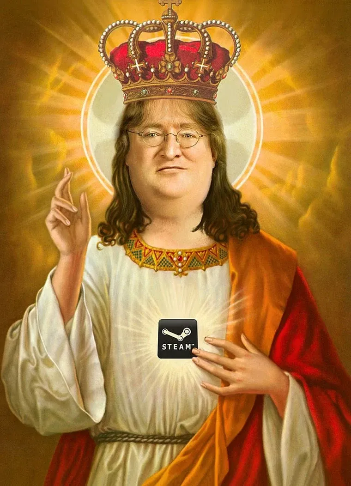

+++
title = 'Loosing What You Bought'
date = 2024-04-13T00:34:08-04:00
draft = false
subtitle = "Was it yours to start with?"
tags = ['Thoughts']
+++

Earlier today, I was watching [this video](https://www.youtube.com/watch?v=QZYy9KzFT2w). In it, Shelby goes over a number of games that can't be played anymore. Physical PC games, that you can install (even on period hardware), but can't launch. Why? Because Windows Live.

Ok, not just Windows Live, but all online activation systems. The issue is, a lot of old games, have had their activation servers shut down. So that physical copy of Red Faction Guerrilla you might have ( / own), can't run. Because it can't talk to a dead server.

Shelby also goes on for a bit about Steam. Manly, how Steam no longer runs on Windows XP. The issue he cites here, is that a physical copy of Half-Life 2, won't work on an XP computer now. However, I see Steam as a middle ground.

<h2>The Middle Ground</h2>

Steam, while it won't run on Windows XP anymore[^1]. You still have the game, and can still play it, just on newer hardware. Its part of you "forever library". That is, so long as the game doesn't have extra DRM built in.

One thing I really don't like, is when publishers shoehorn in extra DRM/launchers into their Steam games. I can't play The Sims 4 on an airplane[^2], not because the game itself needs the internet, but because the EA App launcher, needs to do an online check.

<figure>
	
	<figcaption>My Deck OLED in Airplane mode</figcaption>
</figure>

Steam has shown, over the years, to be more trustworthy, than the other options. I trust Steam, I don't trust EA, or Ubisoft, or the others. Vale has shown, that Steam is in it for the long haul. Having to upgrade every now and then to still use it, is a compromise I'm fine with making.

I'm not dreading, when Steam dies, I'm dreading, when He dies.

<h2>Lord Gaben</h2>

<figure>
	
	<figcaption>Lord Gaben</figcaption>
</figure>

Gabe Newell, the man in charge in Vale/Steam. Gabe has done a lot for PC gaming, being less a man of voice, and more a man of action. Steam helped break people free from a lot of DRM crap.

<blockquote>

The easiest way to stop piracy is not by putting anti-piracy technology to work. It’s by giving those people a service that’s better than what they’re receiving from the pirates.

<cite>- Gabe Newell</cite>

</blockquote>

Unfortunately, games are going back in that direction. Needing to sign in to an extra launcher on every launch, having to hand shake with a server, etc. Multiplayer games are one thing, but this is hitting single player games hard. And it as been, for too long.

Steam can handle pretty much all of this, and in a way that doesn't make people angry. But publisher choose, not to use those systems. They are choosing, to use solutions that won't last, that hurt the consumer both now, and down the line.

I don't fear the death of steam. I fear the death of the man at the helm.

[^1]: Some old games might not like that, but Windows compatibility settings / running the game through Proton on Linux/SteamDeck should fix that.

[^2]: Without paying for internet access.