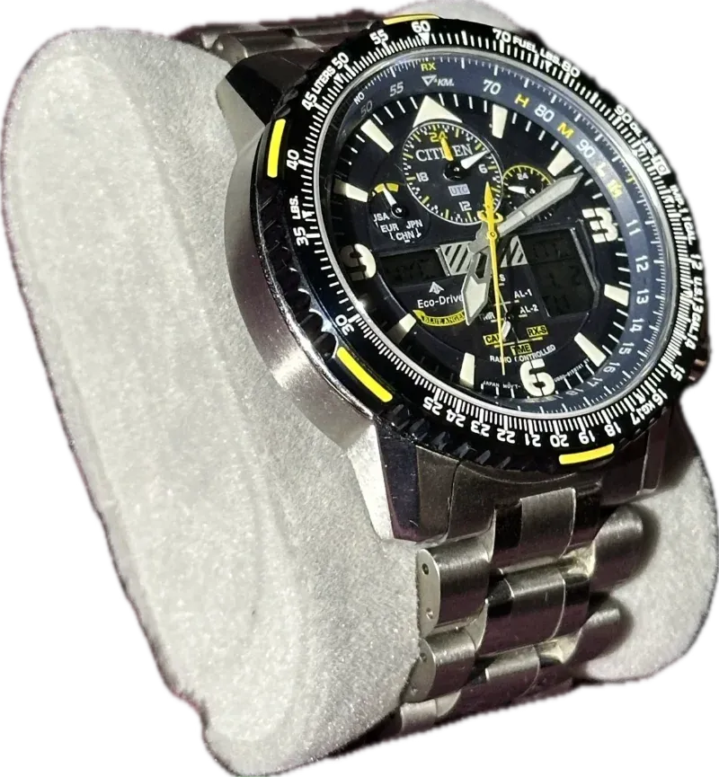
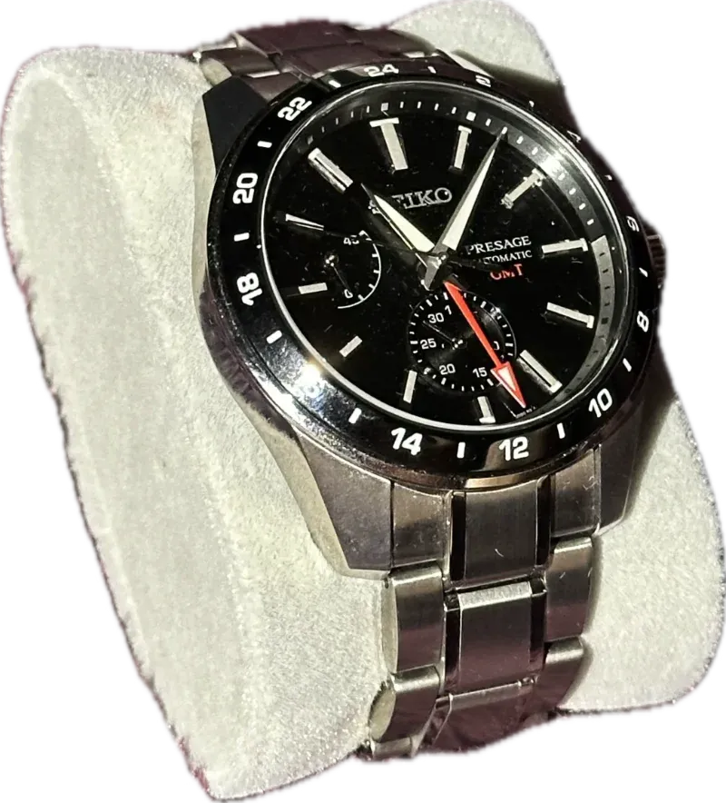
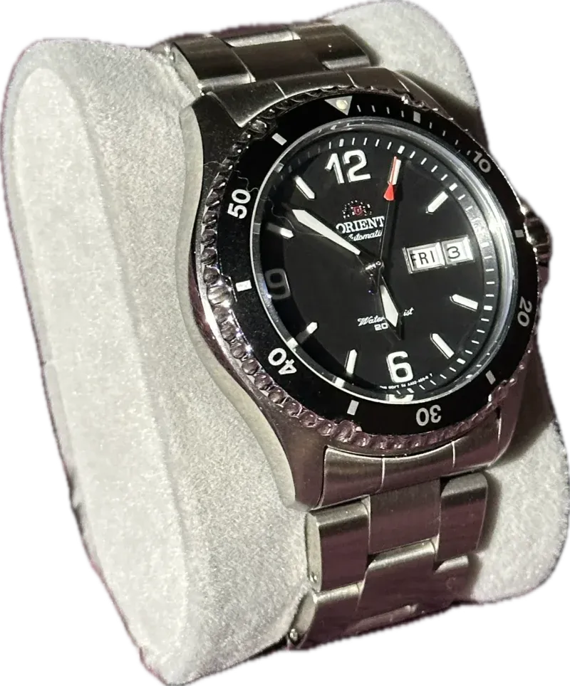
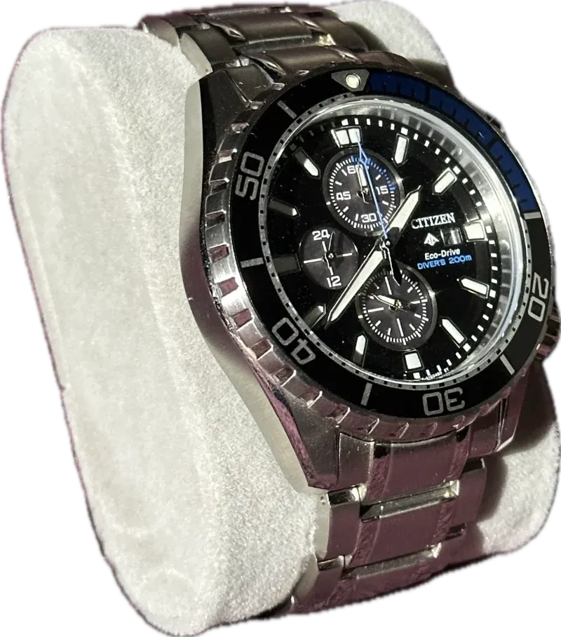
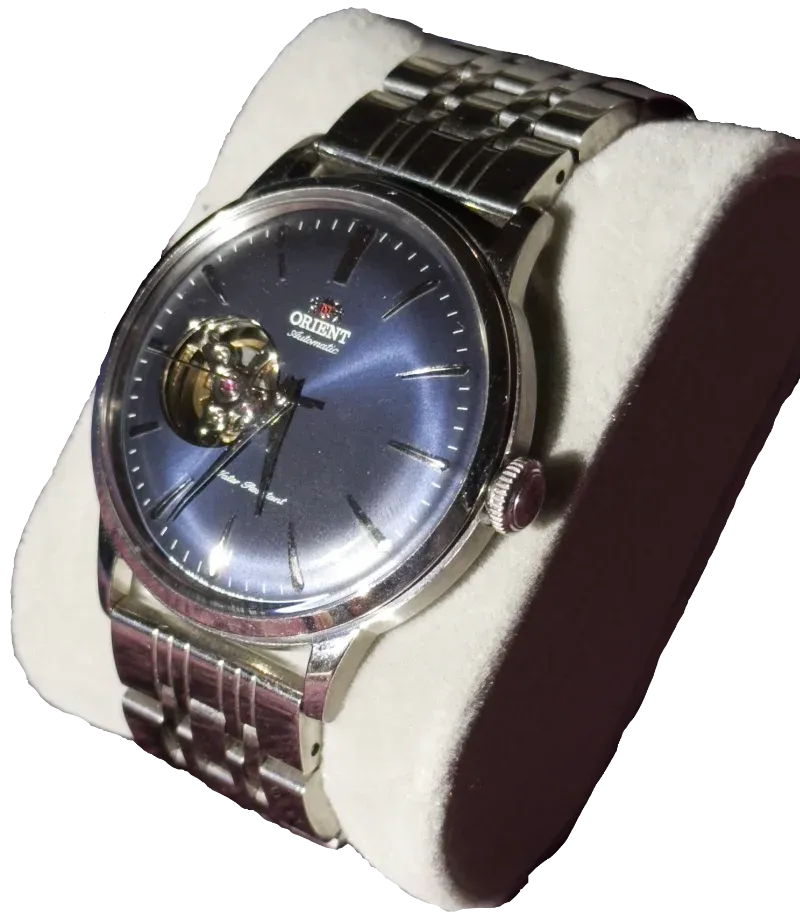
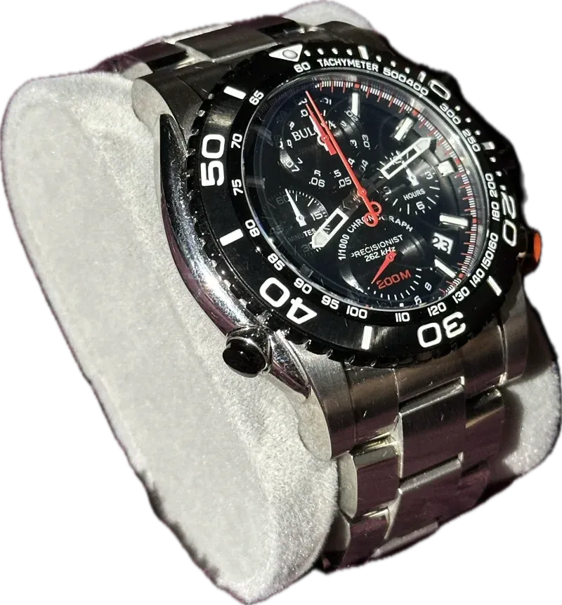
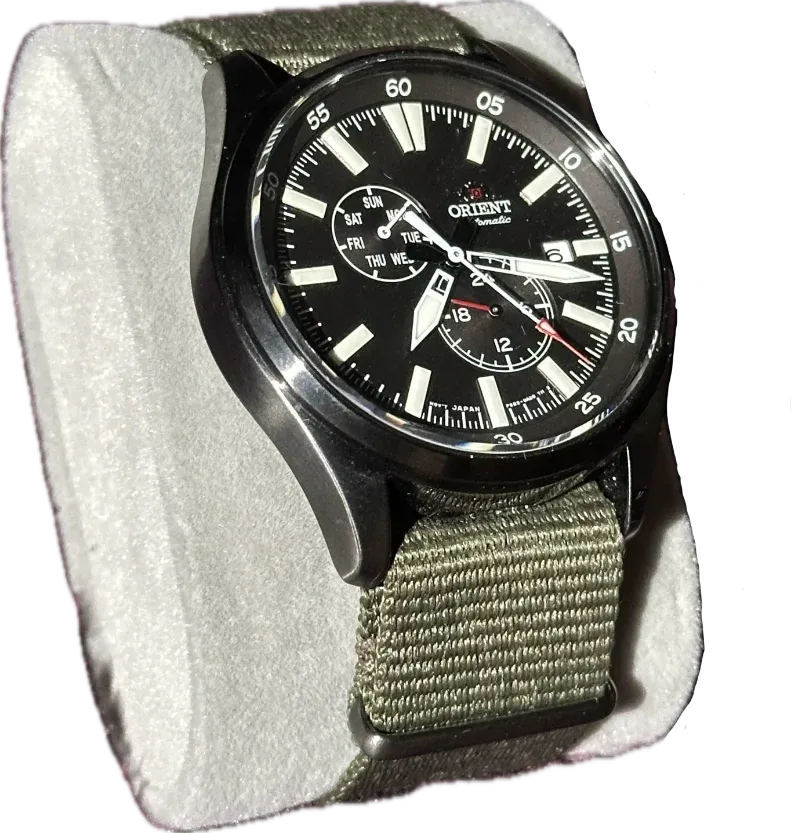
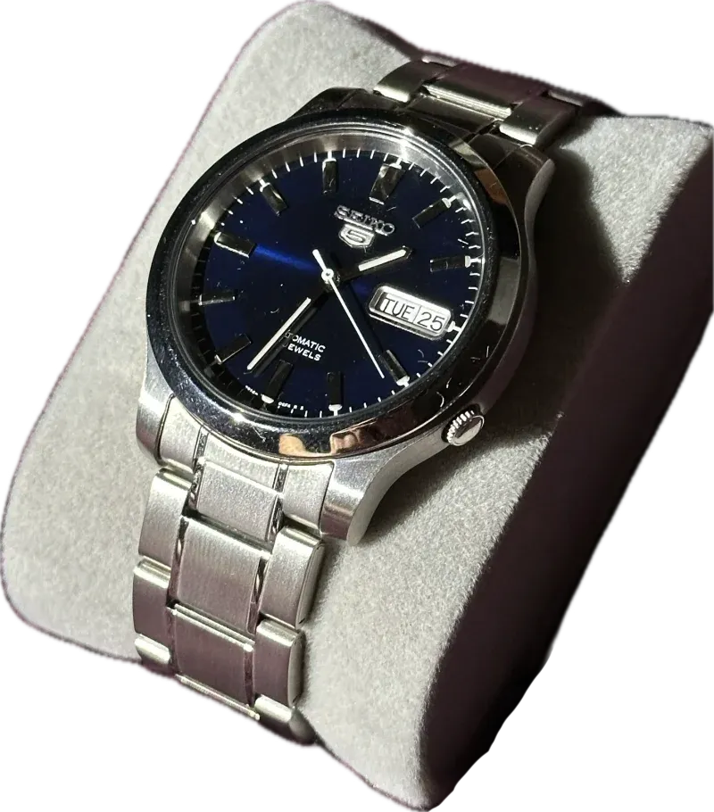

+++
title = 'My Regular Watches'
date = 2024-01-01T21:40:52-05:00
draft = false
tags = ['Watches']
+++

Not too long ago, I made a post about all the smart watches I’ve used. In that post, I said that I would make a part two, going over all of my traditional watches. Well, this is that post. (You can read part one [here](https://nthp.me/posts/2024/my-smart-watch-journey/))

I’m not going to go into why I picked up each watch. I’m just going to list each watch in my collection. 

You can click on the 🌐 emoji to go the the watch's product page. Make sure to read the footnote if there is one. They look like this -> [^6]. None of these are affiliate links.

For those who look at the prices, do what I did, and buy used. You'll save a ton if you can [^7].

<article>

# `Promaster Skyhawk A-T` [🔗](#promaster-skyhawk-a-t)

| Movement      | Solar     |
|---------------|-----------|
| Crystal       | Saphire   |
| Date          | Yes       |
| Extra feature | Self Setting Time  |

[🌐](https://www.citizenwatch.com/us/en/product/JY8078-52L.html)

</article>

<article>

# `Seiko Presage Sharp Edge GMT` [🔗](#seiko-presage-sharp-edge-gmt)

| Movement      | Automatic |
|---------------|-----------|
| Crystal       | Saphire   |
| Date          | Yes       |
| Extra feature | GMT Hand  |

[🌐](https://www.seikowatches.com/us-en/products/presage/spb221j1) [^1]

</article>

<article>

# `Orient FAA02001B9` [🔗](#orient-faa02001b9)

| Movement      | Automatic |
|---------------|-----------|
| Crystal       | Glass     |
| Date          | Yes       |

[🌐](https://www.orientwatchusa.com/collections/sport/faa02001b9)

</article>

<article>

# `Citizen Promaster Chrono Diver` [🔗](#citizen-promaster-chrono-diver)

| Movement      | Solar     |
|---------------|-----------|
| Crystal       | Glass     |
| Date          | Yes       |
| Extra feature | Chronograph  |

[🌐](https://www.citizenwatch.com/us/en/product/CA0710-58L.html?cgid=promaster) [^2]

</article>

<article>

# `Orient Bambino Open Heart` [🔗](#orient-bambino-open-heart)

| Movement      | Automatic |
|---------------|-----------|
| Crystal       | Glass     |
| Date          | No        |
| Extra feature | Open Heart  |

[🌐](https://www.orientwatchusa.com/collections/orient-bambino/ra-ag0005l10a) [^3]

</article>

<article>

# `Bulova 98B212` [🔗](#bulova-98b212)

| Movement      | Quartz    |
|---------------|-----------|
| Crystal       | Glass     |
| Date          | Yes       |
| Extra feature | Chronograph  |

[🌐](https://www.chrono24.com/bulova/bulova-precisionist-diver-98b212--id25850021.htm) [^4]

</article>

<article>

# `Orient RA-AK0403N10A` [🔗](#orient-ra-ak0403n10a)

| Movement      | Automatic |
|---------------|-----------|
| Crystal       | Glass     |
| Date          | Yes       |
| Extra feature | 24h Hand  |

[🌐](https://www.orientwatchusa.com/collections/sport/ra-ak0403n10a)

</article>

<article>

# `SEIKO 5 SNK793` [🔗](#seiko-5-snk793)

| Movement      | Automatic |
|---------------|-----------|
| Crystal       | Glass     |
| Date          | Yes       |

[^5]

</article>

[^1]: This watch must be bought through a dealer, yes it was a pain.

[^2]: This color way looks to be discontinued. So I linked to an all blue one.

[^3]: I put a different band on mine.

[^4]: I couldn't find it on the manufacturer's site, so here's it on Chrono24. Note: you can get this for far less on eBay.

[^5]: I couldn't find it on the manufacturer's site. But you can find it for not much on eBay, and sometimes Amazon.

[^6]: Hello 👋

[^7]: These aren't watches that explode in second hand value. For some, you'll see two prices on the manufacturer's site. The crossed out one is for 3rd party sellers (like Macys). The non crossed out one is what you'll pay by buying direct.
