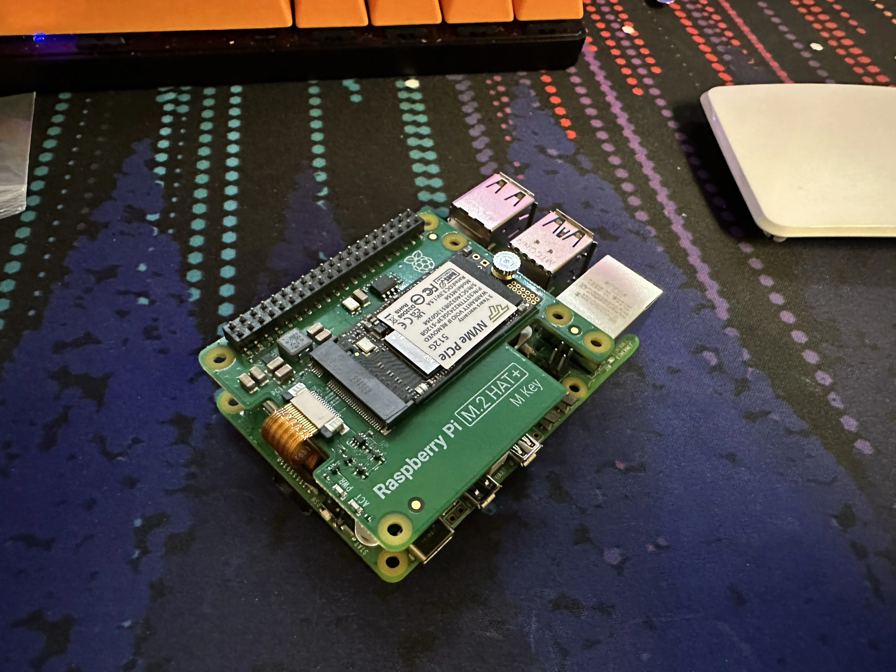
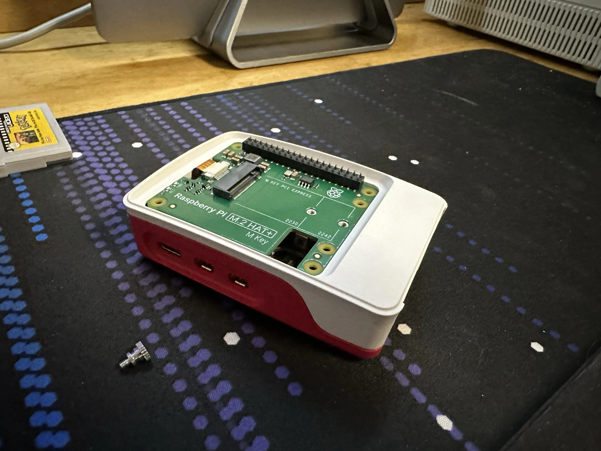

+++
title = 'NVMpie'
date = 2024-05-23T14:05:00-04:00
draft = false
subtitle = "This is some fast food"
tags = ['Raspberry-Pi']
+++

Last week-ish, Raspberry Pi released their NVMe HAT for the Pi 5. The moment I heard that it "fits in the case", I bought one.

<h2>Installing It</h2>

Have you ever pressed your hand onto a bed of nails... I have now.

My main goal was to have this whole thing in the Pi case. I found out quickly that you can't use the stand off screws that you get, if you want to do that. I ended up just using the GPIO extender to support it. That was not fun to put on.

<figure>
	
	<figcaption>SSD installed in the HAT</figcaption>
</figure>

Once I got the board installed, I chucked it in the case. And, it mostly fits. You can't put the case top on with the NVMe board installed, so it mostly fits in the case.

<figure>
	
	<figcaption>The HAT fits, just without the case top</figcaption>
</figure>

<h2>Make It Go <a href="https://www.youtube.com/watch?v=MdBd6yNalHs&pp=ygUJYTEwIGJycnJ0">BRRRR</a></h2>

Getting my PiOS install moved over was pretty easy. My first thought was to just use dd on the Pi to copy my SD card over... dd didn't like the SSD.

I ended up breaking out my Linux laptop. After waiting 30 mins for Gnome Disks to  make an image. I got my install on to the SSD. Writing that 64GB image file took a whopping, 3 minutes... [BRRRR](https://www.youtube.com/watch?v=MdBd6yNalHs&pp=ygUJYTEwIGJycnJ0).

Firing the Pi up, yeah this thing is speedy. I haven't done any benchmarks on it[^1], but reinstalling Hugo is a bit faster. The SSD also won't wear out like an SD card. I've had PiOS die in the past from an SD dying[^2].

If you have a spare NVMe SSD laying around[^3], this is a great Pi 5 upgrade. As the HAT is only $12.

[^1]: That image copy is pretty telling of the speed.

[^2]: Pi-hole log files killed it.

[^3]: It needs to be a 2230 or 2242 drive. Unless you want to get janky.