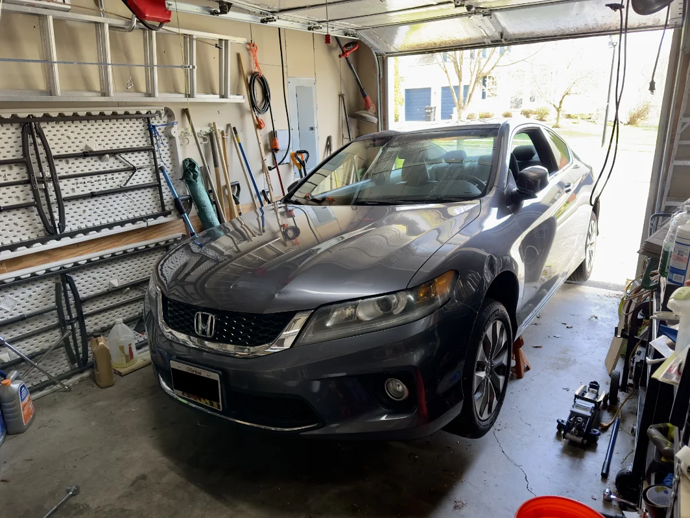

+++
title = 'Oil Time'
date = 2024-04-08T20:41:11-04:00
draft = false
subtitle = "Knock knock, it's the U.S."
tags = ['Cars']
+++

The time has come, time to take the oil out of my car, wash it, and toss it back in[^1].

<figure>
	
	<figcaption>On the jack stand</figcaption>
</figure>

I've never liked getting under my car. I don't have an issue with getting under cars, just mine. She's a low car, so I have to jack it up a fair big to squeeze myself under it, That's the part I don't like[^2].

<h2>Removing of the oil</h2>

After getting under the car, and getting the drain plug out, she was pissing oil out. That part was easy, after remembering what size socket I needed. Getting the filter off, was a different story.

Moving over to the oil filter, I put my filter wrench on. And it wouldn't fully grab. No big deal, I've had that before. After about ten minutes of banging the filter adapter on, it sill wouldn't grab... After getting out from under the car, I looked in the tool box, and realized something. The filter adapter I was trying to use, wasn't for my car. It was was for my old Civic. Oops.

Grabbing the right adapter, the filter came off real easy. Using the right tools really helps.

After getting the new filter on[^3], it was time for my favorite part under the car. Being done under the car.

<h2>Adding of the oil</h2>

With the car off of the jack stand. I dumped some oil in. After putting most of the oil in, I went to start the car for a few seconds... It wouldn't start. Turns out, the key fob needs to be in the car. You know, where it has to be for the computer to start the car.

With the rest of the oil in, and the dip stick happy, I was done. Yay!

I don't mind doing my own oil, it's cheaper, and doesn't take long. But man, I don't like working on low cars.

For anyone wondering what car I drive, she's a 2015 Honda Accord EX-L, with a 2.4L i-VTECH DOHC mated to a CVT. Super fun to drive.

[^1]: I'm joking, calm down.

[^2]: Yes, I do rest the frame onto a jack stand, as you can see in the photo.

[^3]: Yes, I put a touch of oil around the seal.