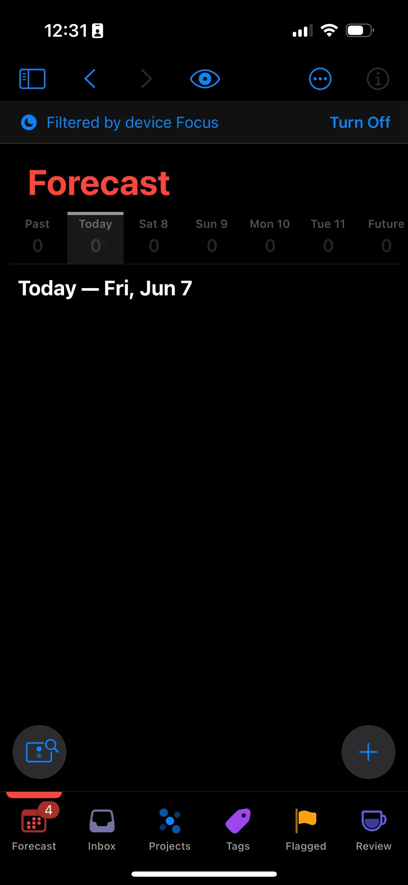
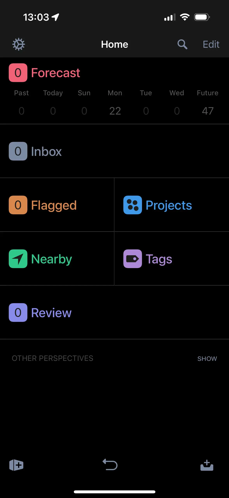

+++
title = 'Omnifocus 4 Is a Mess'
date = 2024-06-08T13:30:00-04:00
draft = false
subtitle = "This is a downgrade"
tags = ['Rant', 'Thoughts', 'Omnifocus']
+++

A couple [posts ago](/posts/2024/i-need-a-task-manager/), I talked about how I needed a task manager. That is still very true, I do. But, what I went with, was kinda a bad choice.

<h2>Omnifocus 4's Bad Design</h2>

My main complaints are with the iPhone app. Don't get me wrong, the mac app has it's issues as well, but they aren't as bad.

The layout, sucks. You have the scrolling tab bar on the bottom. That doesn't always take you to the page in the tab, that you think it will. Tapping on a task is inconsistent. Sometimes it'll expand it, other times it'll do something else.

<table class="invisTable"><thead>
  <tr>
	<td>
		<figure>
			
			<figcaption>Omnifocus 4</figcaption>
		</figure>
	</td>
	<td>
		<figure>
			
			<figcaption>Omnifocus 3</figcaption>
		</figure>
	</td>
  </tr></thead>
</table>

At first glance, OF4 looks better. But trust me, once you use it, it really isn't. But this isn't the worst part.

<h2>The Apple Watch</h2>

OF4 made some big changes to the watch app. It brought it in line with the watchOS 10 design language, and brought your database to the watch. That last change, meant you can use the watch app, away from your phone. There's just one issue. Its slow as shit.

When the watch syncs, it has to pull your database, decrypt it, and parse it. And its not fast at that. That means, the watch face complication, is practically useless. Comparing that to OF3, it didn't do all of that. Yeah that means you can't use the watch app away from your phone. But, the complication updates within two seconds of me, making a task on my phone.

<h2>So, Where To Now</h2>

I've pretty much made the decision to stop using Omnifocus 4. Its already on version 4.3, and still needs a shit ton of work. I though it was going to be fine, seeing how Omnifocus 3 was fantastic, but I was wrong. Maybe they'll fix it down the line.

Until then, I'm leaving Omnifocus, for Omnifocus. Yep, version 3 is fantastic, and my version 4 license, works on it. The layout is much better, the watch app works, and it feels polished.

This trend of releasing software, before it's ready to ship, needs to stop.