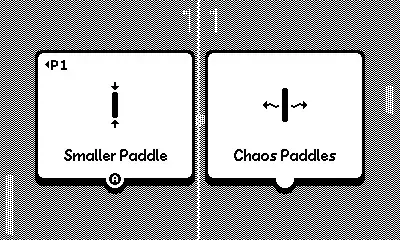
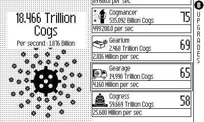
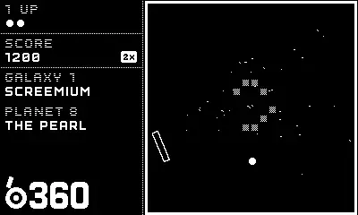
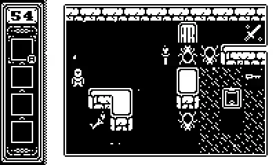

+++
title = 'Playdate With the Playdate'
date = 2024-07-23T00:21:00-04:00
draft = false
subtitle = "Waiting on my Deck"
tags = ['Playdate', 'Gaming']
+++

With my Steam Deck out for repair, I've been a little bored. Yeah KSP on my Mac, and some games on the PS5 have helped, but I've been reaching for the Playdate more. Playdate? Yep, the Playdate. If you're wondering what it is, I have a [blog post](/posts/2024/the-playdate/) about it.

In my continued boredom without my Deck, I thought I'd go over when I've been playing on it.

## The Games

---

### [Doink!](https://play.date/games/doink/)

Doink! Is a fun little pong game. Though, every time a point is scored, you have to choose a power up (or down). The longer the game goes, the more interesting it gets. The choices can get pretty hard, especially when you have to choose from a list of power downs, that only affect you.

<figure>
	
	<figcaption>Doink!</figcaption>
</figure>

### [Crank That Cog](https://elioth-games.itch.io/crank-that-clicker)

This is basically just Cookie Clicker, just on the Playdate. You crank the crank to get cogs (cookies). I've put a little too much time into this one.

<figure>
	
	<figcaption>Crank That Cog</figcaption>
</figure>

### [b360](https://play.date/games/b360/)

Think Breakout, but in a circle.

<figure>
	
	<figcaption>b360</figcaption>
</figure>

### [Icy Dungeon](https://play.date/games/icy-dungeon/)

Icy Dungeon is a simple puzzle game. With every step you take, the ground turns to slippery ice. You really need to think your path out.

I beat Icy Dungeon a while back. While scrolling through my games, I noticed that it was updated. 30 new levels were added, so I had to jump back in.

<figure>
	
	<figcaption>Icy Dungeon!</figcaption>
</figure>