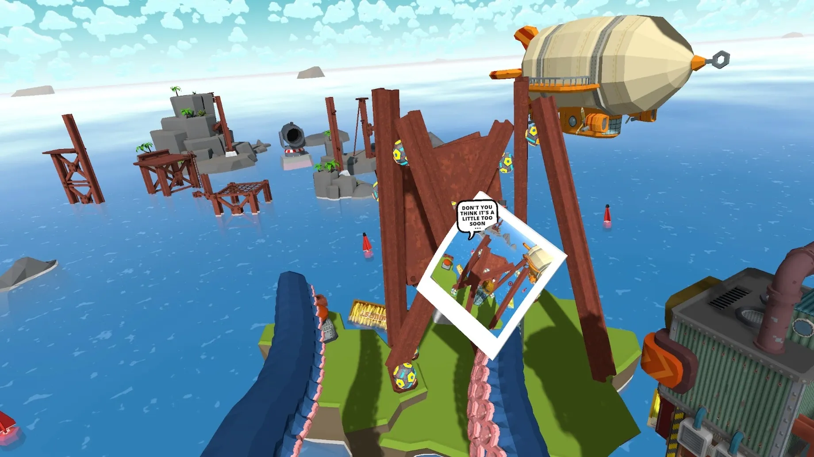
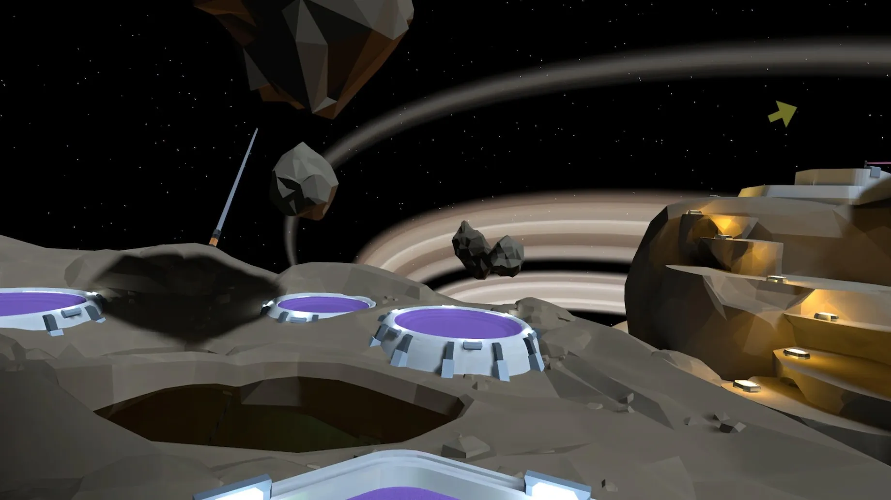
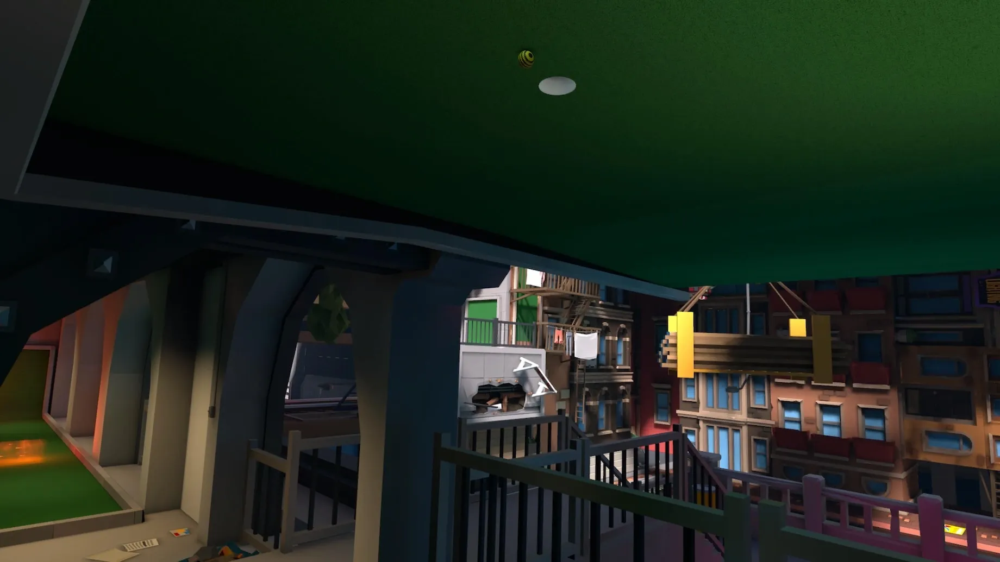
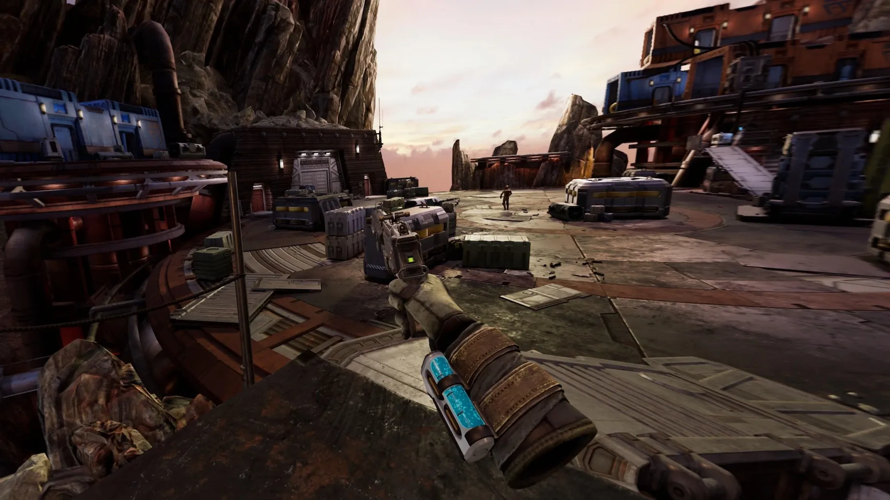
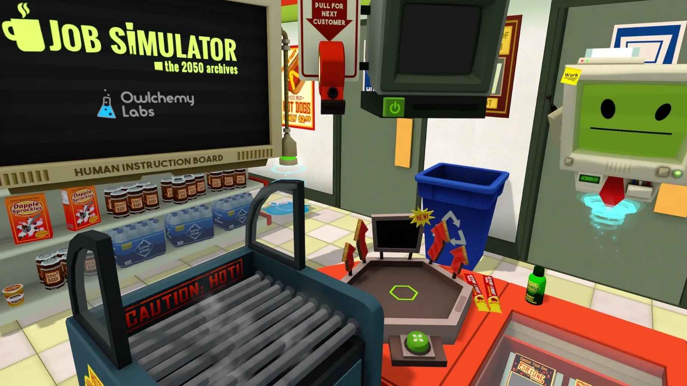
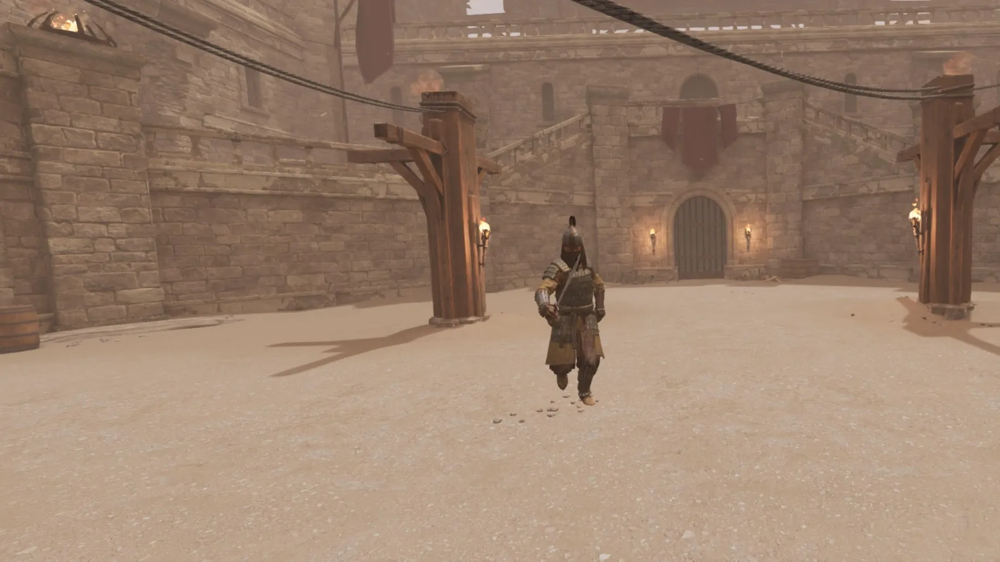

+++
title = 'Puking in VR'
date = 2024-01-10T19:08:32-05:00
draft = false
subtitle = 'It looks so real'
tags = ['VR']
+++

I love VR. Strapping on a headset, and entering another world is truly a unique experience. You could be building something as a giant sea monster, or putting together a 3D puzzle, or playing mini golf, in space. The possibilities are endless.

<figure>
	
	<figcaption>Building things as a giant sea monster</figcaption>
</figure>
<figure>
	
	<figcaption>Golfing in space</figcaption>
</figure>

There's a lot of ways to get into VR. On the cheap end, you can pick up a used Meta Quest[^1]. Or you can go super top end with a PC setup. My setup, is closer to the PC end, just without Windows.

I use a PSVR2 hooked up to a PlayStation 5. The PSVR2 has a lot of features that pulled me to it. Each eye gets a 2000x2040 OLED screen, and tracking camera. That eye tracking lets the PS5 do some fancy rendering tricks, and lets you select menu items with just your eyes[^2]. The headset also has a rumble motor, for added immersion.

The controllers have touch sensitive areas, for added input. And feature the same resistive trigger as the main controller.

<figure>
	
	<figcaption>Golfing upside down</figcaption>
</figure>

I went with the VR2 for two main reasons. VR can get crazy expensive. The Valve Index, costs $1,000. That gets you, the headset, the powered reference markers, and the controllers. That's it. Hope you have a PC that can drive it.

The PSVR2 comes in at $550. Yeah, you'll need to pick up a PS5 if you don't have one. But, tossing in a PS5, you'll either a tad above, or a tad bellow the price of an Index. I don't have a VR grade gaming PC[^3] So the VR2 was a no brainer.

<figure>
	
	<figcaption>Exploring the galaxy</figcaption>
</figure>

The VR2 was also super easy to set up. Unlike something like the Index, the VR2 has no powered reference marker to hang. And you only have one cable to plug in. 

The setup also takes advantage of the built in eye tracking. Helping you get the IPD setting just right[^4]. The eye tracking calibration is also super cool to play with.

<figure>
	
	<figcaption>Working at a convenience store</figcaption>
</figure>
<figure>
	
	<figcaption>About to get stabbed</figcaption>
</figure>

I've had my VR2 for a while (Got it when it came out). And it's the reason why I picked up a PS5. While VR isn't for everyone. It is a ton of fun. Just remember to take breaks, VR fatigue is a thing, and it's not fun.

[^1]: Though, buying used VR gear is like buying used socks.

[^2]: It's super cool.

[^3]: Yes, people have gotten VR working on the Deck, but its really not built for that workload.

[^4]: It will also ask you to readjust the IPD, if the dial got moved while powered off.