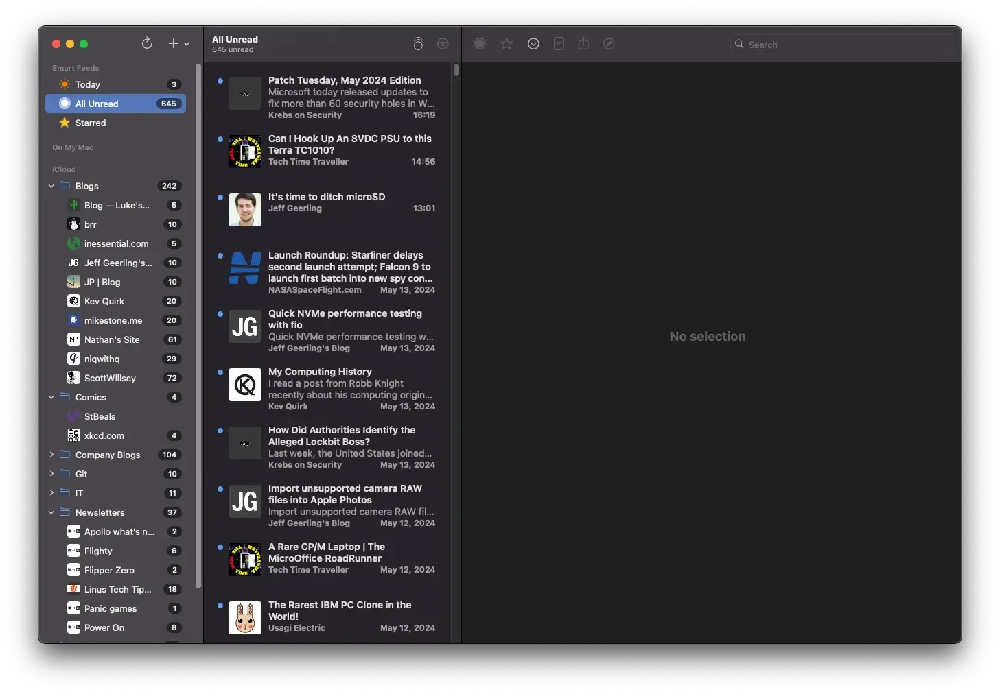

+++
title = 'RSS Syncing Is a Mess'
date = 2024-05-14T22:55:00-04:00
draft = false
subtitle = "You have 600 unread items"
tags = ['RSS']
+++

Recently, I opened my RSS client on my laptop. I do this all the time. However, this time it threw an error. Saying I needed to re-add my iCloud “account”. So I did… and it proceeded to mark everything as unread…

<h2>What Did You Do‽</h2>

For the past year, I have been using iCloud to sync my RSS clients. I was pretty happy with this, as it didn't cost me anything extra, and worked pretty well.

That was until NetNewsWire and iCloud didn't agree, and all my feeds got marked as unread.

<figure>
	
	<figcaption>645 unread items</figcaption>
</figure>

<h2>Stop Being Cheep</h2>

I already pay for iCloud storage, that's what I liked about using it to sync my clients. However, it did have a drawback. I was locked into one client[^1]. I also went with it, because I didn't want a subpar experience.

Most sync services have their own client, with extra features. if you wanted to use a good client, you weren't getting everything that you're paying for. I didn't want that, I just want something cheap, and basic.

I ended up going with [Miniflux](https://miniflux.app). It pretty much hits all my boxes, $15/year, no shitty client with extra features, and it works with pretty much every client out there.

Using a real sync service also lets me mix clients. I can use NetNewsWire on my mac, and Reeder 5 on my iPhone.

Don't get caught in the idea of using cloud storage to sync clients. It's not worth the looming implosion.

[^1]: Had to be the same one on both devices.