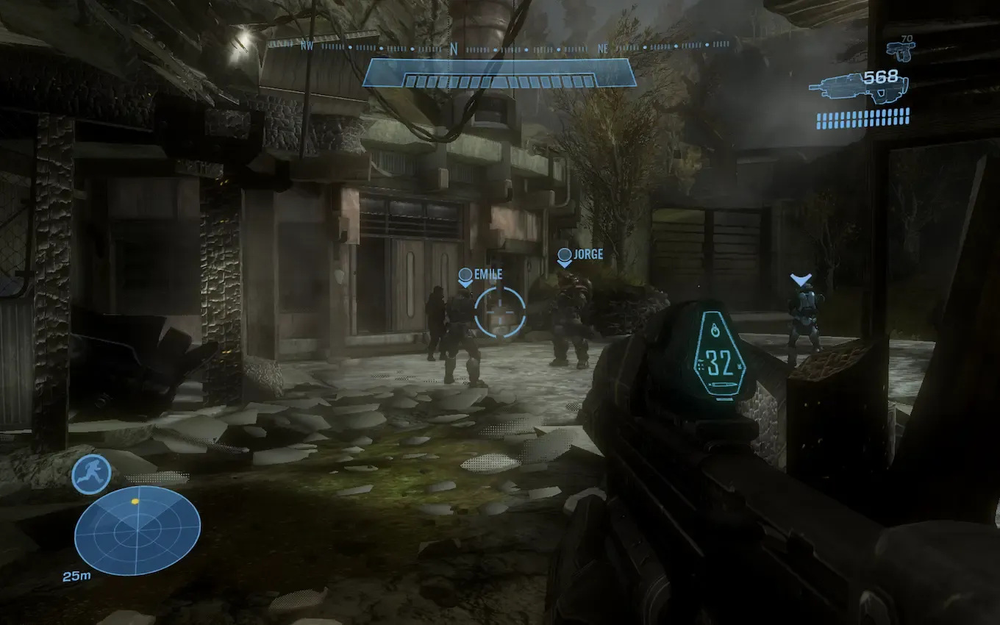
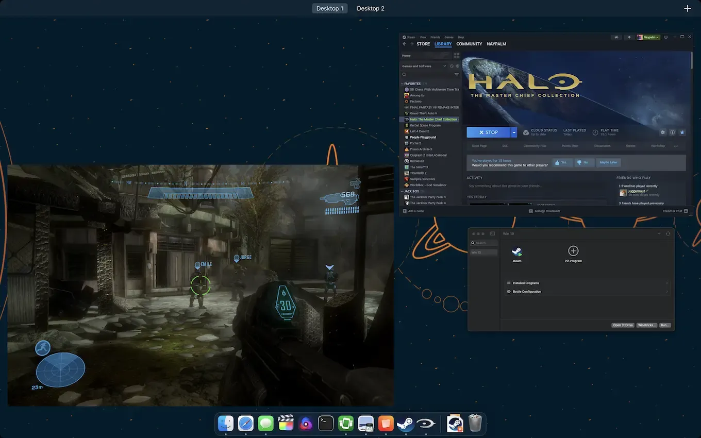

+++
title = 'Running Halo on an ARM Mac'
date = 2024-02-08T15:52:25-05:00
draft = false
subtitle = "Satan would be proud"
tags = ['Mac', 'Gaming']
+++

I know what you're thinking, but I'm not pulling a fast one on you.

## What?

Halo the Master Chief Collection, is a windows only game. You want to play it? Buy an Xbox, or a Windows PC. However, there are ways to run windows programs on not windows.

Valve, has been putting a lot of time, and money, into doing just that. The back bone of their Proton translations system, is WINE[^1]. WINE makes it possible for windows programs, to run on Linux. This allows the Steam Deck (a Linux game system), to run games like, Halo MCC.

The Mac, runs macOS. While macOS isn't Linux, it is UNIX[^2]. And with how closely Linux is related to UNIX. It's possible to port software back and forth. Because of that, WINE is available for macOS. 

## So, how do I do this?

In short, you probably shouldn't, Halo doesn't run well on macOS. WINE for the mac is still pretty young.

But, just in case you want to try anyway, you'll need a couple things.

1. An ARM mac (ie: M1, M2, M3)
2. macOS 14 or up

You'll need to download [Whisky](https://github.com/Whisky-App/Whisky?tab=readme-ov-file) from GitHub. This will set up and manage WINE for you. Just create a new Windows 10 bottle.

Download the Windows version of steam, and launch the EXE. Whisky will ask you to pick what bottle you want to use, just pick your Windows 10 bottle, and hit run. Then, just install steam.

Once you log in, just install Halo MCC. You might have to restart steam a few times, as the download can get stuck sometimes. You will have to turn the graphics down, so it won't crash. 

And with that, you have Halo on a mac. Satan would be proud.

<figure>
	
	<figcaption>Halo MCC</figcaption>
</figure>

<figure>
	
	<figcaption>Halo MCC, running on macOS</figcaption>
</figure>

<iframe width="560" height="315" src="https://www.youtube-nocookie.com/embed/3wiTuzr_IkE?si=VsmWlqB3PdMDVHki&amp;controls=0" title="YouTube video player" frameborder="0" allow="accelerometer; autoplay; clipboard-write; encrypted-media; gyroscope; picture-in-picture; web-share" allowfullscreen></iframe>

[^1]: Wine Is Not an Emulator.
[^2]: Linux is a clone of UNIX.