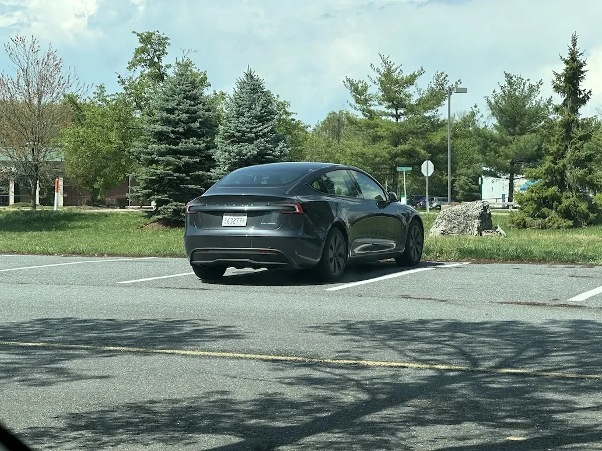
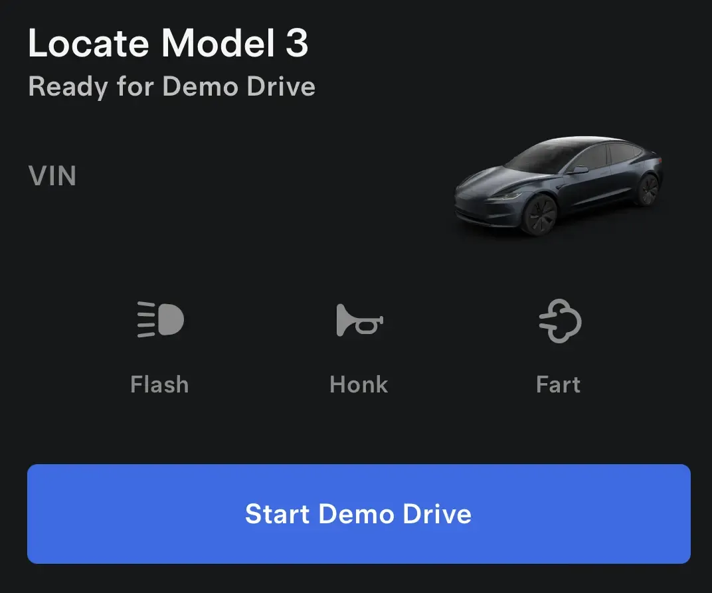
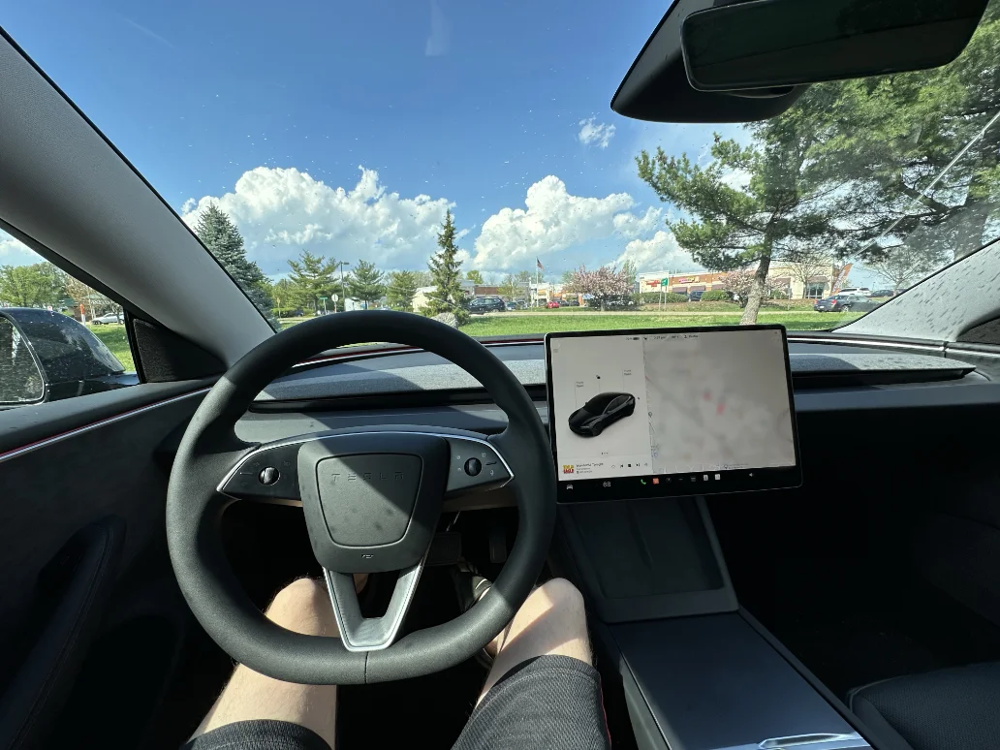
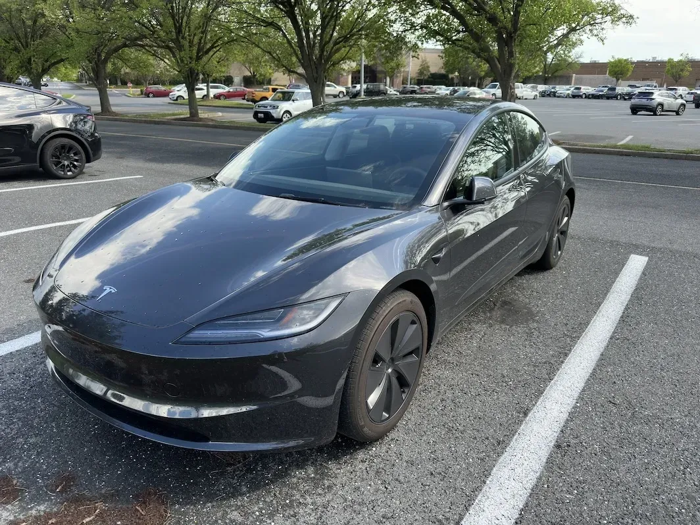

+++
title = 'Self Service Test Drive'
date = 2024-04-17T14:29:06-04:00
draft = false
subtitle = "Test drive a car, you found at a mall"
tags = ['Cars']
+++

Last week, my coworker was telling how he was going to test drive a Tesla. "That's cool", I thought. Then he told me it was a self service test drive. Wait, what‽ I need to check this out. So, I signed up for one.

<h2>Signing up</h2>

The sign up was pretty simple. I just went to Tesla's website, and picked the car I wanted to test drive. After picking the Model 3, I put in my zip, picked the local mall from the available locations, and picked a time slot, Monday at 3PM. The rest, was done in the Tesla app.

After logging in, it had me upload my license[^1], and watch some videos. I did have to do a phone interview. It was just a quick, "what make's you interested in a Tesla" type thing. They did confirm some info, and gave me some basic rules. Only I could drive, and don't leave it at the charger when I'm done.

When Monday rolled around, I headed up to the mall. And there it was.

<figure>
	
	<figcaption>The car</figcaption>
	
	<figcaption>The app letting make the car fart. Yes, I did hit it</figcaption>
</figure>

I went up to the car, right when 3 o'clock hit. My phone connected to it, and the door unlocked.

<h2>The Drive</h2>

Getting in, my first impression was just how much I could see. The big windshield, and lack of center instrument panel really allows for a great view.

<figre>
	
	<figcaption>A big view</figcaption>
</figre>

You might notice, that a lot is missing here[^2]. No stalks at all, or climate consoles, or a shifter, and those missing instruments, what‽

In reality, nothing is really missing, they've just moved. The turn signals and wipers are buttons on the wheel. Shifting and climate are on the touch screen. And so are the instruments. How long did that take me to get used to? About ten minutes.

Now, I know what you're thinking, climate, on the touch screen‽ That sounds horrible! But, it really isn't that bad. Air flow presences get set to your driver profile, so just set it, and forget it. As for changing the temperature, just use the really good voice control. And let the automatic climate control do its thing.

As for driving the thing, it did take a while to get used to one peddle driving.  Having the car start essentially braking when I let off the accelerator was weird. I did make the decision to drive for a bit in the empty parking lot, to get used to things. I also used that space to play with the self parking.

Letting the car operate itself was weird. It went against everything that I was taught. It just felt wrong, but it was just so cool. I did try the self driving a little[^3]. But it wasn't the biggest fan of the roads out here. I did love how it would beep when the light turned green. It did it right when it went green when I was at the front of the line, and when the car in front of me started moving, when I wasn't.

Unfortunately, my test drive was over pretty quick. I only had an hour to drive the car. So I parked it where they wanted, locked it, and left.

<figure>
	
</figure>

<h2>Thoughts</h2>

This specific car was the duel motor 2024 Model 3. And man, was it nice. From the crazy takeoff power, the comfort, and features every new car should have (beeping at you to let you known that the light is green, and blind spot cameras), it was way cooler than I expected.

It's not cheep though. This trim starts at $47,740. While I'm not in the market for a new car[^4], I'm defiantly going to keep the Model 3 in the back of my mind, for when I eventually am.

As for the whole self service demo thing. I loved it. I didn't truly have to BS a sales rep to do a test drive. And I didn't have to talk with anyone in the car. That part, was fantastic.

[^1]: Standard practice for any test drive. 

[^2]: If you're used to a normal car, like I am.

[^3]: It didn't have the full self driving package. Just the auto speed, and auto steer.

[^4]: And probably won't be for quite a while.