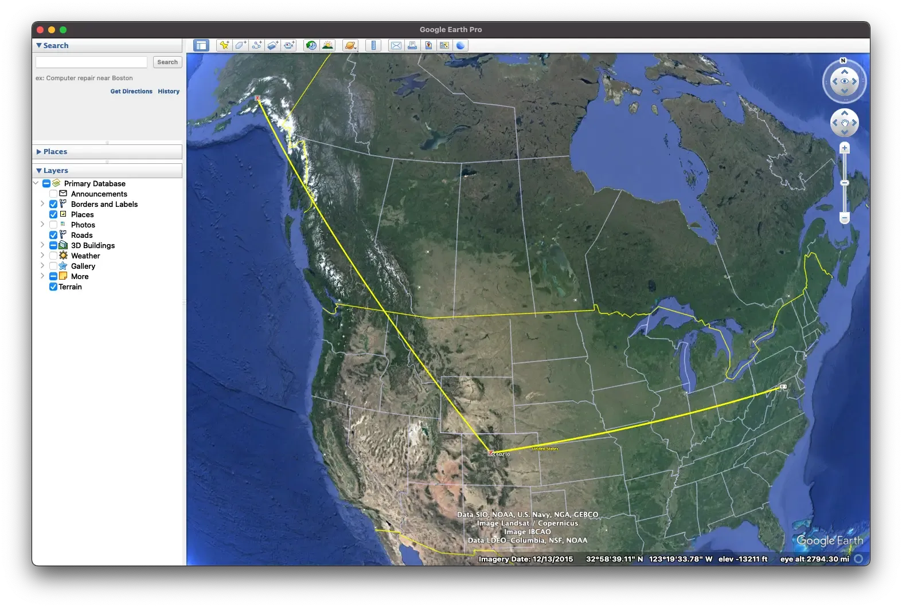
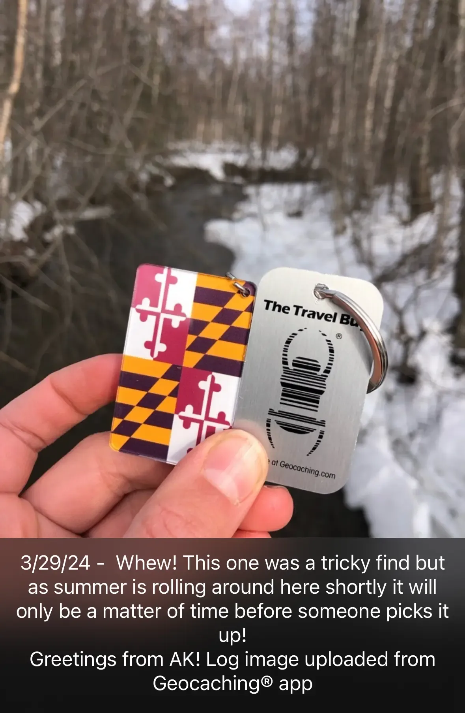

+++
title = 'Sending a Flag to Alaska'
date = 2024-03-29T00:22:39-04:00
draft = false
subtitle = "By hiding it behind a cat"
tags = ['Geocaching']
+++

One of my hobbies is geocaching. And a neat part of geocaching, is trackables. A trackable, in short, is a little trinket with a tracking code. People move trackables from cache to cache, and up date the trackable's log online. This lets people watch, and see, where a trackable has been.

I've had a few trackables in the past, but none really went anywhere. I wanted to change that, even if I had to do it myself.

When I was getting ready for my [Denver 2024](/tags/denver-2024/) trip, I had an idea. To spread the greatest state flag in the union, Maryland. So, I grabbed a keychain flag, and a trackable tag, and made them one.

I made sure to take the trackable to a local-ish cache, to log that it was in Maryland. Then, I flew out to Colorado. My target was Vail resort. There were a few caches on the trails, but I picked one that was behind a big cat. Dropped it off, logged it, and went on skiing.

<h2>The Last Frontier</h2>

The flag was already over 1,000 miles[^1] from home. So imagine my surprise when someone moved it to Alaska. Traveling over 3,891 miles. I didn't expect that.

<figure>
	
	<figcaption>Trackable travels plotted in Google Earth Pro</figcaption>
</figure>

The user who moved even posted a picture.

<figure>
	
</figure>

Hopefully it keeps moving. But even if it doesn't, I'm happy with this.

[^1]: 1.609344e+8 cm for the didn't walk on the moon nations.
