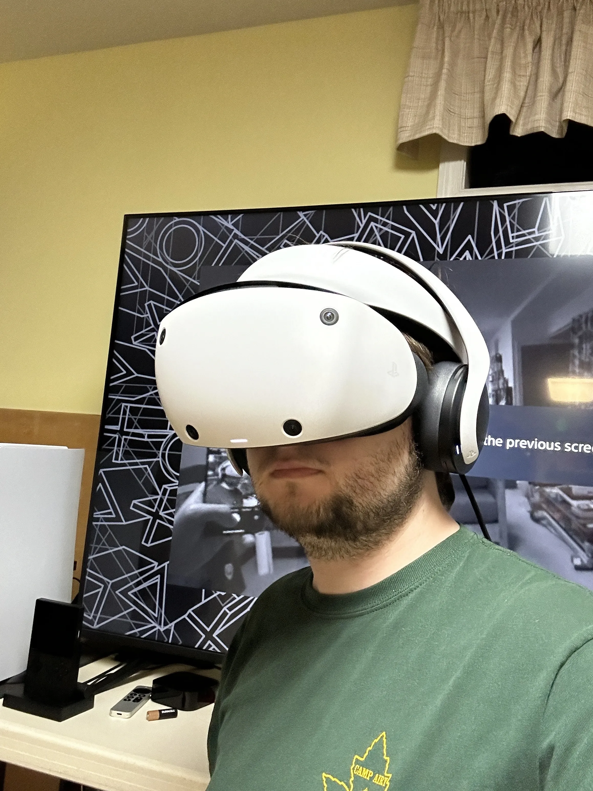
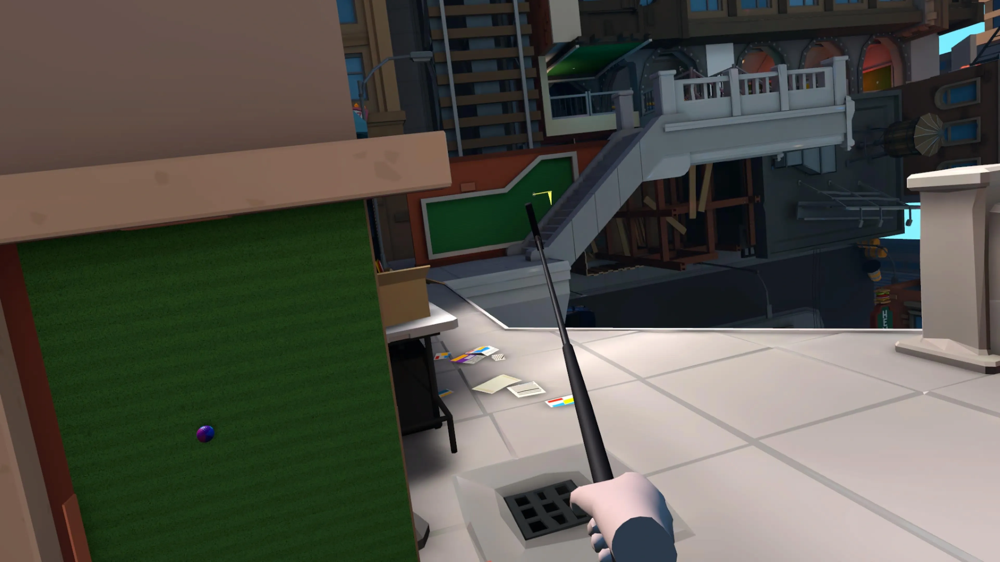
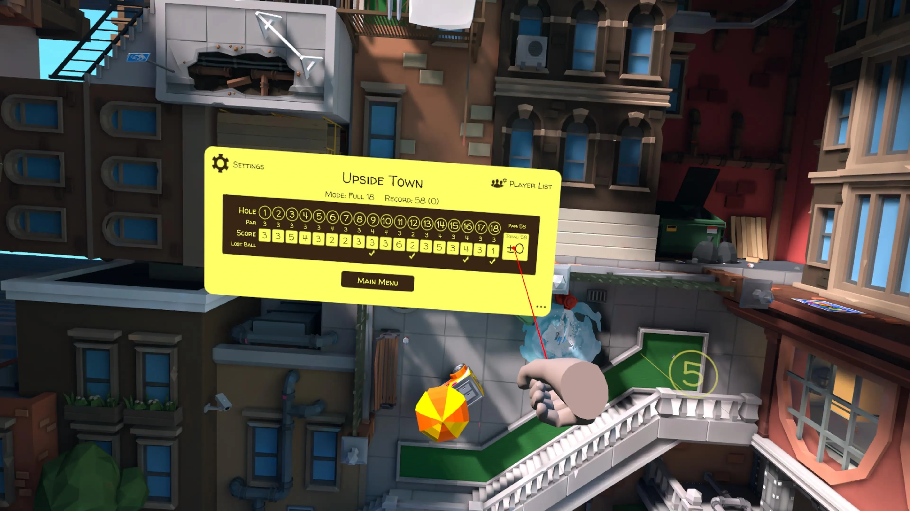

+++
title = 'Some Relaxing After Work Mini-golf'
date = 2024-06-03T01:31:00-04:00
draft = false
subtitle = ""
tags = ['VR', 'Gaming']
+++

After a long, bland day at work, I needed to relax. Why not some mini-golf. Perfect... but, none are open right now. I guess I'll just have to bring one to my place.

<h2>Strap In</h2>

<aside class="invisAside">
	<figure>
		
	</figure>
</aside>

Strapping on the VR headset is a process. Fire up the PS5, grab the everything. Turn it all on, strap in, and clear the space. Something I should have done first. But after that, I was ready to golf.

The choice of course was easy. Upside downtown, a course that likes to play with the gravity on the ball.

<h2>Golfing Sideways</h2>

Golf is super boring. That's why mini-golf exists. Mini-golf in VR, lets you get crazy. I went over that in my first VR [post](https://nthp.me/posts/2024/puking-in-vr/). For a taste of this course, just watch this clip.

<figue>
	<video controls>
		<source src="vid1.mp4" type="video/mp4">
		Your browser does not support the video tag.
	</video>
</figue>

The whole course is like this. The ball regularly sticks to the wall, and sometimes the ceiling. All while you stay stuck the the floor. I love it, and it's a great experience for first time VR players.

<figure>
	
	<figcaption>I need to hit the ball "down" to the hole</figcaption>
</figure>

<h2>The Score</h2>

I finished the game, with a score of 54 out of 54. Dead on the par. That's way better than I thought I would get. And made it a really satisfying after work relaxation. I even got a hole in one on the last hole.

<figure>
	
	<figcaption>On par</figcaption>
</figure>

<figue>
	<video controls>
		<source src="vid2.mp4" type="video/mp4">
		Your browser does not support the video tag.
	</video>
	<figcaption>Hope you like heights</figcaption>
</figue>

If you have a VR setup, definitely check out Walkabout Mini Golf.