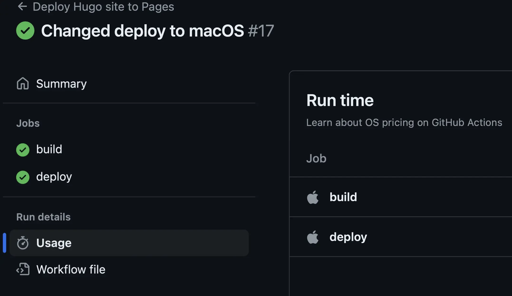

+++
title = 'The Mac in the Sky'
date = 2024-07-09T13:32:00-04:00
draft = false
subtitle = "Building my site on a cloud Mac"
tags = ['Web', 'Hugo', 'GitHub']
+++

To help save space in my site's repo, I decided to have GitHub do the build for me. That way I don't have have two copies of every large file in the same repo. Thankfully, GitHub has a pre made hugo workflow that I could use. I just had a few issues with it.

<h2>Ubuntu, ew</h2>

The first issue, is that the workflow uses an Ubuntu runner. Okay, that isn't really an issue, as it worked perfectly fine. But, the workflow had some things I didn't like.

The biggest offender, is that it would install dart-sass via snap. I don't use dart-sass for my site, and snap is slow and garbage. Thankfully that was just two lines in the config to delete. The other issue was, I would have to manually upgrade the version number for hugo in the config, when a new version came out.

That's a first world problem, I know. But, I would prefer if it just used the latest for every build. Being that this was Ubuntu LTS, the workflow had to download hugo manually with wget, then install it. And hugo has the version in the file name, so that wouldn't be easy to get around.

<h2>Brew.sh</h2>

One of the first things I thought of was to just use brew. This would install the latest version. Great, there was just one issue. GitHub removed brew on it's Linux runners... Great.

After a bit if digging, I remembered that GitHub offers macOS runners. With brew installed. Perfect. 

With only a couple changes to my workflow config, my site was now being built on a Mac. In the cloud.

<figure>
	
</figure>

Did I have to move to macOS containers. No. Changing the version number when a new hugo version comes out is no big deal. This was just a bit of fun.