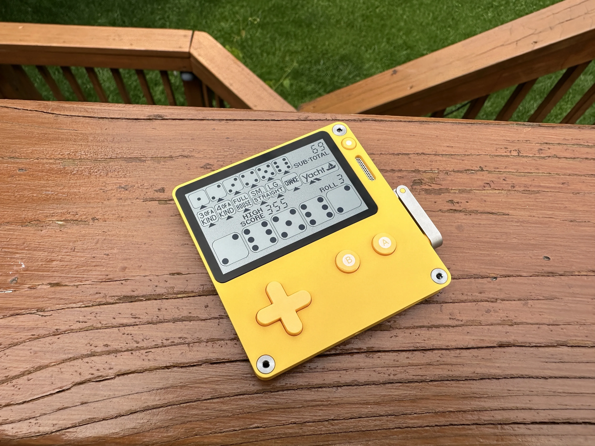
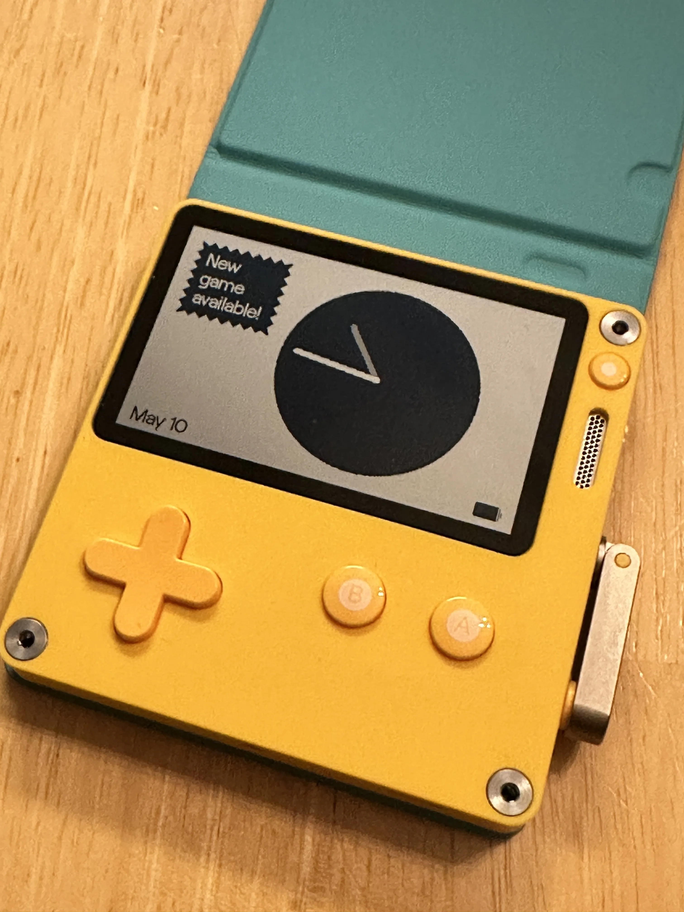
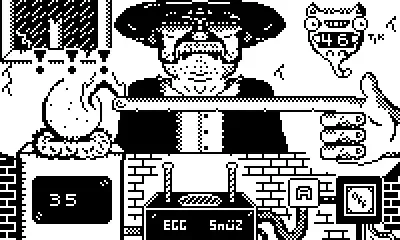
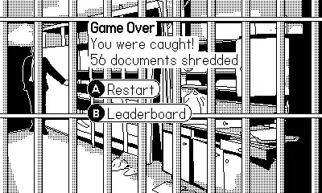
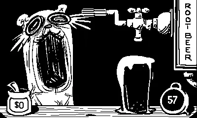
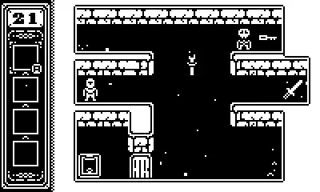

+++
title = 'The Playdate Console'
date = 2024-05-22T23:02:04-04:00
draft = false
subtitle = "It is yellow"
tags = ['Playdate']
+++

What do you get, when you combine the color yellow, a black and white screen, and a crank? Well, you get something odd. You might also get a Playdate, I did.

<h2>Wait What?</h2>

Yep, I bought one of these things. A little game system, with a built in crank. Why, because I wanted one. Simple. Well, also because games I wanted to play, finally came to the system.

I don't want this to be a "tech" blog. But, here's a specs table, at least the ones that matter. You can find the full one [here](https://help.play.date/hardware/the-specs/).

<table>
<thead>
  <tr>
	<th>Screen</th>
	<th>Black and White</th>
  </tr>
</thead>
<tbody>
  <tr>
	<td>Resolution </td>
	<td>400x240</td>
  </tr>
  <tr>
	<td>Backlight</td>
	<td>Nope</td>
  </tr>
  <tr>
	<td>Battery Life</td>
	<td>8-16 hours</td>
  </tr>
  <tr>
	<td>Crank</td>
	<td>Oh yeah</td>
  </tr>
</tbody>
</table>

<h2>Wait, No Backlight‽</h2>

Nope. But the screen is a fancy Sharp memory LCD. Thus it's super reflective[^1]. You really only need a touch of light, to see the screen. That said, out in the sun, the thing looks amazing.

<figure>
	
	<figcaption>Yacht on the Playdate, out in the sun</figcaption>
</figure>

The build quality is as good as the screen. The crank is metal, and uses magnets to know where it is, and when its docked. That means no drift, and its super sensitive when in use. The rest of the unit is made out of plastic.  Very sturdy plastic. But a good build means nothing without

<h2>The Games</h2>

When I first looked into getting one of these. You only got the 24 games that come with it, and anything you side loaded. That kinda put me off, yeah you get included games, but I'd have to hunt others down on the web. That was until the Catalog came out.

The Catalog, is an on device game store. This is what I was waiting for, and some good games in it. I'll drop a list of some of my favorite games bellow.

You might have noticed, I said side loading. And yes, you can side load games. You can either do it over USB, or via the web. Doing it over the web is fantastic. You just upload a .pdx file[^2] to a page on your account. And the game will show up on the playdate. You can even upload an updated pdx, and it will show up on the Playdate, as an update for that game. It'll even give you a notification on the lock screen, when it's ready[^3].

<figure>
	
	<figcaption>A new game was installed while in sleep mode</figcaption>
</figure>

<h2>Thoughts</h2>

Over all, this thing is fun. Just that, fun. I'm glad I picked it up. And I'm super glad to see that I can back up my save files, over USB. Thank you Panic.

As for that game list, here it is. In no particular order. Along with some screenshots[^4] in a drop down.

<h3>Catalog Games</h3>

- [Touch Egg](https://play.date/games/touch-egg/)

- [Rocket Bytes](https://play.date/games/rocket-bytes/)

- [Icy Dungeon](https://play.date/games/icy-dungeon/)

- [Root Bear](https://play.date/games/root-bear/)

- [Greed](https://play.date/games/greed/)

- [Skwish](https://play.date/games/skwish/)

<h3>Sideloaded</h3>

- [Super Corporate Tax Evader](https://osuika.itch.io/super-corporate-tax-evader-playdate)

- [Yacht](https://nkorth.itch.io/yacht)

- [Gatecrasher](https://benzgrant.itch.io/gatecrasher)

- [Stream](https://simply-in-dev.itch.io/stream)

Screenshots

	

	<figure>
		
		<figcaption>Touch Egg</figcaption>
	</figure>
	<figure>
		
		<figcaption>Super Corporate Tax Evader</figcaption>
	</figure>
	<figure>
		
		<figcaption>Root Bear</figcaption>
	</figure>
	<figure>
		
		<figcaption>Icy Dungeon</figcaption>
	</figure>
	

	<b>NOTE</b>: None of these link are affiliate links

[^1]: If you have an old Pebble (the OG, OG Steal, or Pebble 2), it's the same screen tech.

[^2]: Or a .pdx in a zip file.

[^3]: You can also manually download the game, through the system setting.

[^4]: Yep, it can do that.
