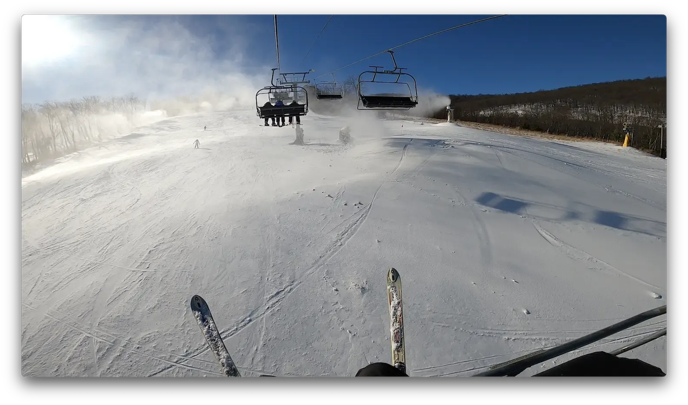
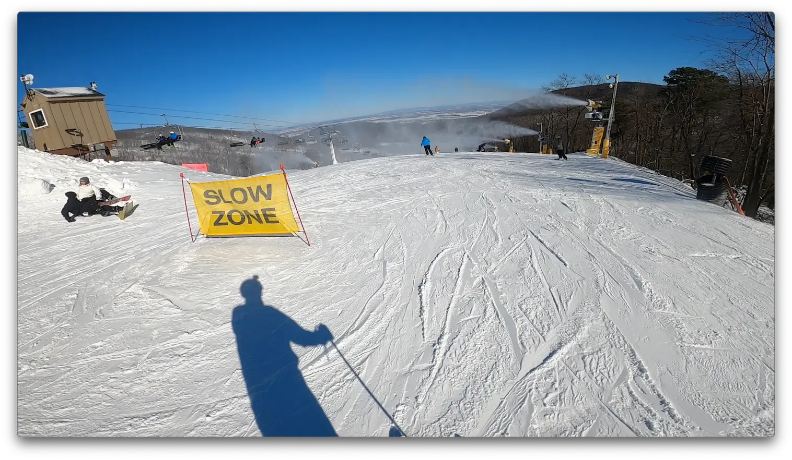

+++
title = 'The Prep Run'
date = 2024-01-17T19:57:55-05:00
draft = false
subtitle = 'Falling down a mountain'
tags = ['Denver 2024', 'Skiing', 'Winter']
+++

Today was prep day. In a few weeks, I'll be flying out to ski in the rockies. So I needed to do a warm up run.

<figure>
	
	<figcaption>On the lift</figcaption>
</figure>

It was about 23F[^2] at Whitetail Resort. Not my preferred skiing temperature[^1] but it was good enough. This being the east coast, there wasn't any snow, it was all ice. The ice coast.

The big "snow" guns you see in the photos, don't make snow. They make small things of ice. And they are not fun[^3] to ski in front of.

<figure>
	
	<figcaption>Over the hill</figcaption>
</figure>

My friend who lives in Denver, told me to get plenty of turns in. I think I did, but I'll find out in the morning.

[^1]: I prefer a touch colder

[^2]: ccccc below zero

[^3]: For most people, and my camera