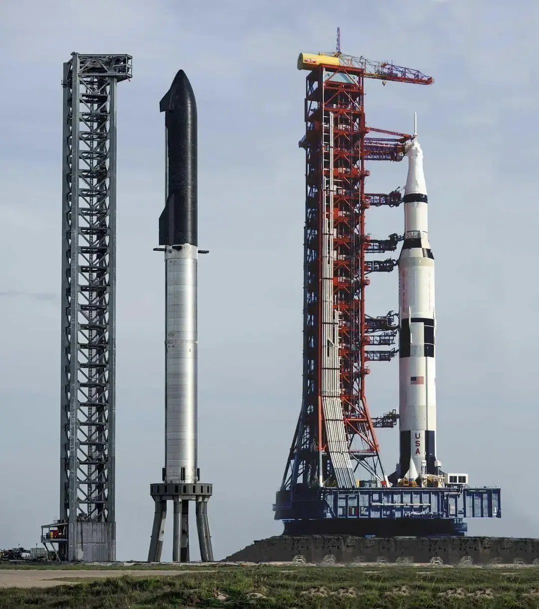
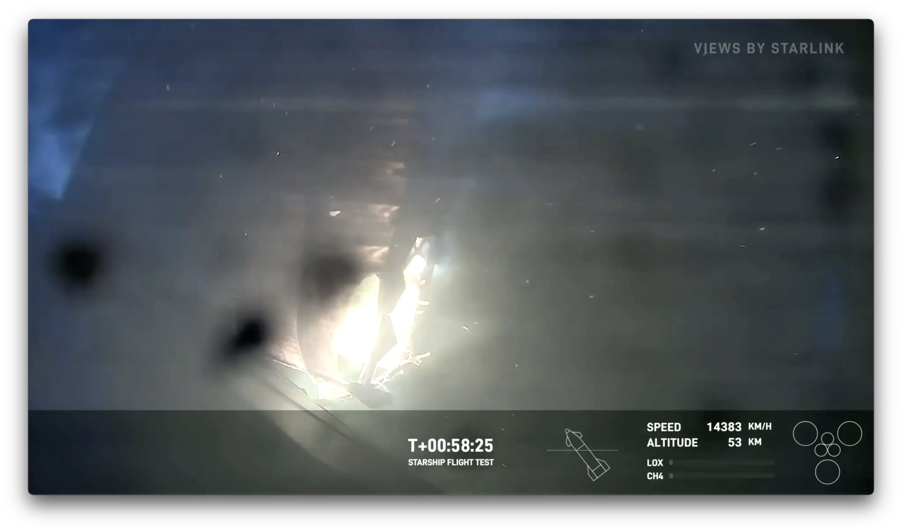
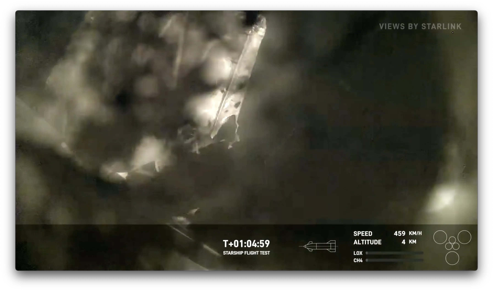

+++
title = 'They Did It'
date = 2024-06-06T15:16:46-04:00
draft = false
subtitle = "Holy shitballs, they did it!"
tags = ['Rockets', 'Starship']
+++

They did it, holy shit they did it. That largest rocket ever flown made a powered water landing this morning. As well as its massive booster.

<h2>The Big One</h2>

The Starship stack is crazy big. Bigger than the Saturn V.

<figure>
	
</figure>

Reentry is super problematic. The crazy heat, and pressure is really hard to deal with. While Starship did make it through Reentry, it almost didn't.

The forward right fin took a lot of heat damage. As in a good chunk of it melted. And the whole thing was caught on video.

<figure>
	
</figure>

The big question was, will it make it. If that fin was lost, it's over. Thankfully, that fin was a damn trooper. Not only did it hang on, it still worked! Allowing Starship to flip upright, and preform a soft water landing.

<figure>
	
	<figcaption>That's a lot of damage, but it still worked</figcaption>
</figure>

They still have a lot of work to do. But holy shit, they landed it. And after watching it, I can't wait for test flight 5.

Definitely check out [Scott Manley's breakdown](https://www.youtube.com/watch?v=8m0TY6i1Kuo) of the whole thing. 