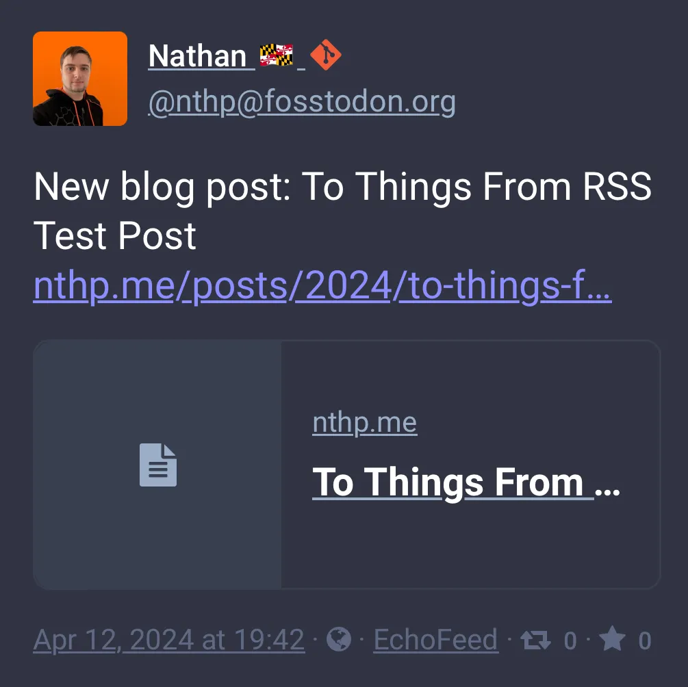

+++
title = 'To Things From RSS Test Post'
date = 2024-04-12T18:10:59-04:00
draft = false
subtitle = "Checked luggage costs extra"
tags = ['Web']
+++

I've been looking around for a while for a good RSS to [thing] poster. Something that looks at an RSS feed, and when it see a new item, makes a post. I know you can do that with IFTTT, but IFTTT doesn't support Mastodon.

I've tried a few out there, but none of the liked my RSS feed[^1]. Well, a new one popped up, and didn't seem to have a problem when I added my feed. This post is going to serve as a test of [EchoFeed](https://echofeed.app). I'll post an update if it works.

Update: It worked.

<figure>
	
</figure>

[^1]: And they were the only thing that didn't like it.