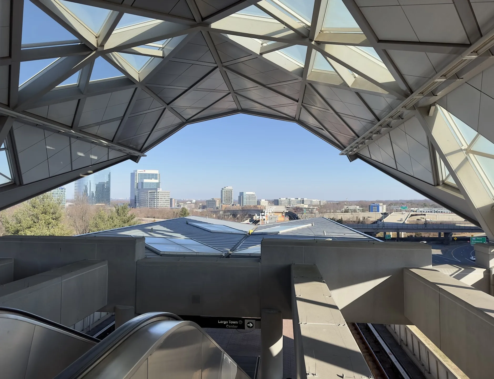
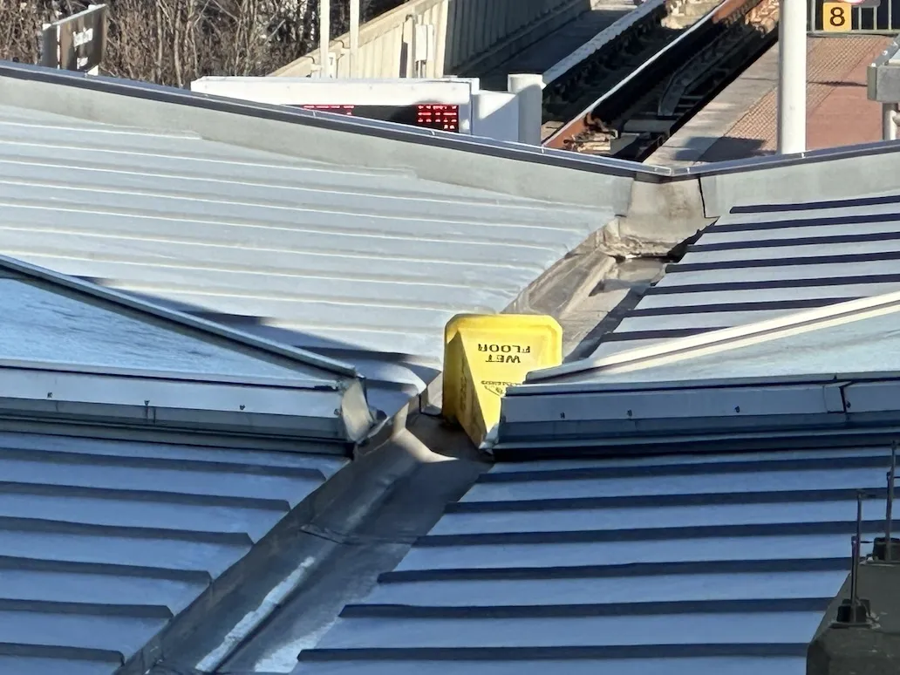

+++
title = 'Vision Pro Demo'
date = 2024-02-05T19:28:00-05:00
draft = false
subtitle = "I can see now!"
tags = ['Vision Pro']
+++

The Apple Vision Pro has released, and I’m not buying one. I just don’t have $3,500 to drop on it. But I am super excited by the product. So, I booked a demo. 

Booking a demo was pretty straight forwards. I fired up the Apple Store app on my iPhone, and hit the book demo button. It then asked me where I would like to do the demo. Unfortunately, my closest store didn't have a good time for me. My only option was the Apple Store down in Tyson's Mall[^1]. This is about an hours trip for me.

After I got a time slot, it gave me check-in pass, and asked me a few questions about my eyes. Things like, do I use glasses or contacts, and do I have mono vision. But with that, I was all set.

## The Journey [🔗](#journey)

With my metro card loaded up, I headed off to the station. Parking mid-weekday at a DC metro station can be a pain. They have tons of spots, but you might have to walk a bit. 

After about an hour and a transfer later, I was at Tysons mall.

<figure>
	
	<figcaption>View from Tysons station</figcaption>
</figure>

And yes, that is a wet floor sign on top of that roof.

Don't believe me?

<figure>
	Told you</figcaption>
</figure>

## The demo [🔗](#demo)

The demo started with a face scan. This was to determine what size and shape light skirt I needed. Once that was done, the Vision is brought out on a wooden platter, and you are given a tour of it. 

Once you strap it on, the Vision atomically locates your eyes. It ask you to hold the crown button, and when you do, motors automatically moves the display assemblies to match your eyes. After that, you go through the eye tracking calibration. Then, you are ready.

The demo gets going with looking at some photos. This lets you experience windows floating out in front of you, and lets you get the hang of the hand gestures. 

You’re taken through a number of photos, all of different types. First up is a regular photo, then a couple panoramas. At first, the panorama is just right in front of you, that changes when they have you put it into immersive mode. Then, the panorama wraps around you. After that, you go on to a 3D Spatial photo. Then a Spatial video. 

The panoramas were cool, but the Spatial videos were super impressive.

After that, you play around with changing your environment, and moving windows around.

The demo wraps up with a quick viewing of a 3D movie. All in, the demo takes about 30 minutes.

## Thoughts [🔗](#thoughts)

Overall, I am crazy impressed. The pass through was good to the point, it was like I was looking through my ski goggles. Everything felt pretty natural as well. From the look of the windows, the 3D videos, and surprising, the ease of the gestures.

I am super excited to pick one up. In two or so generation. $3,500 before AppleCare+ is a little much for me.

[^1]: The [first Apple Store](https://www.macobserver.com/analysis/the-first-apple-store-open-20-years-ago-today/)