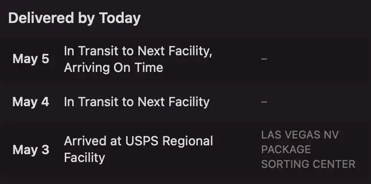

+++
title = 'Waiting on a Yellow Slab'
date = 2024-05-06T00:38:42-04:00
draft = false
hasUpdate = true
subtitle = "No, it's not cheese"
tags = ['Playdate', 'Rant', 'Post Update']
+++

Last week, I ordered a Playdate. The weird yellow console with a crank. I've been keeping my eye on the system. Waiting for some good games to hit its store. But I'll go over that in a later post. Right now, I just need it to show up.

<h2>United States Postal Snail</h2>

The USPS has some big upsides over the non government carriers. Legal protection for your shipment, and being able to sick the USPI on anyone who steals your mail. But man, can they be slow.

Congress, mandates that the USPS be self sustaining. Meaning, they can't use any tax dollars. And they are having major troubles staying afloat. Because Congress won't let them branch out in offerings.

Lack of money, brings lack of speed. However, it seams that their tracking predictions, haven't been adjusted for this.

<figure>
	
	<figcaption>Tacking in Deliveries.app</figcaption>
</figure>

In short, I don't think I'm getting my Playdate today.

	Update: It did not show up today. I tried to pick it up at the post office, but it was still in sorting. - May 6, 2023

