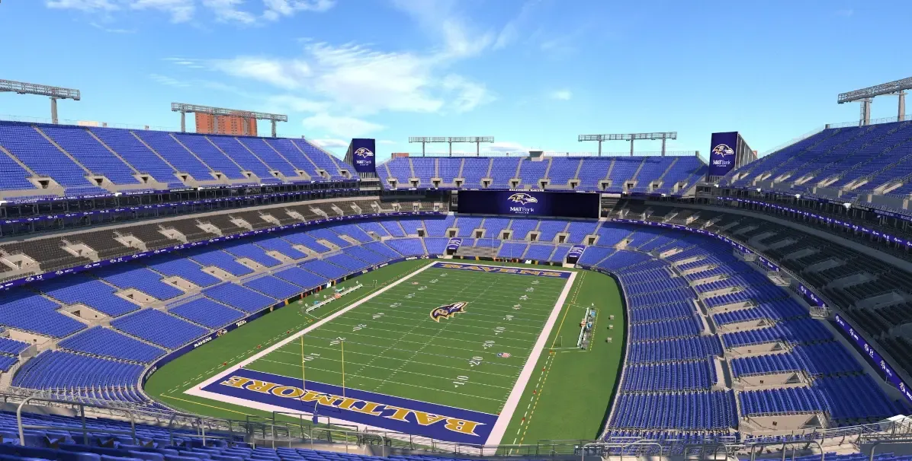

+++
title = 'Why Does Buying Tickets Suck'
date = 2024-05-19T00:21:02-04:00
draft = false
subtitle = "I just want to go to a game"
tags = ['Rant', 'Football']
+++

As of a few days ago[^1] the NFL schedule dropped. So I decided to buy a ticket... That was painful.

<h2>Ticket-apprentice</h2>

With the schedule dropping, now is a good time to snag a ticket. With the Ravens being my team, why not hit a home game?

My first thought, was just to go to the Ravens website. That linked me to Seat Geek. They wanted over $350 for two tickets. And you had to buy two. Yeah, no. I'm not paying that.

So I turned to Ticketmaster. Way, way cheaper. Still had to buy two tickets, but that's not an issue, I have someone who'll go with me. The issue came at checkout.

When I hit the big buy button, I got denied. My Apple Card wanted to make sure I was the one making the purchase. Alright, no big deal. I hit yes, and went to buy the tickets. This time I got a new error, my tickets expired... What‽

Turns out, Ticketmaster doesn't reserve your tickets while you're checking out... Great. I had to go back and pick new seats, and checkout again.

<h2>An Easy Win, Maybe</h2>

In the end, I did get my tickets. I really forgot how much Ticketmaster sucks. Eventbrite is way better[^2]. This game should be an easy win though, we'll be playing the skins[^3]. They've been in the toilet for a long time, but who knows, they may surprise us.

<figure>
	
	<figcaption>My seat view, according to Ticketmaster</figcaption>
</figure>

[^1]: I think?

[^2]: At least from what I remember.

[^3]: Washington Commanders / Red Skins