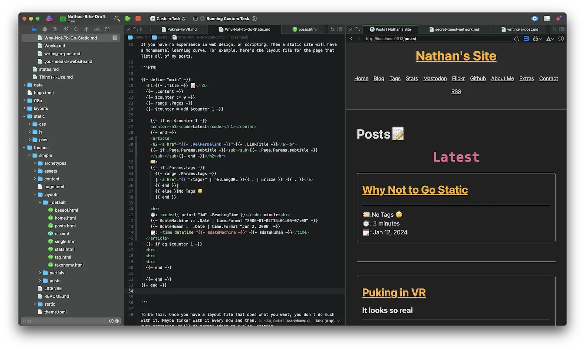
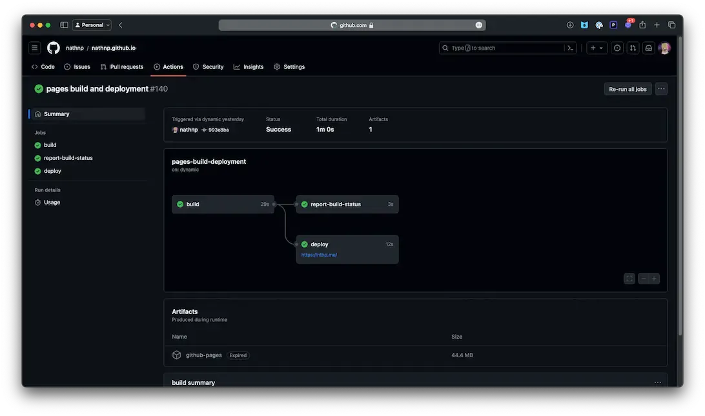
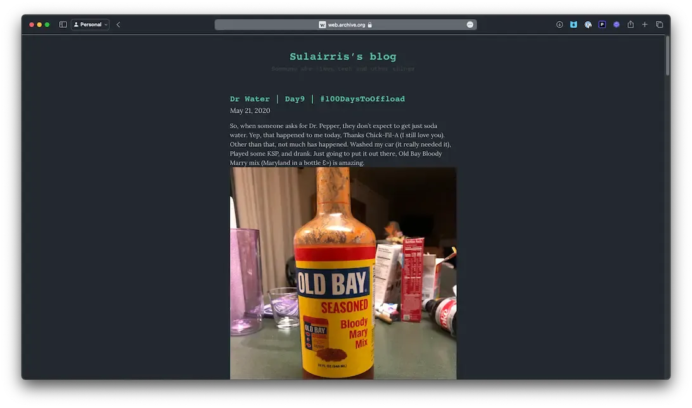

+++
title = 'Why Not to go Static'
date = 2024-01-13T00:32:43-05:00
draft = false
subtitle = "I'm not talking about the TV kind"
tags = ['web']
+++

If you’re just getting into blogging. The idea of a static site sounds pretty great. Crazy fast load times for your readers. Complete control over the site’s design. And anywhere from dirt cheep, to free hosting. 

The problem is, you have to do all the work yourself. You might be thinking, that’s no problem, I’ll just drag and drop some elements in and be good to go, right? Nope, fire up your favorite text editor, and start typing. 

If you have no experience in web design, or scripting. Then a static site will have a monumental learning curve. For example, here’s the layout file for the page that lists all of my posts. 

```HTML
{{- define "main" -}}
  <h1>{{- .Title -}} 📝</h1>
  {{- .Content -}}
  {{- $counter := 0 -}}
  {{- range .Pages -}}
  {{- $counter = add $counter 1 -}}
  
	{{- if eq $counter 1 -}}
	<center><h1><code>Latest</code></h1></center>
	{{- end -}}
	<article>
	<h2><a href="{{- .RelPermalink -}}">{{- .LinkTitle -}}</a><br>
	{{- if .Page.Params.subtitle -}}<sub><sub>{{- .Page.Params.subtitle -}}</sub></sub>{{- end -}}</h2><hr>
	🏷️: 
	{{- if .Params.tags -}} 
	  {{- range .Params.tags -}}
	  | <a href="{{ "/tags/" | relLangURL }}{{ . | urlize }}">{{ . }}</a>
	  {{ end }}|
	  {{ else }}No Tags 😢
	  {{ end }}
	
	<br>
	⏱️: <code>{{ printf "%d" .ReadingTime }}</code> minutes<br>
	{{- $dateMachine := .Date | time.Format "2006-01-02T15:04:05-07:00" -}}
	{{- $dateHuman := .Date | time.Format "Jan 2, 2006" -}}
	🗓️: <time datetime="{{- $dateMachine -}}">{{- $dateHuman -}}</time>
  </article>
  {{- if eq $counter 1 -}}
  <br>
  <hr>
  <br>
  {{- end -}}
	
  {{- end -}}
{{- end -}}
```

To be fair. Once you have a layout file that does what you want, you don’t do much with it. Maybe tinker with it every now and then. So as a better example, let’s go over something you’ll do pretty often on a blog, posting. 

For this, let’s compare two different setups. First will by my workflow (static site). And second, will be with [write.as](https://write.as) (a very beginner friendly platform). 

## My Workflow

It starts with opening up my text editor of choice. In this case, Nova. Once I have the project opened, the first thing I’ll do is fire up a debug server[^1]. I have that mapped to the run button in Nova. Then, I’ll start a new post.


<figure>
	
	<figcaption>Nova</figcaption>
</figure> 

I have Nova split into three panes. The left one is a file browser, middle is where I edit files, and on the right, a web browser, for viewing the output of the debug server. To make a new post, I’ll open a terminal in the middle, and run this command. 

`hugo new content posts/Test-Post.md`

This will make a new file in the posts folder named Test-Post.md. It will also pre-fill the file with its front matter(information about the file).  And then, I write. 

If I want to add a photo, oh man, that takes work. First, I get the pictures I want all in one place. Then I’ll resize them to around 1000px tall. After that I’ll run a script that converts them all to webp, and adds a touch of compression. 

The images will get moved to a folder for that post. In this case static/pics/Test-Post. Then I can call them in the post, with some HTML.

```HTML
<figure>
	
	<figcaption>Nova</figcaption>
</figure>
```

Posting the post (like everything else here) takes some work. First I’ll click the build button in Nova. This will spit out a ready to serve web directory in the public folder. Then I’ll copy the contents to another folder, and push that to GitHub. GitHub will then, redeploy my site, with the new content. 

<figure>
	
	<figcaption>GitHub deploying my site</figcaption>
</figure>

That's a fair bit of work, just for a post. And posting is the easy part.

## The Beginners Route

If that last section is putting you off from blogging, don’t let it. A static site is just one of many way to host a blog. If you’re just getting started, let’s go over posting on [write.as](https://write.as). 

Write.as is where my blog originally started. I went with it because of how easy it was to get up in running. Yes it cost a little per month, but, you don’t have to do much work because of that. 

To write a post, you simply log in, and write. Formatting is done with markdown (a super easy to learn formatting system). If you want to add an image, you just upload it to [snap.as](https://snap.as) (write.as’s image host) and paste the provided markdown. When you’re ready to post, you just click post. That’s it.

<figure>
	
	<figcaption>The first version of my blog</figcaption>
</figure> 

Yeah, you don’t have much control of how things look (you can set custom CSS). But, you also don’t have to learn web design. 

<hr>

A static site seams like the perfect way to blog (and for many, it is). But, they take a lot of work, and head banging, to set up. But, it shouldn't be your first blogging setup. No one said, you can't switch your blog to something else.

[^1]: This will let me see how my site will look, as I work on it. 